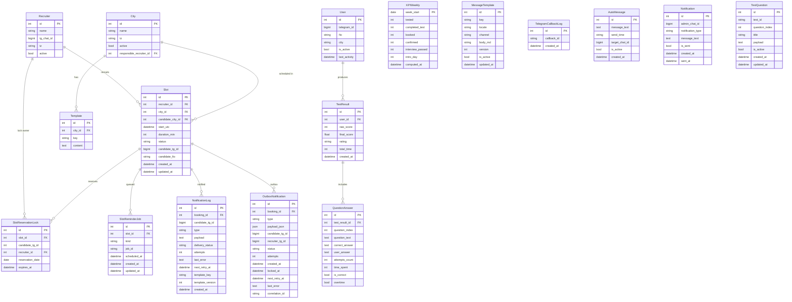

# Database ERD (Mermaid)

```mermaid
erDiagram
    Recruiter ||--o{ Slot : "recruits"
    Recruiter ||--o{ SlotReservationLock : "lock owner"
    City ||--o{ Slot : "scheduled in"
    City ||--o{ Template : "has"
    Slot ||--o{ SlotReservationLock : "reserves"
    Slot ||--o{ SlotReminderJob : "queued"
    Slot ||--o{ NotificationLog : "notified"
    Slot ||--o{ OutboxNotification : "outbox"
    User ||--o{ TestResult : "produces"
    TestResult ||--o{ QuestionAnswer : "includes"

    Recruiter {
        int id PK
        string name
        bigint tg_chat_id
        string tz
        bool active
    }
    City {
        int id PK
        string name
        string tz
        bool active
        int responsible_recruiter_id FK
    }
    Template {
        int id PK
        int city_id FK
        string key
        text content
    }
    Slot {
        int id PK
        int recruiter_id FK
        int city_id FK
        int candidate_city_id FK
        datetime start_utc
        int duration_min
        string status
        bigint candidate_tg_id
        string candidate_fio
        datetime created_at
        datetime updated_at
    }
    SlotReservationLock {
        int id PK
        int slot_id FK
        int candidate_tg_id
        int recruiter_id FK
        date reservation_date
        datetime expires_at
    }
    SlotReminderJob {
        int id PK
        int slot_id FK
        string kind
        string job_id
        datetime scheduled_at
        datetime created_at
        datetime updated_at
    }
    NotificationLog {
        int id PK
        int booking_id FK
        bigint candidate_tg_id
        string type
        text payload
        string delivery_status
        int attempts
        text last_error
        datetime next_retry_at
        string template_key
        int template_version
        datetime created_at
    }
    OutboxNotification {
        int id PK
        int booking_id FK
        string type
        json payload_json
        bigint candidate_tg_id
        bigint recruiter_tg_id
        string status
        int attempts
        datetime created_at
        datetime locked_at
        datetime next_retry_at
        text last_error
        string correlation_id
    }
    KPIWeekly {
        date week_start PK
        int tested
        int completed_test
        int booked
        int confirmed
        int interview_passed
        int intro_day
        datetime computed_at
    }
    MessageTemplate {
        int id PK
        string key
        string locale
        string channel
        string body_md
        int version
        bool is_active
        datetime updated_at
    }
    TelegramCallbackLog {
        int id PK
        string callback_id
        datetime created_at
    }
    User {
        int id PK
        bigint telegram_id
        string fio
        string city
        bool is_active
        datetime last_activity
    }
    TestResult {
        int id PK
        int user_id FK
        int raw_score
        float final_score
        string rating
        int total_time
        datetime created_at
    }
    QuestionAnswer {
        int id PK
        int test_result_id FK
        int question_index
        text question_text
        text correct_answer
        text user_answer
        int attempts_count
        int time_spent
        bool is_correct
        bool overtime
    }
    AutoMessage {
        int id PK
        text message_text
        string send_time
        bigint target_chat_id
        bool is_active
        datetime created_at
    }
    Notification {
        int id PK
        bigint admin_chat_id
        string notification_type
        text message_text
        bool is_sent
        datetime created_at
        datetime sent_at
    }
    TestQuestion {
        int id PK
        string test_id
        int question_index
        string title
        text payload
        bool is_active
        datetime created_at
        datetime updated_at
    }
```
