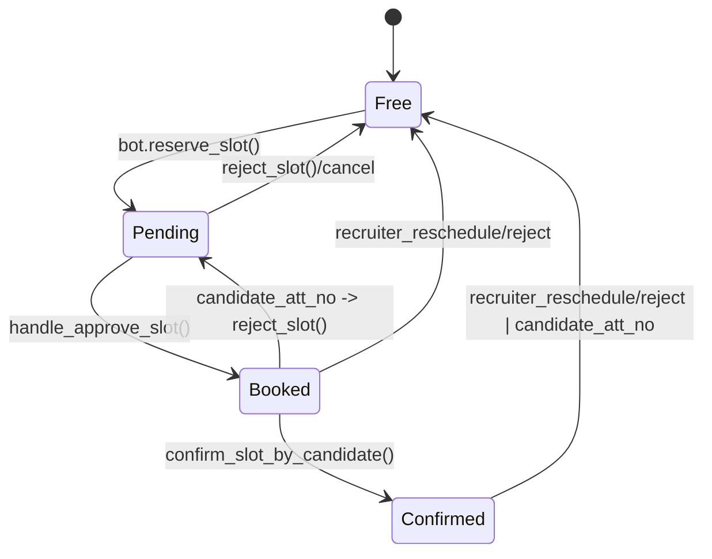
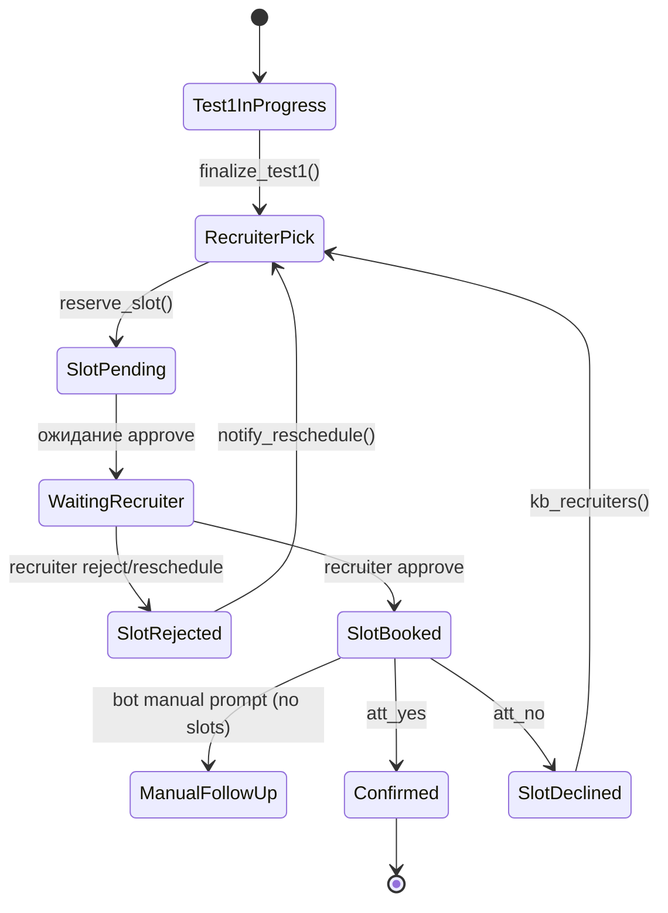

# Тест 1 — состояние слота и кандидата

## Slot lifecycle

### Allowed transitions & побочные эффекты
| From | To | Trigger | Код | Побочные эффекты |
|------|----|---------|-----|------------------|
| Free | Pending | Кандидат выбирает слот (`reserve_slot`) | `backend/domain/repositories.py` | Заполнение `candidate_*`, создание `SlotReservationLock` (TTL 5 мин) |
| Pending | Booked | Рекрутёр жмёт «Согласовано» (`handle_approve_slot` → `approve_slot`) | `backend/apps/bot/services.py` | Отправка сообщения кандидату, `notification_logs` (`candidate_interview_confirmed`), планирование напоминаний |
| Pending/Booked | Free | Рекрутёр жмёт «Перенести» / «Отказать» (`handle_reschedule_slot` / `handle_reject_slot`) | `backend/apps/bot/services.py` + `reject_slot` | Отмена напоминаний, уведомление кандидата (reschedule/reject) |
| Booked | Confirmed | Кандидат жмёт «Подтверждаю» (`handle_attendance_yes` → `confirm_slot_by_candidate`) | `backend/apps/bot/services.py` | `Slot.status=confirmed_by_candidate`, `notification_logs` (`candidate_confirm`), перезапланированные напоминания (без confirm-промптов) |
| Confirmed | Free | Перенос/отказ (рекрутёр или кандидат «Не смогу») | `handle_reschedule_slot` / `handle_attendance_no` | Очистка кандидата, отмена напоминаний, уведомление рекрутёра |

> ⚠️ См. аудит: NotificationLog не очищается при переходах на `Free`, что ломает повторную цепочку.

## Candidate flow (Test 1)

### Таблица допустимых переходов кандидата
| From | To | Условие/действие | Побочные эффекты |
|------|----|------------------|------------------|
| Test1InProgress | RecruiterPick | `finalize_test1` завершает анкету | Рассылка Test 1 рекрутёрам, показ меню выбора рекрутёра |
| RecruiterPick | SlotPending | `handle_pick_slot` → `reserve_slot` | Сообщение рекрутёру, шаблон «slot_sent» кандидату |
| SlotPending | SlotRejected | Рекрутёр нажал «Отказать/Перенести» | Бот уведомляет кандидата (отказ/перенос), очищает state |
| SlotPending | SlotBooked | Рекрутёр подтвердил | Бот отправляет приглашение (см. P0), планирует напоминания |
| SlotBooked | Confirmed | Кандидат жмёт «Подтверждаю» | Ссылка на телемост, отмена confirm-подсказок |
| SlotBooked | SlotDeclined | Кандидат жмёт «Не смогу» | Слот освобождён, рекрутёр уведомлён, кандидат возвращён к выбору |
| SlotDeclined/SlotRejected | RecruiterPick | Бот повторно показывает список рекрутёров | Сброс `picked_slot_id`, `picked_recruiter_id` |
