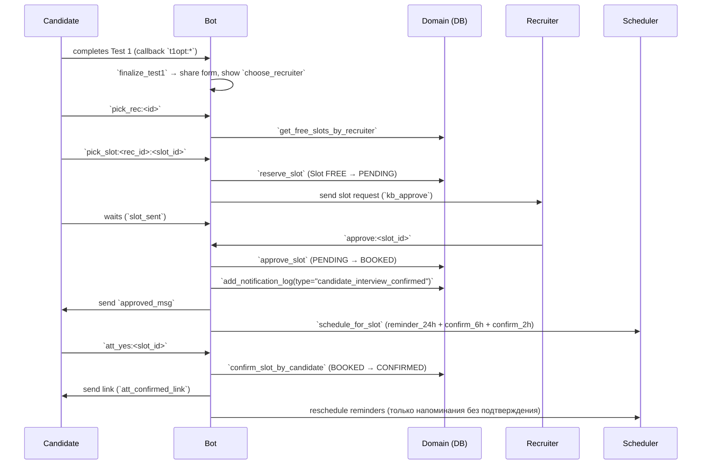
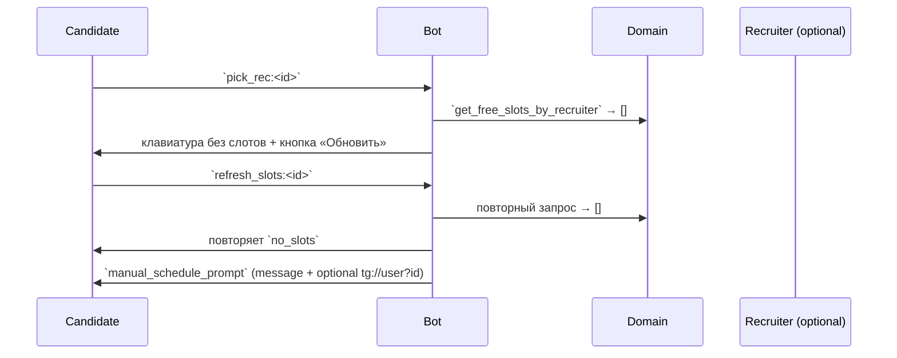
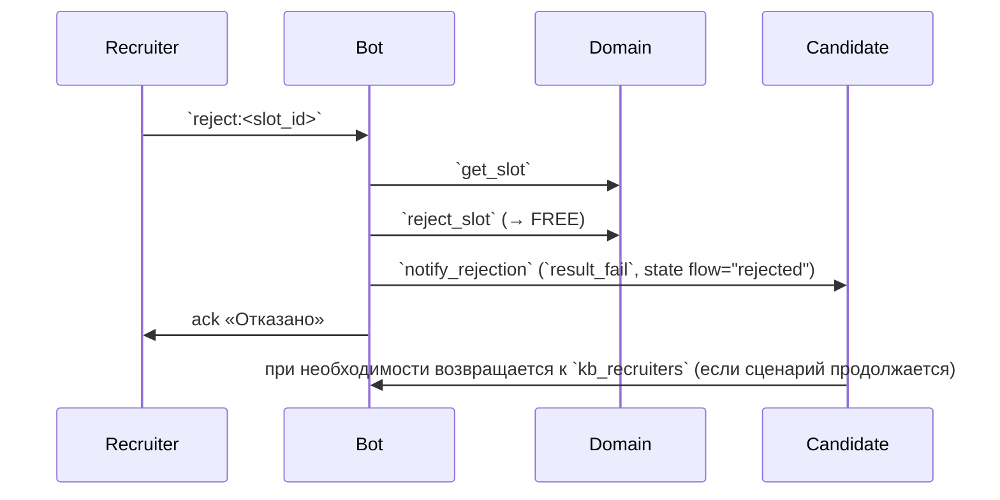

# TEST 1 — Sequence Traces

## 1. Happy path (Test 1 → слот → согласование → подтверждение)


## 2. Нет свободных слотов


## 3. Перенос по решению рекрутёра
```mermaid
sequenceDiagram
    participant R as Recruiter
    participant B as Bot
    participant D as Domain
    participant C as Candidate
    participant S as Scheduler

    R->>B: `reschedule:<slot_id>`
    B->>D: `get_slot`
    B->>D: `reject_slot` (PENDING/BOOKED/CONFIRMED → FREE)
    B->>S: `cancel_for_slot`
    B->>C: `notify_reschedule` (template `slot_reschedule`, state reset)
    B->>R: ack message «Перенос»
    C->>B: выбирает нового рекрутёра/слот (возврат к flow RecruiterPick)
    (далее повторяется happy-path)
```

## 4. Отказ рекрутёра


> См. P0: NotificationLog не очищается в шагах `reject_slot`, что ломает повторный happy-path.
