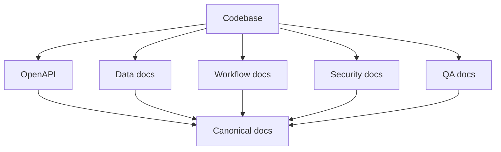

# ADR 0001: Canonical docs and Mermaid as source of truth

## Header
- Purpose: Зафиксировать canonical documentation system для RecruitSmart Admin с Markdown + Mermaid как основной формой описания архитектуры, flow и QA-контроля.
- Owner: Architecture / Documentation
- Status: Accepted
- Last Reviewed: 2026-03-25
- Source Paths: `docs/architecture/*`, `docs/data/*`, `docs/frontend/*`, `docs/security/*`, `docs/qa/*`, `docs/adr/*`
- Related Diagrams: `docs/architecture/core-workflows.md`, `docs/data/erd.md`, `docs/qa/critical-flow-catalog.md`
- Change Policy: Изменение этого ADR допускается только через новое ADR, а не прямой перепиской смысла.

## Context
Проект уже живёт как modular monolith с несколькими runtime boundaries: admin UI, admin API, bots, portal flows, scheduling, messaging, HH sync и AI-assisted сценарии. Команде нужен единый, проверяемый и масштабируемый способ описания системы без расползания смысла по архивным заметкам.

## Decision
- Каноническая документация хранится в Markdown.
- Диаграммы и схемы в canonical docs пишутся в Mermaid.
- Source of truth разделён по доменам:
  - HTTP contracts: backend OpenAPI
  - data model: `docs/data/*`
  - workflows / interactions: `docs/architecture/*`
  - security model: `docs/security/*`
  - QA / release criteria: `docs/qa/*`
- Архивные документы остаются историческими и не считаются рабочим source of truth.

## Consequences
- Команды backend, frontend, QA, design и analytics получают единый набор входных документов.
- Документация становится проверяемой и пригодной для онбординга.
- Mermaid обеспечивает быстрое сопровождение flow и state diagrams без отдельного графического инструмента.
- Любое изменение source of truth требует обновления соответствующих canonical docs.

## Mermaid

