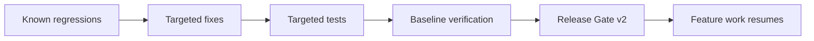

# ADR 0002: Phase 0 stabilization before feature work

## Header
- Purpose: Зафиксировать правило, что перед расширением функционала в RecruitSmart Admin необходимо закрыть stabilization tranche и собрать reproducible quality baseline.
- Owner: QA / Release Engineering
- Status: Accepted
- Last Reviewed: 2026-03-25
- Source Paths: `docs/qa/*`, `backend/tests/`, `frontend/app/tests/`, `Makefile`, `package.json`
- Related Diagrams: `docs/qa/release-gate-v2.md`, `docs/qa/master-test-plan.md`
- Change Policy: Изменяется только новым ADR и только если изменяется release philosophy или gating policy.

## Context
В monolith-проекте есть взаимосвязанные areas: portal, scheduling, messaging, bots, AI flows, dashboard. Без stabilizing baseline новые изменения могут замаскировать существующие регрессии и усложнить ownership.

## Decision
- Новые feature-доработки не являются приоритетом до завершения Phase 0 stabilization.
- Phase 0 включает:
  - сбор baseline verification snapshot
  - устранение известных red regressions
  - добавление targeted regression tests
  - фиксацию release evidence
- Release Gate v2 обязателен для любого release candidate.

## Consequences
- Сначала снижается риск ложного green и деградации core flows.
- QA получает устойчивый процесс triage и blocking criteria.
- Backend и frontend команды работают от одного baseline и одного evidence pack.
- Документация и тесты становятся обязательной частью release readiness, а не постфактум-описанием.

## Baseline expectations

## Notes
- Это ADR не меняет deployment/runtime model.
- Это ADR не вводит микросервисную архитектуру.
- Это ADR не заменяет backend OpenAPI, data docs, workflow docs или security docs как source of truth в их доменах.

