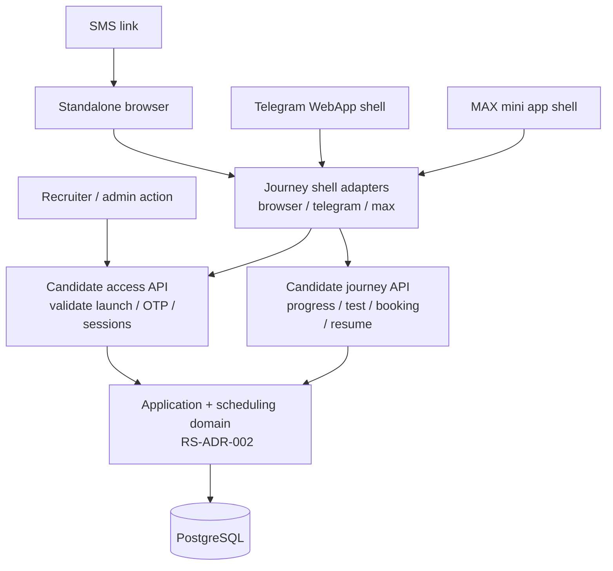
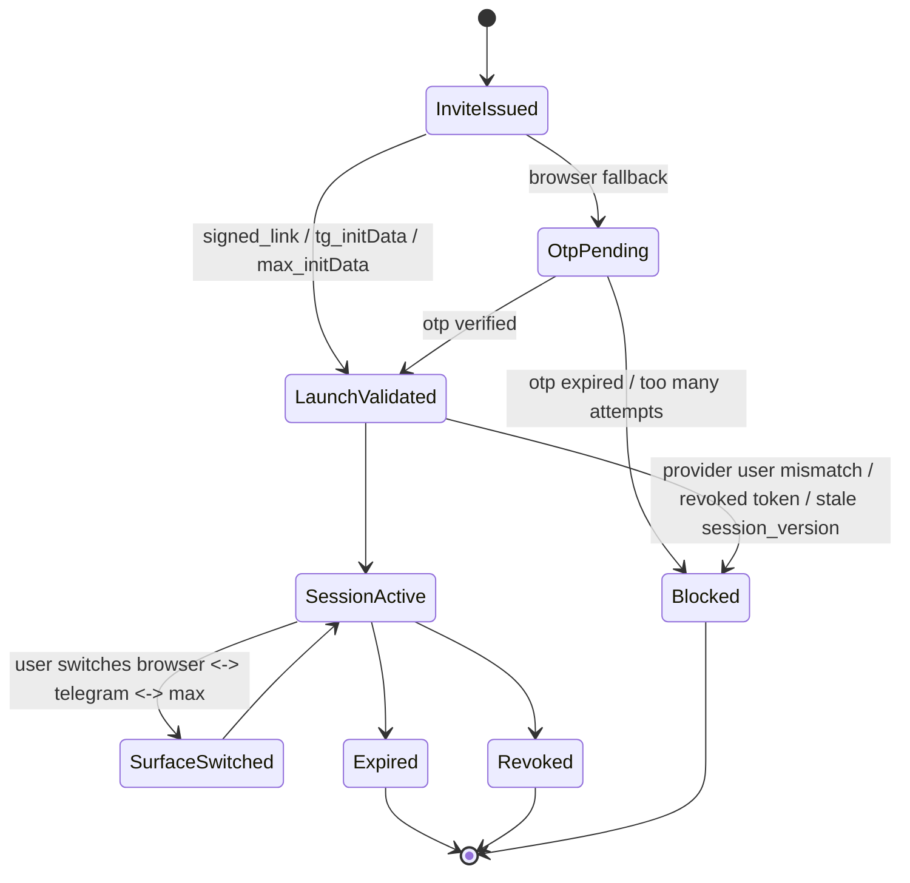
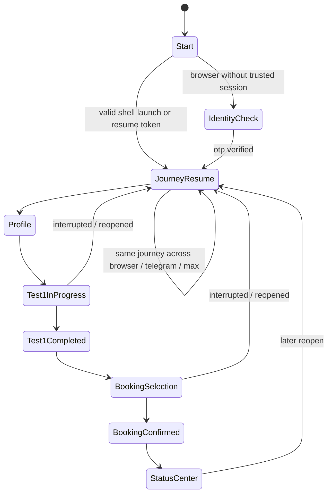

# RS-ADR-004: Candidate Access And Journey Surfaces For Browser / Telegram / MAX / SMS

## Статус
Proposed

## Дата
2026-04-16

## Связанные решения

- [RS-ADR-002: Target Data Model For Candidate, Application, Requisition, Lifecycle, And Event Log](/Users/mikhail/Projects/recruitsmart_admin/docs/architecture/adr/rs-adr-002-application-requisition-lifecycle-event-log.md)
- [ADR-0003: Telegram/MAX Channel Ownership And Session Invalidation](/Users/mikhail/Projects/recruitsmart_admin/docs/adr/adr-0003-telegram-max-channel-ownership-and-session-invalidation.md)

## Внешний documentation context

Этот ADR опирается на официальный documentation context:

- MAX mini apps / MAX Bridge: [dev.max.ru/docs/webapps/introduction](https://dev.max.ru/docs/webapps/introduction)
- MAX Bridge / `initData` / `start_param` / `requestContact` / `openLink` / `openMaxLink`: [dev.max.ru/docs/webapps/bridge](https://dev.max.ru/docs/webapps/bridge)
- MAX validation algorithm for `WebAppData`: [dev.max.ru/docs/webapps/validation](https://dev.max.ru/docs/webapps/validation)
- MAX platform overview: [dev.max.ru/docs](https://dev.max.ru/docs)
- Telegram Mini Apps / `initData` validation: [core.telegram.org/bots/webapps](https://core.telegram.org/bots/webapps)

Критичные выводы из official docs, которые влияют на дизайн:

- MAX mini app работает как web surface поверх чат-бота и стандартных web-технологий, а не как отдельный runtime-продукт.
- MAX передаёт в mini app `window.WebApp.initData` и `start_param`; `startapp` ограничен 512 символами и допустимыми символами `A-Z`, `a-z`, `0-9`, `_`, `-`.
- MAX `openLink()` открывает внешний браузер, `openMaxLink()` открывает диплинк `https://max.ru/...` внутри MAX и требует явного user gesture.
- MAX `requestContact()` доступен как native affordance, но `SecureStorage` не поддерживается в web-версии и не должен быть обязательной частью auth-контракта.
- Telegram и MAX используют сходную модель server-side валидации `initData`: HMAC-SHA256 c константой `WebAppData` и bot token.

## Контекст

Текущий live runtime зафиксирован в canonical docs:

- candidate browser portal сейчас deliberately disabled и `/candidate*` возвращает `410 Gone`;
- `admin_api` уже обслуживает внешние non-admin surfaces: Telegram webapp и n8n HH callbacks;
- `candidate_journey_sessions`, `candidate_journey_step_states`, `candidate_invite_tokens`, `session_version` уже существуют как historical/additive foundation;
- Telegram recruiter webapp auth и `initData` validation уже реализованы в `backend/apps/admin_api/webapp/auth.py`;
- MAX bot runtime и candidate browser portal не считаются supported production promises до отдельного решения.

Проблема:

- сейчас нет одного поддерживаемого candidate-facing journey, который одинаково работает в browser, Telegram, MAX и через SMS fallback;
- MAX нельзя запускать как второй отдельный продукт с отдельными экранами, отдельным lifecycle и отдельными бэкенд-контрактами;
- browser flow обязателен как universal fallback;
- Test 1, booking, resume и candidate status visibility должны быть channel-agnostic;
- auth / launch surface и собственно journey progress сейчас смешаны в historical portal artifacts.

RS-ADR-002 уже разделяет person / application / requisition / event log. Этот ADR добавляет поверх него единый access/journey слой для candidate-facing surfaces.

## Решение

### 1. Один candidate journey core, несколько launch/auth adapters

Вводится единый candidate journey с одной frontend screen-logic и одним backend contract.

Поверх него работают 4 launch/auth surface:

- standalone browser;
- Telegram WebApp;
- MAX mini app;
- SMS link + OTP fallback.

Решение:

- browser, Telegram и MAX не получают отдельные бизнес-экраны;
- Telegram и MAX считаются shell-адаптерами над тем же journey core;
- различаются только:
  - launch entry;
  - auth bootstrap;
  - shell capabilities;
  - handoff UX;
- все post-auth journey endpoints и payloads одинаковы.

### 2. Browser становится обязательным canonical fallback

Browser flow обязателен как universal continuation surface:

- если shell unavailable или candidate вышел из MAX/Telegram, browser должен уметь продолжить тот же journey;
- recruiter invite package всегда содержит browser entry;
- MAX и Telegram не должны быть единственным способом пройти Test 1 или booking.

### 3. Candidate state должен быть channel-agnostic

Кандидатский state принадлежит не shell и не messenger runtime, а:

- `users` как person row на переходном этапе;
- `applications` как funnel grain из RS-ADR-002;
- `candidate_journey_sessions` как progress state;
- `candidate_access_tokens` / `candidate_access_sessions` как access/auth layer.

Следствия:

- shell switch не создаёт второй flow;
- Test 1 progress и booking state не теряются при переходе browser <-> Telegram <-> MAX;
- candidate-facing messages, status и steps читаются из одного journey envelope.

### 4. Access/auth отделяется от journey progress

Current `candidate_journey_sessions` уже хранит progress. Новый auth/access слой не должен дублировать progress state.

Решение:

- `candidate_journey_sessions` хранит progress;
- `candidate_access_tokens` хранит launch artifacts и one-time / short-lived access material;
- `candidate_access_sessions` хранит authenticated candidate session после успешного launch bootstrap;
- OTP и shell auth работают как способы открыть access session, а не как отдельные candidate flows.

### 5. MAX не становится отдельным продуктом

Прямой запрет:

- нельзя заводить отдельную MAX-only data model;
- нельзя заводить отдельные MAX-only статусы;
- нельзя делать отдельный MAX-only frontend для Test 1 и booking;
- нельзя переносить business logic в MAX shell adapter.

Разрешено только:

- MAX-specific bridge integration;
- MAX-safe launcher token;
- MAX-specific UI affordances для back/close/share/contact, не меняющие смысл screen logic.

## Target Principles

### Same frontend journey

- один route/state model для candidate journey;
- одинаковая screen logic для `profile -> test1 -> booking -> status`;
- одинаковый смысл CTA и одинаковая step-semantics;
- различается только shell chrome:
  - safe area;
  - back/close buttons;
  - native bridge calls;
  - launcher switch controls.

### Same backend contract

- после успешного launch bootstrap все surfaces используют одинаковые endpoints;
- backend payload для journey один и тот же;
- mutations возвращают один и тот же refreshed journey envelope;
- scheduling / tests / messaging / application lifecycle не зависят от surface.

### Different launch/auth surfaces

- browser: signed link, resume token, OTP;
- Telegram: `initData` + optional launch token;
- MAX: `initData` + `start_param` + optional launch token;
- SMS: browser link как transport + OTP fallback.

### Channel-agnostic candidate state

- candidate progress и application state не зависят от messenger platform;
- канал влияет только на launch, delivery, native affordances и audit;
- candidate journey должен быть резюмируемым из любого supported surface при наличии валидного access context.

## Target Architecture



### Boundary choice

Целевой public candidate boundary должен жить отдельно от recruiter `/api/webapp/*`.

Рекомендуемое размещение:

- candidate access/journey API размещается как новый public boundary рядом с `admin_api`, а не как расширение recruiter Telegram webapp endpoints;
- candidate browser shell может быть отдан тем же статическим frontend bundle, но его API-authority остаётся отдельным candidate access/journey boundary;
- `admin_ui` session/CSRF boundary не должен становиться implicit trust anchor для public candidate launch.

Причина:

- `admin_api` уже обслуживает внешние auth-like surfaces и callback boundaries;
- recruiter Telegram webapp и candidate journey — разные trust boundaries;
- public browser candidate flow не должен наследовать admin/browser semantics по умолчанию.

## Target Frontend Contract

### Journey shell model

Frontend делится на 2 слоя:

1. `journey-core`
2. `surface-adapter`

`journey-core` owns:

- route/state progression;
- Test 1 screens;
- booking screens;
- progress save/resume;
- status center;
- shared copy and UX semantics.

`surface-adapter` owns:

- init bridge bootstrap;
- back/close/share/contact integration;
- launcher handoff;
- shell capability detection.

### Surface capabilities

`journey-core` не должен знать о Telegram или MAX напрямую. Он получает только `surface_capabilities`.

Пример:

```json
{
  "surface": "max_miniapp",
  "can_close": true,
  "can_open_external_browser": true,
  "can_open_native_link": true,
  "can_request_contact": true,
  "can_share": true,
  "native_back_button": true
}
```

Shell-specific bridge calls не меняют journey semantics.

## Data Model Additions

### Reuse existing progress model

Существующие таблицы:

- `candidate_journey_sessions`
- `candidate_journey_step_states`

сохраняются как journey progress model.

### Extend `candidate_journey_sessions`

Additive fields:

| Field | Type | Null | Purpose |
| --- | --- | --- | --- |
| `application_id` | FK -> `applications.id` | yes in migration | привязка journey к application grain из RS-ADR-002 |
| `last_access_session_id` | FK -> `candidate_access_sessions.id` | yes | ссылка на последнее успешное authenticated session |
| `last_surface` | varchar(32) | yes | `standalone_web`, `telegram_webapp`, `max_miniapp` |
| `last_auth_method` | varchar(32) | yes | audit/debug |

`entry_channel` и `session_version` остаются и продолжают использоваться как compatibility layer.

### New table: `candidate_access_tokens`

Назначение:

- invite / launcher / resume / OTP challenge material;
- привязка launch surface к candidate/application/journey;
- revocation, TTL и replay protection.

#### Columns

| Column | Type | Null | Notes |
| --- | --- | --- | --- |
| `id` | integer PK | no | surrogate key |
| `token_id` | uuid | no | public token reference |
| `token_hash` | varchar(128) | no | хранится только hash opaque token secret |
| `candidate_id` | FK -> `users.id` | no | person |
| `application_id` | FK -> `applications.id` | yes | target application |
| `journey_session_id` | FK -> `candidate_journey_sessions.id` | yes | target progress session |
| `token_kind` | varchar(24) | no | `invite`, `launch`, `resume`, `otp_challenge` |
| `journey_surface` | varchar(24) | no | `standalone_web`, `telegram_webapp`, `max_miniapp` |
| `auth_method` | varchar(24) | no | `telegram_init_data`, `max_init_data`, `signed_link`, `otp`, `admin_invite` |
| `launch_channel` | varchar(16) | no | `telegram`, `max`, `sms`, `email`, `manual`, `hh` |
| `launch_payload_json` | jsonb | yes | deep link context, source message id, campaign, shell params |
| `start_param` | varchar(512) | yes | opaque MAX/Telegram-safe launch reference; never full JWT |
| `provider_user_id` | varchar(64) | yes | linked Telegram/MAX user id snapshot if known |
| `provider_chat_id` | varchar(64) | yes | optional shell chat context |
| `session_version_snapshot` | integer | yes | binds token to journey security version |
| `phone_verification_state` | varchar(24) | no | `not_required`, `pending`, `verified`, `failed`, `expired` |
| `phone_delivery_channel` | varchar(16) | yes | `sms`, `telegram`, `max`, `email` |
| `secret_hash` | varchar(128) | yes | only for `otp_challenge` |
| `attempt_count` | integer | no | default 0 |
| `max_attempts` | integer | no | default 5 |
| `correlation_id` | uuid | yes | workflow trace |
| `idempotency_key` | varchar(128) | yes | create-invite idempotency |
| `issued_by_type` | varchar(32) | yes | `admin`, `recruiter`, `system` |
| `issued_by_id` | varchar(64) | yes | actor id |
| `expires_at` | timestamptz | no | TTL |
| `consumed_at` | timestamptz | yes | first successful exchange |
| `revoked_at` | timestamptz | yes | revocation |
| `last_seen_at` | timestamptz | yes | last validation attempt |
| `created_at` | timestamptz | no | created timestamp |
| `metadata_json` | jsonb | yes | extra audit context |

#### Indexes and constraints

- unique on `token_id`;
- unique on `token_hash`;
- index on `(candidate_id, token_kind, expires_at)`;
- index on `(application_id, token_kind, expires_at)`;
- index on `(journey_session_id, token_kind)`;
- unique on `(start_param)` where not null;
- index on `(launch_channel, auth_method, created_at desc)`.

#### Notes

- `start_param` must be an opaque short reference because MAX `startapp` is limited to 512 chars and a restricted character set by official docs.
- Token rows are not progress rows. They are launch/auth artifacts.
- `invite` token may be multi-open until revoked, but only for the same candidate identity and current `session_version_snapshot`.
- `launch` and `resume` tokens are short-lived exchange tokens.
- `otp_challenge` rows are one-time and attempt-limited.

### New table: `candidate_access_sessions`

Назначение:

- authenticated candidate session after successful launch validation;
- единая post-auth session layer для browser, Telegram и MAX;
- server-side source of truth for session expiry, refresh and revocation.

#### Columns

| Column | Type | Null | Notes |
| --- | --- | --- | --- |
| `id` | integer PK | no | surrogate key |
| `session_id` | uuid | no | public opaque session ref |
| `candidate_id` | FK -> `users.id` | no | person |
| `application_id` | FK -> `applications.id` | yes | current application |
| `journey_session_id` | FK -> `candidate_journey_sessions.id` | no | progress session |
| `origin_token_id` | FK -> `candidate_access_tokens.id` | yes | bootstrap source |
| `journey_surface` | varchar(24) | no | `standalone_web`, `telegram_webapp`, `max_miniapp` |
| `auth_method` | varchar(24) | no | same enum as token |
| `launch_channel` | varchar(16) | no | original transport |
| `provider_session_id` | varchar(128) | yes | Telegram/MAX `query_id` or equivalent |
| `provider_user_id` | varchar(64) | yes | Telegram/MAX user id snapshot |
| `session_version_snapshot` | integer | no | must match current journey security version |
| `phone_verification_state` | varchar(24) | no | `required`, `pending`, `verified`, `bypassed`, `expired` |
| `phone_verified_at` | timestamptz | yes | when OTP or trusted launch verified phone state |
| `phone_delivery_channel` | varchar(16) | yes | where OTP was delivered |
| `csrf_nonce` | varchar(128) | yes | only for cookie-bound session flows |
| `status` | varchar(16) | no | `active`, `expired`, `revoked`, `blocked` |
| `issued_at` | timestamptz | no | session start |
| `last_seen_at` | timestamptz | yes | rolling activity |
| `refreshed_at` | timestamptz | yes | last refresh |
| `expires_at` | timestamptz | no | idle / absolute expiry |
| `revoked_at` | timestamptz | yes | explicit revoke |
| `correlation_id` | uuid | yes | end-to-end trace |
| `metadata_json` | jsonb | yes | device, ua hash, capabilities snapshot |

#### Indexes and constraints

- unique on `session_id`;
- index on `(candidate_id, status, expires_at)`;
- index on `(application_id, status, expires_at)`;
- index on `(journey_session_id, status)`;
- index on `(provider_user_id, journey_surface, issued_at desc)`.

### Why both tables are needed

`candidate_access_tokens` and `candidate_access_sessions` intentionally remain separate:

- token = bootstrap artifact;
- session = authenticated working context.

Без этого separation придётся смешивать:

- invite/reissue/revoke;
- OTP challenge lifecycle;
- browser/session refresh;
- shell replay protection;
- journey progress.

## Phone Verification State

Phone verification belongs to access/auth context, not to shell UI.

Canonical states:

- `required`
- `pending`
- `verified`
- `bypassed`
- `expired`
- `failed`

Rules:

- browser first-entry without trusted shell identity starts in `required` or `pending`;
- Telegram/MAX trusted launch may start in `bypassed` only if shell identity is already bound to candidate and the launch token matches candidate/application;
- after successful OTP, session becomes `verified`;
- OTP expiry or max attempts produce `expired` / `failed`.

## Auth Flows

### 1. Telegram `initData` validation

Контракт:

- frontend sends raw `Telegram.WebApp.initData` to backend;
- backend validates HMAC with bot token and constant `WebAppData`;
- backend validates `auth_date` freshness;
- backend never trusts `initDataUnsafe`;
- backend resolves `provider_user_id` from validated payload only.

Rules:

- `initData` is a launch/auth proof, not the full business context;
- candidate/application context must come from signed launch token, direct launch link, or existing bound access session;
- if Telegram user already linked to another candidate, validation succeeds but launch is blocked at identity resolution stage;
- if token and Telegram user point to the same candidate, repeated launch is idempotent.

### 2. MAX `WebApp.initData` validation

Контракт:

- frontend sends raw `window.WebApp.initData` to backend;
- backend validates `WebAppData` according to official MAX validation algorithm;
- backend validates `auth_date` freshness and uniqueness/idempotency of `query_id` per access session;
- backend never trusts `initDataUnsafe` as identity proof;
- `start_param` is treated only as opaque launcher reference.

Official-doc-driven constraints:

- MAX `start_param` is short and restricted, therefore only a compact opaque token ref is allowed;
- `openMaxLink()` and `openLink()` require explicit user gesture, so cross-surface handoff must always be user-initiated;
- `SecureStorage` must not be a required auth dependency because official docs note it is unsupported in web-version and surface-dependent;
- `requestContact()` may improve UX but does not replace server-side identity and OTP verification.

### 3. Signed link + OTP for browser

Контракт:

- browser invite opens `/candidate/start` with signed opaque token reference;
- backend validates token, TTL, revocation, session-version snapshot and target candidate/application;
- if token is absent, expired, or insufficient for trust elevation, browser falls back to phone + OTP;
- OTP verifies control over the candidate’s phone-based identity before issuing a full access session.

Rules:

- browser flow is always available even when shell launch fails;
- signed link does not expose `candidate_id`, `application_id`, recruiter id or raw JWT payload in URL;
- OTP flow must be anti-enumeration safe: same visible UI path for known and unknown phone numbers;
- OTP delivery channel is preferably SMS once implemented, but migration can temporarily route OTP through linked Telegram/MAX/email while keeping the same auth model.

### 4. Session refresh and expiry

Рекомендуемая модель:

- candidate access session stored server-side;
- browser/webview receives opaque session cookie + CSRF nonce after successful bootstrap;
- idle refresh allowed only while:
  - session status = `active`;
  - `session_version_snapshot` still matches journey security version;
  - absolute TTL not exceeded.

Session types:

- access session: authenticated runtime session;
- invite/launch token: bootstrap only, not long-lived session.

### 5. Replay protection

Rules:

- `candidate_access_tokens.token_hash` is one-way stored and never returned after creation;
- `otp_challenge` tokens are one-time and attempt-limited;
- launch tokens are bound to `session_version_snapshot`;
- Telegram/MAX `provider_session_id` (`query_id`) is stored for idempotent launch handling and suspicious replay detection;
- same token + same provider user + same session version can reopen idempotently;
- same token + different provider user must fail closed and produce audit event;
- revoked or superseded tokens must never silently succeed.

### 6. Correlation and idempotency

Rules:

- every invite package gets `correlation_id`;
- every candidate write mutation accepts `X-Idempotency-Key`;
- `create invite`, `validate launch`, `otp send`, `otp verify`, `complete test`, `confirm booking`, `cancel`, `reschedule` all write auditable events with the same correlation chain;
- shell launch itself is never trusted as a write event without server-side idempotency and audit.

## Launch Flows

### Recruiter sends invite

1. Recruiter or admin requests an invite package for candidate + application.
2. Backend issues:
   - browser link;
   - optional Telegram launcher;
   - optional MAX launcher;
   - correlation id.
3. Invite package is delivered over selected transport:
   - Telegram
   - MAX
   - SMS
   - email
   - HH
   - manual copy
4. All launchers resolve to the same target `candidate_id + application_id + journey_session_id`.

### Candidate opens via Telegram

1. Candidate taps Telegram web app button or direct mini app link.
2. Telegram provides `initData`.
3. Frontend sends `initData` plus optional launch token/start param to `validate launch`.
4. Backend validates Telegram payload, resolves candidate/application, creates or refreshes `candidate_access_session`.
5. Frontend starts the shared journey core with the same envelope used by browser/MAX.

### Candidate opens via MAX `startapp`

1. Candidate taps MAX bot/mini-app launcher.
2. MAX mini app receives `initData` and `start_param`.
3. Frontend sends them to `validate launch`.
4. Backend validates MAX `WebAppData`, resolves short `start_param` reference, creates or refreshes `candidate_access_session`.
5. Shared journey core starts.

### Candidate opens via SMS/browser

1. Candidate opens browser link from SMS, email, HH or copied URL.
2. Browser sends signed link token to `validate launch`.
3. If link is insufficient, expired or missing, backend requests phone verification.
4. Candidate enters phone and OTP.
5. Backend verifies OTP and creates `candidate_access_session`.
6. Shared journey core starts.

### Candidate resumes interrupted Test 1

1. Candidate reopens any valid surface.
2. Backend resolves active `candidate_access_session` or issues a fresh one against the same `journey_session_id`.
3. Frontend loads the saved `candidate_journey_session` and `candidate_journey_step_state`.
4. Test 1 resumes from last saved progress, independent of surface.

### Candidate moves from Test 1 to booking without losing context

1. Candidate completes Test 1.
2. Backend writes completion into journey state and application events.
3. Response returns the same journey envelope with booking section activated.
4. Candidate enters slot selection immediately in the same core flow.
5. If the shell changes before booking, reopening restores the same `journey_session_id` and booking context.

## State Diagrams

### Access lifecycle



### Journey continuity



## Shared Journey Envelope

All surfaces should consume one envelope, for example `CandidateJourneyEnvelopeV1`.

Core sections:

```json
{
  "schema_version": "2026-04-16.v1",
  "access": {
    "session_id": "uuid",
    "surface": "standalone_web|telegram_webapp|max_miniapp",
    "auth_method": "telegram_init_data|max_init_data|signed_link|otp|admin_invite",
    "launch_channel": "telegram|max|sms|email|manual|hh",
    "expires_at": "datetime",
    "phone_verification_state": "verified"
  },
  "candidate": {
    "candidate_id": 123
  },
  "application": {
    "application_id": 456,
    "requisition_id": 789,
    "lifecycle_status": "qualification_pending"
  },
  "journey": {
    "journey_session_id": 42,
    "current_step_key": "test1",
    "steps": []
  },
  "test1": {},
  "booking": {},
  "status_center": {},
  "surface_capabilities": {}
}
```

Rules:

- this envelope is identical across browser, Telegram and MAX;
- only `access` and `surface_capabilities` vary by shell;
- business sections remain surface-agnostic.

## API Proposal

### Access APIs

| Endpoint | Purpose | Auth before call | Idempotency |
| --- | --- | --- | --- |
| `POST /api/candidate-access/invites` | create invite/access package | recruiter/admin principal | required |
| `POST /api/candidate-access/launch/validate` | validate signed link or shell launch | none; validates token/initData | idempotent by token/query_id |
| `POST /api/candidate-access/otp/send` | start OTP challenge | none or pre-validated link context | required |
| `POST /api/candidate-access/otp/verify` | verify OTP and open session | challenge token | required |
| `POST /api/candidate-access/session/refresh` | refresh active session | candidate access session | idempotent |
| `POST /api/candidate-access/session/revoke` | logout / revoke session | candidate access session or admin | idempotent |
| `POST /api/candidate-access/surface/switch` | persist shell switch and return launcher URL | candidate access session | required |

### Journey APIs

| Endpoint | Purpose | Auth | Idempotency |
| --- | --- | --- | --- |
| `POST /api/candidate-journey/start` | bootstrap journey envelope after launch validation | candidate access session | idempotent |
| `GET /api/candidate-journey/current` | current envelope / resume | candidate access session | n/a |
| `PATCH /api/candidate-journey/progress` | save draft / step progress | candidate access session + CSRF for cookie session | required |
| `POST /api/candidate-journey/test1/complete` | finalize Test 1 | candidate access session + CSRF | required |
| `GET /api/candidate-journey/slots` | list slots for current application | candidate access session | n/a |
| `POST /api/candidate-journey/slots/select` | select slot | candidate access session + CSRF | required |
| `POST /api/candidate-journey/booking/confirm` | confirm booking | candidate access session + CSRF | required |
| `POST /api/candidate-journey/booking/cancel` | cancel booking | candidate access session + CSRF | required |
| `POST /api/candidate-journey/booking/reschedule` | request reschedule | candidate access session + CSRF | required |

### Access endpoint semantics

#### `POST /api/candidate-access/invites`

Request creates one invite package with:

- browser URL;
- optional Telegram launcher;
- optional MAX launcher;
- launch metadata;
- `correlation_id`.

#### `POST /api/candidate-access/launch/validate`

Accepts one of:

- signed browser token;
- Telegram `initData`;
- MAX `initData` + `start_param`;
- existing active session cookie.

Response:

- success: `CandidateJourneyEnvelopeV1` or bootstrap session context;
- blocked: structured reason (`identity_mismatch`, `token_expired`, `otp_required`, `session_revoked`, `stale_launch_version`);
- duplicate/idempotent launch reuses current session when safe.

### Journey mutation contract

Every write mutation:

- accepts `X-Idempotency-Key`;
- returns refreshed journey envelope;
- writes application/journey/access audit events;
- never returns shell-specific business state.

## Security

### Signed links

Rules:

- link contains only opaque token reference, not business payload;
- server stores only token hash;
- tokens are revocable and TTL-bound;
- tokens are bound to `candidate_id`, `application_id`, `journey_session_id`, and `session_version_snapshot`.

### OTP

Rules:

- OTP challenge stored as `otp_challenge` token or equivalent persisted challenge artifact;
- OTP codes are hashed at rest;
- OTP flow must be anti-enumeration-safe;
- browser fallback default should prefer SMS when provider becomes available;
- until SMS exists in runtime, same OTP model may temporarily deliver via Telegram/MAX/email without changing the API contract.

### CSRF applicability

Decision:

- pre-auth bootstrap endpoints do not use cookies as trust anchor and are CSRF-exempt;
- post-auth journey session uses secure cookie + CSRF nonce, including inside Telegram/MAX webviews;
- this keeps browser, Telegram and MAX on one mutation contract and avoids leaking bearer session tokens into JS storage by default.

### `initData` validation

Rules:

- Telegram and MAX `initData` are validated server-side only;
- `initDataUnsafe` is never identity source;
- `auth_date` freshness is checked;
- provider-side user id is not enough without candidate/application resolution.

### TTLs

Recommended defaults:

- invite token: 7 days, revocable, reusable only for same identity and current journey security version;
- launch token: 15 minutes;
- OTP challenge: 10 minutes, max 5 attempts;
- candidate access session idle TTL: 8 hours;
- candidate access session absolute TTL: 7 days with rolling refresh only while journey remains active.

### Rate limits

Minimum requirements:

- per IP on `launch/validate`, `otp/send`, `otp/verify`;
- per candidate/application on invite creation;
- per phone hash on OTP sends and verifies;
- per provider user id on shell launch bootstrap;
- suspicious replay/mismatch escalates to audit and temporary block.

### Audit

Audit events required:

- invite created / reissued / revoked;
- launch validated / blocked;
- OTP sent / verified / expired / failed;
- session refreshed / revoked / expired;
- surface switched;
- Test 1 completed;
- slot selected / booking confirmed / cancelled / rescheduled.

These events should map into `application_events` from RS-ADR-002 plus dedicated security/audit logs where needed.

## Migration Strategy

### Goal

Встроить candidate journey в current runtime так, чтобы:

- не сломать supported recruiter Telegram webapp;
- не превратить MAX в отдельный продукт;
- вернуть browser flow только через новый controlled boundary;
- сделать browser default fallback before broad shell rollout.

### Phase A — foundation only

- add `candidate_access_tokens` and `candidate_access_sessions`;
- extend `candidate_journey_sessions` with `application_id` and latest access links;
- no public `/candidate*` restore yet;
- no recruiter webapp behavior changes.

### Phase B — hidden browser bootstrap

- enable candidate public shell behind feature flag and allowlist, instead of `410`, only for controlled pilot;
- add browser signed-link + OTP flow;
- keep recruiter Telegram webapp untouched;
- keep MAX disabled.

### Phase C — shared journey core

- route candidate browser through shared journey envelope and shared step logic;
- make Test 1 and booking use the new journey contract;
- persist progress in `candidate_journey_sessions` linked to `applications`;
- keep legacy bot-only candidate flows as compatibility wrappers where needed.

### Phase D — Telegram shell adapter

- add candidate-facing Telegram WebApp launch as shell adapter over the shared journey core;
- use `initData` only for launch/auth;
- do not fork candidate screens;
- keep recruiter `/api/webapp/*` routes unchanged.

### Phase E — MAX shell adapter

- add MAX mini app bootstrap using official `initData` validation and short `start_param`;
- same shared journey core, same APIs;
- shell-specific layer limited to MAX Bridge integration;
- browser remains universal fallback.

### Phase F — browser becomes default continuation path

- every recruiter invite package sends browser URL as canonical fallback;
- Telegram and MAX buttons become convenience launchers over the same journey;
- SMS link + OTP becomes default non-messenger continuation path.

## No-Go Areas

- no separate MAX-only product surface;
- no separate Telegram-only candidate business screens;
- no candidate state duplicated by channel;
- no direct shell writes into PostgreSQL;
- no shell-specific lifecycle statuses;
- no dependence on MAX SecureStorage or Telegram local storage for canonical auth state;
- no breaking changes to current recruiter Telegram webapp routes during rollout.

## Risks

| Risk | Why it matters | Mitigation | Rollback |
| --- | --- | --- | --- |
| Browser portal broadens public trust boundary | current runtime deliberately closed `/candidate*` | introduce new candidate access boundary, feature flag, strict signed-link/OTP/CSRF model | return `/candidate*` to `410`, keep tables additive |
| Telegram and MAX diverge into separate UX | shell teams may start forking screens | enforce one shared journey envelope and one core screen model | disable shell-specific rollout, keep browser only |
| MAX `start_param` overflow or unsafe encoding | official MAX docs cap `startapp` at 512 chars and restricted charset | use only opaque short token refs | drop MAX shell launch, keep browser fallback |
| Replay or token theft | public launch surfaces increase attack surface | server-side token hashing, TTLs, session-version binding, provider-user mismatch blocking | revoke tokens and force OTP/browser re-entry |
| OTP abuse / phone enumeration | public browser flow invites brute force and discovery | anti-enumeration UI, rate limits, hashed phone lookup, attempt caps | temporarily disable OTP and require signed links only |
| Cookie / CSRF issues inside webviews | browser and shells share one post-auth contract | explicit candidate CSRF nonce and webview regression tests | switch mutations back to signed one-time action endpoints temporarily |
| Progress split between legacy bot flow and new journey | Test 1 / booking may fork state during migration | bind journey to `application_id` and keep one progress source | keep legacy flow primary until parity proven |
| Scheduling race conditions across surfaces | candidate may book/reschedule from multiple launchers | reuse existing reservation/idempotency invariants, access session correlation | freeze candidate-facing reschedule until conflict path is stable |

## Почему это решение

Это минимальный безопасный путь, потому что он:

- не ломает current supported recruiter Telegram webapp;
- делает browser обязательным fallback вместо shell lock-in;
- переиспользует уже существующий progress foundation (`candidate_journey_sessions`, `session_version`);
- не превращает MAX в отдельный продукт;
- естественно дополняет RS-ADR-002, где funnel truth already moves to `applications` and `application_events`.

## Rollout Deliverables

1. Schema design for `candidate_access_tokens` and `candidate_access_sessions`.
2. Candidate access API spec.
3. Shared journey envelope spec.
4. Browser signed-link + OTP threat model.
5. Telegram shell adapter spec.
6. MAX shell adapter spec using official MAX validation and bridge constraints.
7. Pilot rollout plan with feature flags and fallback to `410`.

## Proposed Implementation Backlog

1. Additive schema RFC for access tokens/sessions and `candidate_journey_sessions.application_id`.
2. Detailed auth bootstrap spec for Telegram, MAX, signed link, and OTP.
3. Candidate journey envelope schema and frontend shell adapter contract.
4. Candidate access API with idempotency and audit rules.
5. Browser pilot feature flag and fail-closed rollback gate.
6. Test 1 / booking shared screen spec with shell capability map.
7. Scheduling concurrency plan for candidate-facing booking APIs.
8. Candidate security regression suite: initData, signed links, OTP, CSRF, replay.
9. Telegram candidate shell rollout behind per-channel flag.
10. MAX candidate shell rollout behind per-channel flag and browser fallback enforcement.

## Assumptions

- `applications` from RS-ADR-002 becomes the canonical journey business grain even while `users` remains the physical candidate/person table.
- Public candidate browser portal remains disabled until explicitly enabled behind a new feature flag and candidate access boundary.
- Telegram and MAX bot tokens are available server-side for `initData` validation.
- SMS provider may arrive later, but the browser + OTP auth model should be designed now so transport can change without changing auth semantics.
- MAX official constraints on `start_param`, `initData`, `openLink`, `openMaxLink`, `requestContact` and unsupported web `SecureStorage` remain relevant until reverified during implementation.
