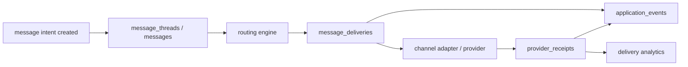

# RS-ADR-005: Messaging Delivery Model And Channel Routing For Telegram / MAX / SMS

## Status
Proposed

## Date
2026-04-16

## Companion To
- [RS-ADR-002: Target Data Model For Candidate, Application, Requisition, Lifecycle, And Event Log](./rs-adr-002-application-requisition-lifecycle-event-log.md)
- [ADR-0003: Telegram/MAX Channel Ownership And Session Invalidation](../../adr/adr-0003-telegram-max-channel-ownership-and-session-invalidation.md)

## Context

Текущая messaging-поверхность RecruitSmart собрана из нескольких полезных, но несвязанных слоёв:

- `chat_messages` хранит кандидатский чат, но не даёт first-class thread model и не отделяет message intent от provider delivery;
- `outbox_notifications` даёт retry queue для уведомлений по слотам, но остаётся slot-centric и не описывает fallback routing как отдельную доменную модель;
- `notification_logs`, `message_logs` и `bot_message_logs` полезны для аудита, но не дают канонической attempt/receipt semantics;
- `message_templates` уже различает `channel`, но по сути хранит channel-specific body, а не один intent с несколькими renderer-variant;
- `users.messenger_platform`, `users.telegram_*`, `users.max_user_id` и persisted degraded state покрывают только часть reachability/routing truth;
- текущий adapter contract в `backend/core/messenger/protocol.py` умеет только `send_message(...)` и не задаёт receipt ingestion, capability discovery, health probing или normalized failure classification.

В результате система пока не умеет как first-class capability:

- поддерживать unified thread model поверх Telegram / MAX / SMS / browser-link;
- хранить provider delivery attempts и receipts независимо от бизнес-сообщения;
- принимать routing decision из одного места с учётом consent, quiet windows, health и reachability;
- делать controlled fallback без duplicate spam;
- строить сквозную аналитику по source, channel, fallback и conversion;
- держать MAX/Telegram/SMS как clean adapter layer вместо ad hoc branching в workflow code.

При этом current runtime matrix остаётся без изменений:

- production-supported messaging runtime сегодня только Telegram;
- MAX bot сейчас disabled/historical;
- SMS и browser-link как delivery channel ещё не реализованы как runtime surface;
- этот ADR задаёт target model и phased rollout, а не немедленный runtime promise.

## Decision

### 1. Вводим unified messaging model поверх candidate/application model из RS-ADR-002

Новая модель отделяет:

- thread как бизнес-разговор с кандидатом;
- message как один message intent внутри thread;
- delivery как конкретную routed/attempted отправку в канал/провайдер;
- provider receipt как внешний факт от провайдера;
- contact policy как источник routing rules и spam-guards;
- channel health registry как persisted operational truth по каналу/провайдеру.

`messages` и `message_deliveries` должны ссылаться на:

- `candidate_id -> users.id`;
- `application_id -> applications.id` если сообщение связано с конкретной заявкой;
- `requisition_id -> requisitions.id` если нужен requisition-level reporting;
- `source_entity_type/source_entity_id` для `slot`, `slot_assignment`, `test_result`, `campaign_run`, `manual_outreach`.

### 2. Identity truth остаётся в RS-ADR-002, routing truth выносим в contact policy

`candidate_channel_identities` из RS-ADR-002 остаётся canonical identity layer для:

- Telegram user/chat identity;
- MAX identity;
- phone / SMS endpoint;
- browser-link or other externally routable endpoint.

Identity table не должна становиться delivery log. Для routing truth вводится `candidate_contact_policies`, а attempt-level факты уходят в `message_deliveries` и `provider_receipts`.

### 3. Thread model единый для всех candidate-facing каналов

Один business thread может переживать channel fallback без создания нового разговора.

Правила:

- thread по умолчанию якорится на `(candidate_id, application_id, thread_kind)`;
- если `application_id` ещё нет, допустим candidate-level thread;
- смена канала не создаёт новый thread;
- inbound reply по другому каналу маппится в существующий thread, если correlation и identity match подтверждены;
- thread хранит бизнес-контекст, а не transport-specific state.

### 4. Routing engine принимает решение по policy, health, capability и dedupe

Routing decision обязан учитывать:

- preferred channel для данного purpose/scope;
- наличие verified/serviceable endpoint;
- global and per-channel health;
- consent и quiet window;
- template renderer availability;
- urgency и fallback policy;
- cooldown/dedupe window, чтобы не дублировать один и тот же outreach.

### 5. Failure semantics стандартизируем в три класса

- `hard_fail`: terminal failure для данного endpoint/channel. Примеры: `blocked_user`, `invalid_recipient`, `provider_rejected_permanent`.
- `soft_fail`: канал пропущен из-за policy/capability, но не считается provider failure. Примеры: quiet window, нет consent для campaign SMS, template renderer missing, channel disabled, not verified for sensitive purpose.
- `temporary_fail`: retryable transport/provider condition. Примеры: timeout, 429, provider 5xx, transient network error.

Правило переходов:

- `hard_fail` обновляет reachability и разрешает fallback на следующий канал;
- `soft_fail` не бьёт health score канала, но разрешает fallback или defer по policy;
- `temporary_fail` сначала исчерпывает bounded retry budget на том же канале и только потом может открыть fallback.

### 6. n8n не является source of truth для delivery state

`n8n` может:

- создавать message intents через backend API;
- получать canonical events;
- запускать campaign orchestration;
- принимать решения higher-level workflow.

`n8n` не должен:

- писать напрямую в `messages`, `message_deliveries`, `provider_receipts`, `candidate_contact_policies`;
- считаться источником истины для delivered/failed/read;
- самостоятельно реализовывать fallback routing или dedupe state.

Причина: delivery state требует transaction-safe idempotency, receipt reconciliation, candidate spam guards и auditable joins с application lifecycle. Это доменная ответственность backend, а не workflow-оркестратора.

## Non-Goals

- нет runtime cutover в этом ADR;
- нет немедленной активации MAX bot или SMS provider;
- нет миграций и нет dual-write implementation в этой задаче;
- не переносим существующие `chat_messages` и `outbox_notifications` сразу в historical;
- не делаем `n8n` transport adapter.

## Target Schema

### `message_threads`

Purpose:

- канонический thread для всех candidate-facing разговоров;
- one thread survives channel fallback;
- thread является якорем для chat UI, routing history и analytics.

Recommended columns:

| Column | Type | Null | Notes |
| --- | --- | --- | --- |
| `id` | bigint PK | no | surrogate key |
| `thread_uuid` | uuid | no | public/correlation-safe id |
| `candidate_id` | FK -> `users.id` | no | person anchor |
| `application_id` | FK -> `applications.id` | yes | preferred grain for recruiting ops |
| `requisition_id` | FK -> `requisitions.id` | yes | analytics/reporting |
| `thread_kind` | varchar(32) | no | `recruiting`, `scheduling`, `campaign`, `support`, `reactivation` |
| `purpose_scope` | varchar(32) | no | `transactional`, `operational`, `campaign` |
| `source_entity_type` | varchar(32) | yes | `slot`, `slot_assignment`, `campaign_run`, `test_result` |
| `source_entity_id` | varchar(64) | yes | external-safe id |
| `status` | varchar(24) | no | `open`, `snoozed`, `closed`, `archived` |
| `current_primary_channel` | varchar(32) | yes | cached routing hint, not identity truth |
| `last_inbound_at` | timestamptz | yes | cached for inbox ordering |
| `last_outbound_at` | timestamptz | yes | cached for inbox ordering |
| `last_message_id` | FK -> `messages.id` | yes | optional denormalized pointer |
| `created_at` | timestamptz | no | created timestamp |
| `updated_at` | timestamptz | no | updated timestamp |
| `closed_at` | timestamptz | yes | terminal close |

Indexes and constraints:

- unique logical key target: `(candidate_id, application_id, thread_kind)` for active threads, when `application_id` is present;
- index `(candidate_id, updated_at desc)`;
- index `(application_id, updated_at desc)`;
- index `(status, updated_at desc)`.

### `messages`

Purpose:

- одна строка = один message intent;
- отделяет business content от delivery attempts;
- хранит idempotency, correlation и dedupe scope.

Recommended columns:

| Column | Type | Null | Notes |
| --- | --- | --- | --- |
| `id` | bigint PK | no | surrogate key |
| `message_uuid` | uuid | no | canonical message id |
| `thread_id` | FK -> `message_threads.id` | no | parent thread |
| `candidate_id` | FK -> `users.id` | no | direct anchor for reporting |
| `application_id` | FK -> `applications.id` | yes | lifecycle join |
| `requisition_id` | FK -> `requisitions.id` | yes | conversion join |
| `direction` | varchar(16) | no | `outbound`, `inbound`, `system` |
| `intent_key` | varchar(64) | no | `test1_invite`, `booking_invite`, `interview_reminder`, `no_show_recovery`, `reactivation` |
| `purpose_scope` | varchar(32) | no | `transactional`, `operational`, `campaign` |
| `sender_type` | varchar(16) | no | `system`, `recruiter`, `candidate`, `n8n`, `provider_webhook` |
| `sender_id` | varchar(64) | yes | actor id |
| `template_family_key` | varchar(100) | yes | logical template family |
| `template_context_json` | jsonb | yes | canonical render context snapshot |
| `canonical_payload_json` | jsonb | yes | normalized message intent body, not provider-specific |
| `intent_status` | varchar(24) | no | `created`, `routing`, `in_flight`, `completed`, `failed`, `cancelled` |
| `idempotency_key` | varchar(128) | no | caller-level dedupe key |
| `correlation_id` | varchar(128) | yes | cross-service trace |
| `dedupe_scope_key` | varchar(160) | yes | anti-spam scope, for example `candidate:123:booking_invite:slot_assignment:456` |
| `reply_to_message_id` | FK -> `messages.id` | yes | threading for replies |
| `created_at` | timestamptz | no | created timestamp |
| `completed_at` | timestamptz | yes | final terminal timestamp |

Indexes and constraints:

- unique `(idempotency_key)`;
- index `(thread_id, created_at asc)`;
- index `(candidate_id, created_at desc)`;
- index `(application_id, intent_key, created_at desc)`;
- index `(dedupe_scope_key, created_at desc)`.

### `message_deliveries`

Purpose:

- одна строка = один routed delivery attempt в конкретный канал/endpoint/provider;
- retries и fallbacks видны как отдельные строки;
- именно эта таблица является operational source of truth для transport execution.

Recommended columns:

| Column | Type | Null | Notes |
| --- | --- | --- | --- |
| `id` | bigint PK | no | surrogate key |
| `delivery_uuid` | uuid | no | public delivery id |
| `message_id` | FK -> `messages.id` | no | business message |
| `thread_id` | FK -> `message_threads.id` | no | denormalized join |
| `candidate_id` | FK -> `users.id` | no | reporting/ops |
| `application_id` | FK -> `applications.id` | yes | lifecycle analytics |
| `channel` | varchar(32) | no | `telegram`, `max`, `sms`, `browser_link` |
| `provider` | varchar(32) | no | `telegram_bot_api`, `max_api`, `smsc`, `signed_link_service` |
| `identity_id` | FK -> `candidate_channel_identities.id` | yes | routed endpoint identity |
| `destination_fingerprint` | varchar(160) | yes | masked phone/chat id hash for audit joins |
| `route_order` | integer | no | 1 = primary, 2+ = fallback order |
| `channel_attempt_no` | integer | no | retry number within channel |
| `overall_attempt_no` | integer | no | monotonic within message |
| `delivery_status` | varchar(24) | no | `planned`, `sending`, `provider_accepted`, `delivered`, `read`, `failed`, `skipped`, `cancelled` |
| `failure_class` | varchar(16) | yes | `hard`, `soft`, `temporary` |
| `failure_code` | varchar(64) | yes | normalized reason |
| `provider_message_id` | varchar(128) | yes | external provider id |
| `provider_correlation_id` | varchar(128) | yes | request/trace id on provider side |
| `rendered_payload_json` | jsonb | yes | final rendered channel payload snapshot |
| `request_payload_json` | jsonb | yes | provider request snapshot, redacted |
| `idempotency_key` | varchar(160) | no | attempt idempotency key |
| `next_retry_at` | timestamptz | yes | retry scheduling |
| `sent_at` | timestamptz | yes | adapter accepted request |
| `terminal_at` | timestamptz | yes | terminal status time |
| `created_at` | timestamptz | no | created timestamp |

Indexes and constraints:

- unique `(idempotency_key)`;
- index `(message_id, overall_attempt_no)`;
- index `(candidate_id, channel, created_at desc)`;
- index `(delivery_status, next_retry_at)` for worker claims;
- index `(provider, provider_message_id)` for receipt reconciliation.

### `provider_receipts`

Purpose:

- append-only receipt/event stream от внешних провайдеров;
- хранит raw provider truth независимо от агрегированного статуса delivery;
- позволяет позднюю reconcile и analytics по delivered/read/failed.

Recommended columns:

| Column | Type | Null | Notes |
| --- | --- | --- | --- |
| `id` | bigint PK | no | surrogate key |
| `receipt_uuid` | uuid | no | canonical receipt id |
| `delivery_id` | FK -> `message_deliveries.id` | no | delivery attempt |
| `message_id` | FK -> `messages.id` | no | denormalized join |
| `channel` | varchar(32) | no | channel |
| `provider` | varchar(32) | no | provider |
| `provider_message_id` | varchar(128) | yes | external id |
| `provider_event_id` | varchar(160) | yes | webhook/poll dedupe id |
| `receipt_type` | varchar(24) | no | `accepted`, `delivered`, `read`, `failed`, `bounced`, `blocked` |
| `provider_status_code` | varchar(64) | yes | provider-native code |
| `provider_status_text` | text | yes | provider-native message |
| `normalized_failure_class` | varchar(16) | yes | `hard`, `soft`, `temporary` when applicable |
| `normalized_failure_code` | varchar(64) | yes | normalized reason |
| `raw_payload_json` | jsonb | yes | immutable raw provider payload |
| `occurred_at` | timestamptz | no | provider event time |
| `received_at` | timestamptz | no | ingestion time |

Indexes and constraints:

- unique `(provider, provider_event_id)` where `provider_event_id` is not null;
- index `(delivery_id, occurred_at asc)`;
- index `(provider, provider_message_id)`.

### `candidate_contact_policies`

Purpose:

- кандидатский routing truth и consent policy;
- хранит preferred channel, quiet windows, spam guards и purpose-aware fallback rules;
- не дублирует attempt history.

Recommended grain:

- one row per `(candidate_id, purpose_scope)`;
- optional future extension to `(candidate_id, application_id, purpose_scope)` for requisition-specific overrides.

Recommended columns:

| Column | Type | Null | Notes |
| --- | --- | --- | --- |
| `id` | bigint PK | no | surrogate key |
| `candidate_id` | FK -> `users.id` | no | person row |
| `application_id` | FK -> `applications.id` | yes | optional override scope |
| `purpose_scope` | varchar(32) | no | `transactional`, `operational`, `campaign` |
| `preferred_channel` | varchar(32) | yes | first routing preference |
| `fallback_order_json` | jsonb | no | ordered channel list |
| `fallback_enabled` | boolean | no | allow fallback beyond primary |
| `consent_status` | varchar(24) | no | `granted`, `implicit_transactional`, `revoked`, `unknown` |
| `serviceability_status` | varchar(24) | no | `serviceable`, `limited`, `unsupported`, `manual_only` |
| `do_not_contact` | boolean | no | hard block |
| `quiet_hours_json` | jsonb | yes | per timezone quiet window |
| `max_messages_per_day` | integer | yes | anti-spam budget |
| `min_spacing_minutes` | integer | yes | anti-spam spacing |
| `last_contacted_at` | timestamptz | yes | budget/cadence |
| `policy_version` | integer | no | optimistic concurrency/audit |
| `updated_by` | varchar(64) | yes | actor |
| `updated_at` | timestamptz | no | timestamp |

Indexes and constraints:

- unique `(candidate_id, application_id, purpose_scope)` where `application_id` is not null;
- unique `(candidate_id, purpose_scope)` where `application_id` is null;
- index `(preferred_channel)`;
- index `(do_not_contact, updated_at desc)`.

### Reachability fields on `candidate_channel_identities`

Вместо отдельной reachability-table Phase A расширяет `candidate_channel_identities` из RS-ADR-002 следующими полями:

- `verification_status`: `verified`, `unverified`, `assumed`, `revoked`;
- `verified_at`;
- `reachability_status`: `reachable`, `unreachable`, `degraded`, `unknown`;
- `delivery_health`: `healthy`, `watch`, `poor`, `blocked`;
- `last_successful_delivery_at`;
- `last_failed_delivery_at`;
- `last_hard_fail_code`;
- `consent_status` для channel-specific consent, если он отличается от candidate-wide policy;
- `serviceability_status` для channel/region/provider capability;
- `last_receipt_at`;
- `cooldown_until`.

Storage rule:

- identity-specific truth хранится на `candidate_channel_identities`;
- candidate/purpose-wide policy хранится в `candidate_contact_policies`;
- attempt history хранится только в `message_deliveries` и `provider_receipts`.

### `channel_health_registry`

Purpose:

- persisted operational registry по channel/provider;
- источник circuit-breaker состояния для routing engine;
- bridge между runtime adapters и admin observability.

Recommended columns:

| Column | Type | Null | Notes |
| --- | --- | --- | --- |
| `id` | bigint PK | no | surrogate key |
| `channel` | varchar(32) | no | `telegram`, `max`, `sms`, `browser_link` |
| `provider` | varchar(32) | no | provider/runtime id |
| `runtime_surface` | varchar(32) | no | `bot_worker`, `webhook_ingest`, `link_service` |
| `health_status` | varchar(24) | no | `healthy`, `degraded`, `down`, `disabled` |
| `failure_domain` | varchar(64) | yes | normalized incident bucket |
| `reason_code` | varchar(64) | yes | machine-readable reason |
| `reason_text` | text | yes | human-readable reason |
| `circuit_state` | varchar(24) | no | `closed`, `open`, `half_open` |
| `last_probe_at` | timestamptz | yes | health probe time |
| `last_failure_at` | timestamptz | yes | most recent incident |
| `last_recovered_at` | timestamptz | yes | recovery time |
| `updated_at` | timestamptz | no | timestamp |

Constraints:

- unique `(channel, provider, runtime_surface)`;
- index `(health_status, updated_at desc)`.

## Template Model

### Canonical semantics

Один business intent должен маппиться в один logical template family и несколько channel renderers.

Пример:

- `booking_invite` как intent;
- `booking_invite.telegram` renderer;
- `booking_invite.max` renderer;
- `booking_invite.sms` renderer;
- `booking_invite.browser_link` renderer.

### Rules

1. Template selection сначала идёт по `intent_key` и `purpose_scope`, потом по locale/city, и только потом по channel renderer.
2. Channel renderer обязан рендерить один и тот же semantic intent, а не менять бизнес-смысл.
3. Telegram/MAX/SMS formatting differences допускаются только на renderer layer:
   - Telegram/MAX: buttons, markdown flavor, deep links;
   - SMS: plain text, length cap, compact CTA;
   - browser link: signed URL + landing copy.
4. Fallback на другой канал должен брать другой renderer той же template family, а не новый business intent.
5. Template versioning должно фиксироваться и на `messages`, и на `message_deliveries`, чтобы аналитика и расследования видели exact content lineage.

### Physical storage path

Phase A не требует немедленного ввода новых template tables.

Разрешённый переходный вариант:

- existing `message_templates` трактуется как store для channel renderers;
- добавляются логические поля/семантика `template_family_key`, `purpose_scope`, `renderer_kind`, `content_format`;
- admin UI редактирует renderer variants как набор одного intent family.

## Candidate Reachability

### Где что хранить

| Concern | Canonical storage | Notes |
| --- | --- | --- |
| `verified/unverified` | `candidate_channel_identities.verification_status` | identity-level truth |
| `reachable/unreachable` | `candidate_channel_identities.reachability_status` | updated by receipts and operator actions |
| `preferred channel` | `candidate_contact_policies.preferred_channel` | purpose-aware |
| `delivery health` | `candidate_channel_identities.delivery_health` | cached routing hint, derived from attempts/receipts |
| `last successful delivery` | `candidate_channel_identities.last_successful_delivery_at` | per channel |
| `consent/serviceability` | `candidate_contact_policies.*` plus channel-specific override on identity | candidate-wide and channel-specific split |
| `do-not-contact` | `candidate_contact_policies.do_not_contact` | hard routing stop |
| `quiet windows` | `candidate_contact_policies.quiet_hours_json` | timezone-aware |

### Reachability update rules

- `provider_receipts.receipt_type in ('delivered', 'read')` обновляет `last_successful_delivery_at`, `reachability_status='reachable'`, `delivery_health` toward `healthy`;
- `hard_fail` с `blocked_user` или `invalid_recipient` обновляет `reachability_status='unreachable'` для конкретного identity;
- repeated `temporary_fail` без success в пределах policy window переводит `delivery_health` в `watch` или `poor`, но не делает endpoint terminally unreachable;
- manual operator override допустим, но должен писать audit/event.

## Eventing

Messaging eventing должно быть append-only и совместимо с `application_events` из RS-ADR-002.

Canonical events:

| Event | Producer | Emitted when | Required ids |
| --- | --- | --- | --- |
| `message.intent_created` | backend API / workflow service | создан `messages` row | `message_uuid`, `thread_uuid`, `candidate_id`, `application_id?`, `intent_key`, `idempotency_key`, `correlation_id?` |
| `message.sent` | worker/adapter | provider accepted request | `message_uuid`, `delivery_uuid`, `channel`, `provider`, `provider_message_id?`, `route_order` |
| `message.delivered` | receipt ingest | provider confirmed delivery | `message_uuid`, `delivery_uuid`, `channel`, `provider`, `provider_message_id`, `occurred_at` |
| `message.failed` | worker/receipt ingest | delivery reached terminal fail | `message_uuid`, `delivery_uuid`, `channel`, `failure_class`, `failure_code`, `route_order` |
| `message.read` | receipt ingest | provider supports read event | `message_uuid`, `delivery_uuid`, `channel`, `occurred_at` |
| `channel.health_changed` | adapter health manager | channel/provider circuit changed | `channel`, `provider`, `health_status`, `reason_code`, `updated_at` |

Rules:

- event payload содержит both `message_uuid` and `correlation_id`;
- application-bound messages пишут событие в `application_events`;
- non-application message может использовать candidate-level stream с `application_id = null`;
- receipts сами по себе не заменяют canonical event emission.



## Adapter Interfaces

Current `MessengerProtocol.send_message(...)` недостаточен для target model.

Target adapter surface:

```python
class ChannelAdapter(Protocol):
    channel: str
    provider: str

    async def probe_health(self) -> ChannelHealthResult: ...
    async def validate_destination(self, identity: ChannelIdentity) -> DestinationValidation: ...
    async def render(self, renderer: TemplateRenderer, context: dict) -> RenderedChannelPayload: ...
    async def send(self, request: DeliveryRequest) -> ProviderSendResult: ...
    async def ingest_receipt(self, payload: dict) -> ProviderReceiptResult: ...
    def classify_failure(self, error: Exception | ProviderErrorPayload) -> DeliveryFailure: ...
    def supports(self, intent_key: str, purpose_scope: str) -> CapabilityResult: ...
```

Supporting contracts:

```python
class RoutingEngine(Protocol):
    async def plan(self, message_id: int) -> RoutingPlan: ...
    async def next_action(self, delivery_id: int, outcome: DeliveryOutcome) -> RoutingDecision: ...

class ReachabilityStore(Protocol):
    async def snapshot(self, candidate_id: int, purpose_scope: str) -> ReachabilitySnapshot: ...
    async def apply_receipt(self, receipt: ProviderReceiptResult) -> None: ...

class DeliveryWorker(Protocol):
    async def claim(self, batch_size: int) -> list[DeliveryRequest]: ...
    async def execute(self, delivery_id: int) -> DeliveryExecutionResult: ...
```

Adapter rules:

- adapter не принимает routing decision сам;
- adapter не пишет directly в candidate/application lifecycle;
- adapter возвращает normalized ids/statuses, но raw payload тоже сохраняется;
- health probing и receipt ingestion обязаны быть per-provider, а не global per message kind.

## Fallback Decision Table

| Condition | Classification | Action | State updates |
| --- | --- | --- | --- |
| Primary channel linked, verified/serviceable, channel healthy, within quiet window rules | send primary | Create `message_deliveries` route `1` and send | `messages.intent_status='in_flight'` |
| Telegram returned `blocked_user` / `invalid_recipient` | `hard_fail` | Mark Telegram identity unreachable, route to MAX if linked and allowed, else SMS, else browser link/manual task | update identity reachability, emit `message.failed` for Telegram delivery |
| Telegram skipped because quiet window or no consent for campaign | `soft_fail` | Do not call provider, route next allowed channel or defer until quiet window end | write delivery row as `skipped` with failure reason |
| Telegram timed out / 429 / provider 5xx | `temporary_fail` | Retry same channel within bounded retry budget; after budget, allow fallback only if intent is urgent/transactional | update `next_retry_at`, keep identity reachable |
| MAX linked but renderer/capability missing for intent | `soft_fail` | Skip MAX, route SMS/browser link or create recruiter task | `message_deliveries.delivery_status='skipped'` |
| MAX hard failure after accepted send | `hard_fail` | Mark MAX endpoint degraded/unreachable depending code, continue to SMS/browser link if allowed | update identity health and emit `message.failed` |
| SMS sent for transactional message but provider returns temporary outage | `temporary_fail` | Retry SMS within budget; if budget exhausted and browser link allowed, create browser-link fallback plus recruiter task | update retry schedule |
| Same `dedupe_scope_key` already completed within cooldown window | deduped | Do not send again | record no-op event or `cancelled` message with dedupe reason |
| All channels blocked by consent / DNC / serviceability | policy stop | Stop routing and create recruiter-visible task | emit `message.failed` with policy reason, no provider attempt |

Default fallback order for recruiting operations:

1. Telegram
2. MAX
3. SMS
4. Browser link
5. Recruiter task / manual follow-up

Default exceptions:

- campaign/re-activation по умолчанию не используют SMS без явного consent;
- browser link не должен обгонять SMS для urgent transactional flows, если SMS serviceable;
- manual task создаётся всегда, когда exhausted fallback still leaves message uncontacted.

## Integrations

### Backend owns

- canonical `message_threads`, `messages`, `message_deliveries`, `provider_receipts`;
- routing policy, dedupe, consent, quiet windows, reachability updates;
- canonical events and joins with `applications`, `requisitions`, `slots`;
- operator-visible state and auditability.

### Outbox / worker owns

- claiming pending `message_deliveries`;
- adapter invocation;
- retry scheduling for `temporary_fail`;
- receipt reconciliation and state transition on transport layer;
- channel health probe and degraded/open-circuit transitions.

### n8n may own

- trigger conditions for campaigns and reminders;
- orchestration of higher-level workflows around message intents;
- consuming canonical events for downstream automation;
- invoking backend API to create message intent batches.

### Why n8n is not delivery source of truth

- `n8n` не обеспечивает local transaction с app DB;
- webhook retry semantics в `n8n` не заменяют idempotent transport ledger;
- fallback routing и quiet-window handling не должны расползаться по low-code graph;
- delivery analytics требуют normalized join между message, delivery, receipt и application event;
- расследование duplicate spam становится практически невозможным, если state живёт вне PostgreSQL.

## Analytics

Target metrics derive from `messages`, `message_deliveries`, `provider_receipts`, `applications`, `application_events`.

Required views/KPIs:

- `delivery_rate`: delivered / attempted by `channel`, `intent_key`, `city`, `requisition`, `provider`;
- `first_contact_speed`: time from candidate/application creation to first delivered outbound message;
- `per_channel_conversion`: conversion from first delivered contact to next business milestone by channel of first success;
- `fallback_success`: percentage of messages that failed on primary but succeeded on fallback channel;
- `no_show_reminder_effectiveness`: compare reminder delivered/read vs no-show rate by reminder timing and channel;
- `reply_latency`: time from delivered outbound to inbound reply by channel and intent;
- `policy_block_rate`: how often routing stopped because of DNC/quiet window/consent gaps;
- `channel_health_impact`: lost sends or delayed sends while `channel_health_registry.health_status != healthy`.

## Scenario Guidance

| Scenario | Thread / intent | Primary route | Fallback rules | Anti-spam guard |
| --- | --- | --- | --- | --- |
| Test 1 invite | `thread_kind='recruiting'`, `intent_key='test1_invite'` | Telegram if linked and reachable | MAX, then browser link; SMS only if consent allows and link can be short | one active invite per candidate/purpose, dedupe by active test window |
| Booking invite | `thread_kind='scheduling'`, `intent_key='booking_invite'` | Telegram | MAX, then SMS, then browser link/manual task | dedupe by `slot_assignment` and offer version |
| Reminder before interview | `thread_kind='scheduling'`, `intent_key='interview_reminder'` | last successful transactional channel else preferred channel | same channel retries first; fallback only if still before useful SLA window | spacing between reminders, suppress duplicate reminders after confirmed read |
| No-show recovery | `thread_kind='recruiting'`, `intent_key='no_show_recovery'` | channel of last successful reminder | if hard fail, use next operational channel; manual recruiter task mandatory after exhaustion | cooldown window and no more than one recovery ladder per missed event |
| Reactivation campaign | `thread_kind='reactivation'`, `intent_key='reactivation'` | preferred campaign-safe channel | Telegram -> MAX by default; SMS only with explicit campaign consent | cadence budget, quiet windows, DNC hard stop, dedupe per campaign wave |

Additional scenario rules:

- `Test 1 invite` и `booking invite` считаются transactional/operational, поэтому fallback допускается быстрее;
- `reactivation campaign` считается campaign scope и подчиняется более жёстким consent/cadence rules;
- `no_show recovery` всегда создаёт recruiter-visible next action даже при успешной автоматической доставке.

## Rollout Plan

### Phase 0. ADR and vocabulary

- принять naming и event vocabulary;
- зафиксировать текущие legacy tables как compatibility sidecars;
- не менять runtime behavior.

### Phase 1. Additive schema foundation

- добавить `message_threads`, `messages`, `message_deliveries`, `provider_receipts`, `candidate_contact_policies`, `channel_health_registry`;
- расширить `candidate_channel_identities` reachability fields;
- завести read-only projection/backfill из `chat_messages`, `outbox_notifications`, `notification_logs`.

### Phase 2. Telegram parity under new model

- Telegram worker пишет new tables параллельно legacy logs;
- `outbox_notifications` становится compatibility enqueue surface, но transport truth уже живёт в `message_deliveries`;
- health and receipts для Telegram становятся canonical.

### Phase 3. Routing engine and policy enforcement

- ввести purpose-aware fallback, quiet windows, DNC, cadence budget;
- перевести urgent transactional flows на routing engine;
- recruiter/admin UI читает new health/reachability projections.

### Phase 4. MAX and SMS adapters

- MAX adapter вводится только после отдельного runtime go/no-go;
- SMS provider подключается как adapter behind same delivery model;
- `n8n` использует backend API вместо прямой отправки.

### Phase 5. Analytics and legacy retirement

- delivery/fallback analytics переключаются на новые таблицы;
- legacy `message_logs`, `notification_logs`, `bot_message_logs` сохраняются как historical/compatibility audit;
- thread/chat UI постепенно читает `message_threads/messages`.

## Risks

- dual-write period может разъехать legacy logs и new delivery state;
- неверная hard/soft/temporary classification приведёт либо к недосылке, либо к candidate spam;
- MAX/SMS runtime enablement без зрелого adapter health и receipt ingestion даст ложную observability;
- thread merge rules могут ошибочно склеить независимые conversations без чёткого `thread_kind`/`application_id`;
- consent/serviceability truth может быть неполным на старых данных;
- analytics в переходный период потребуют explicit source-of-truth flag, иначе метрики будут double-counted;
- browser-link fallback требует отдельной security review для signed links и token lifetime;
- campaign routing без строгого cadence budget быстро превращается в операционный и репутационный риск.

## Consequences

Positive:

- появляется единая доменная модель сообщения, доставки и receipt;
- routing и reachability перестают быть разбросанными по `users`, outbox и bot-specific logs;
- MAX/TG/SMS получают одинаковый adapter contract;
- analytics по channel conversion и fallback success становятся воспроизводимыми.

Tradeoffs:

- схема усложняется и требует phased migration;
- worker и receipt ingest становятся более строгими по idempotency;
- потребуется явная политика ownership между backend, worker и `n8n`.
