# RecruitSmart Core Workflows

## Purpose
Каноническое описание ключевых workflow: candidate portal, slot booking/reschedule, notification outbox, MAX onboarding/linking, HH sync/import и recruiter messenger. Это основной документ для совместной работы backend, frontend, QA, design и analytics.

## Owner
Platform Engineering

## Status
Canonical

## Last Reviewed
2026-03-27

## Source Paths
- `backend/apps/admin_ui/routers/candidate_portal.py`
- `backend/domain/candidates/portal_service.py`
- `backend/apps/admin_ui/routers/api_misc.py`
- `backend/domain/slot_assignment_service.py`
- `backend/domain/repositories.py`
- `backend/apps/bot/services/notification_flow.py`
- `backend/apps/bot/app.py`
- `backend/apps/max_bot/app.py`
- `backend/apps/max_bot/candidate_flow.py`
- `backend/apps/admin_ui/routers/hh_integration.py`
- `backend/apps/admin_api/hh_sync.py`
- `backend/domain/hh_integration/service.py`
- `backend/domain/hh_integration/importer.py`
- `backend/domain/hh_sync/worker.py`
- `backend/apps/bot/recruiter_service.py`
- `backend/apps/admin_ui/services/chat.py`

## Related Diagrams
- [overview.md](./overview.md)
- [runtime-topology.md](./runtime-topology.md)

## Change Policy
Если меняется хотя бы один входной endpoint, status transition, token contract или delivery branch, этот документ обновляется вместе с кодом и тестами. Не описывать здесь устаревшие или экспериментальные маршруты как canonical behavior.

## 1. Candidate Portal
### Sequence
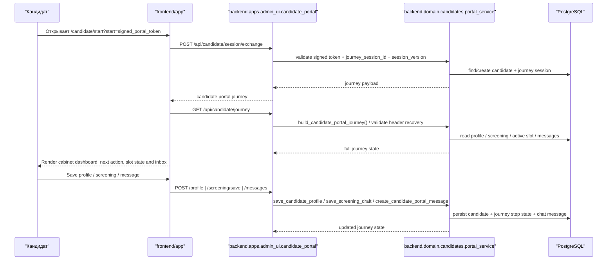

### Entry Surfaces
- Candidate portal can be opened from signed browser links, MAX `startapp` payloads and Telegram `web_app` buttons.
- HH can now act as the public entry source: `/candidate/start?entry=<signed_hh_entry_token>` resolves the active candidate journey and shows a chooser for `Web`, `MAX` and `Telegram`.
- Browser entry uses the signed portal token directly. MAX mini-app entry uses a separate URL-safe launch token that resolves to the same candidate journey contract.
- The portal token remains the source of truth for browser recovery; native app entry only changes the launch surface, not the journey/session invariants.
- The selected HH entry channel is stored in `CandidateJourneySession.payload_json` as `entry_source`, `last_entry_channel`, `last_entry_channel_selected_at` and `entry_channel_history`. This does not create a second journey or change slot/status invariants.
- The same persistence contract is used when the candidate switches launcher from inside `/candidate/journey`: the cabinet records the new `last_entry_channel` before redirecting to the selected Web/MAX/Telegram launcher.

### Product Contract
- The web cabinet is the primary candidate UX and state surface. MAX, Telegram and future channels only deliver entry packages, reminders and mirrored notifications.
- `/candidate/journey` is a persistent cabinet with dashboard, workflow, tests, schedule, inbox, company materials and candidate-visible feedback. It is no longer framed as a messenger-first stepper.
- Recruiter CRM and candidate cabinet share the same conversation history. Messages written from CRM must appear in the candidate web inbox even if the candidate has no active messenger binding.
- Recruiters can send a unified HH entry package from CRM. If HH does not expose a message-capable negotiation action, the system must return an explicit blocked reason and still expose fallback web/MAX/Telegram launch options.

### State
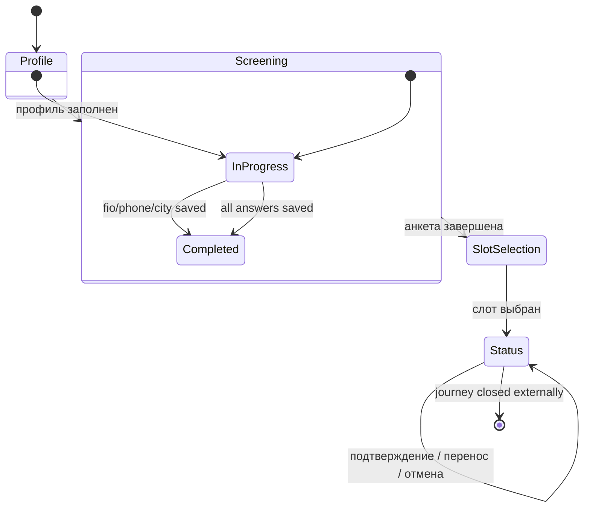

### Reliability Contract
- Browser reopen recovery first uses the short-lived HttpOnly resume cookie; if the cookie is missing, the portal may still recover from an explicit header token only for an `active` journey session with matching `session_version`.
- Frontend bootstrap order is fixed: route token -> query `token/start/startapp` -> `window.WebApp.initDataUnsafe.start_param` from MAX Bridge -> stored session token.
- If no bootstrap source is available, the candidate portal returns structured recovery states (`recoverable`, `needs_new_link`, `blocked`) so the UI can explain the next step instead of showing a dead-end 401.
- Invite rotation, relink and explicit security recovery bump `session_version`; stale browser/header tokens must fail closed and emit audit trail.
- External channel delivery failure must not block cabinet access. A fresh browser link remains a valid recovery path whenever the portal public URL is healthy.

## 2. Slot Booking And Reschedule
### Sequence
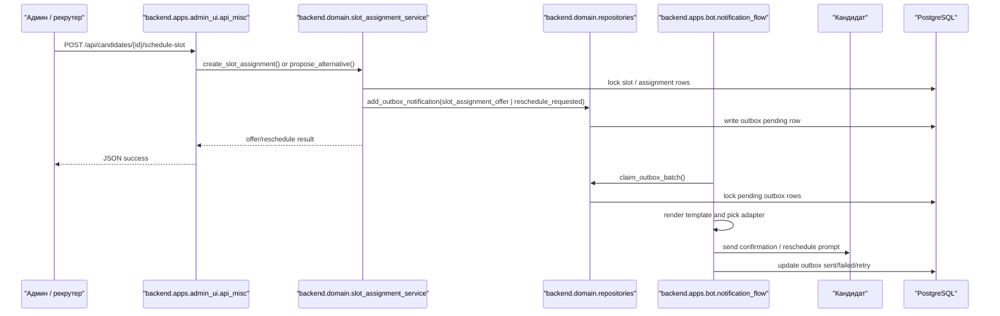

### State
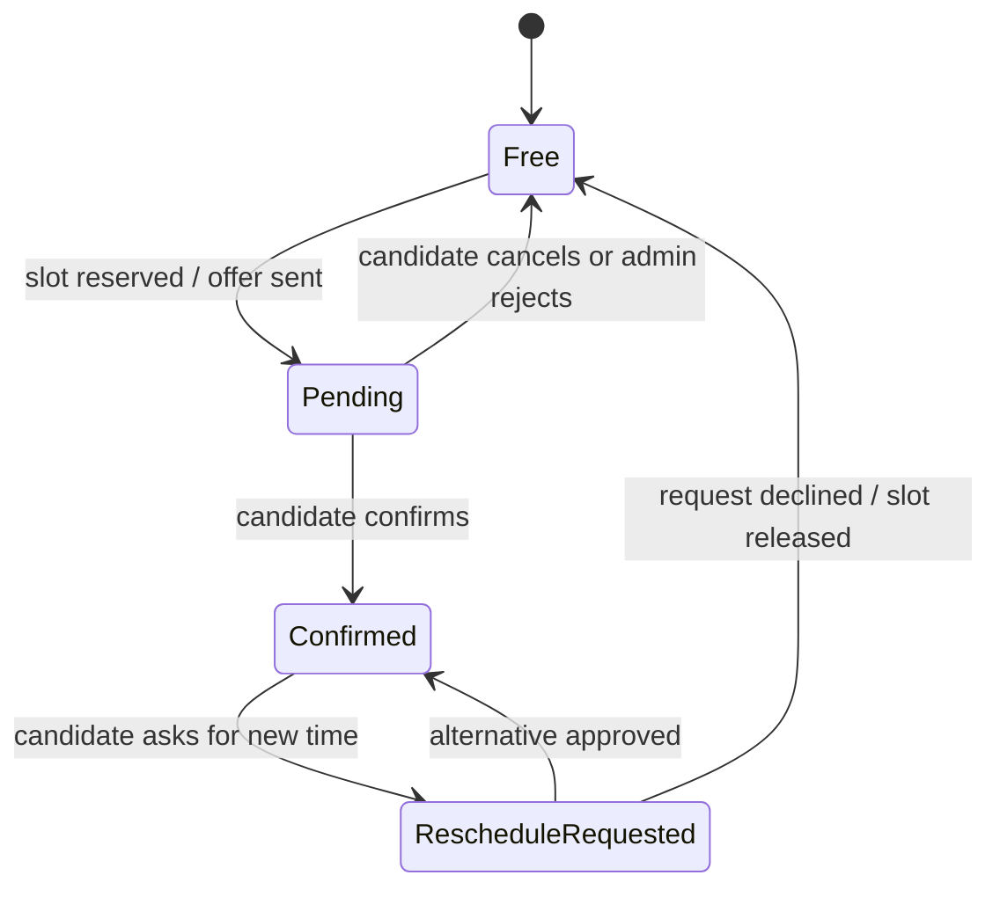

## 3. Notification Outbox
### Sequence
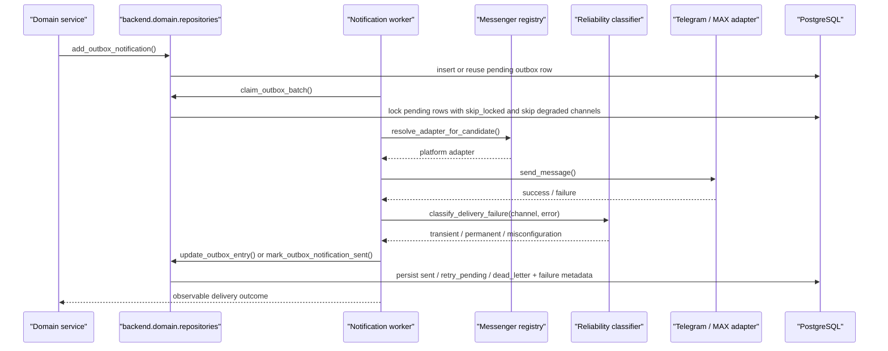

### State
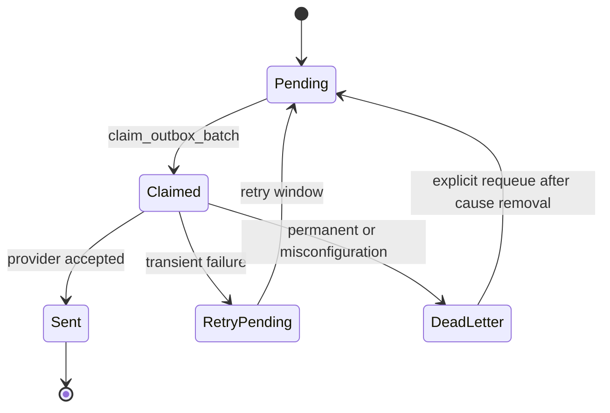

### Reliability Contract
- Telegram and MAX are separate observable failure domains; degraded state is stored per channel and surfaced to operators.
- `transient` failures stay retryable, `permanent` failures go directly to `dead_letter`, `misconfiguration` failures both dead-letter the item and mark the channel degraded.
- Explicit requeue does not clear degraded state; operators recover the channel first, then requeue affected dead-letter items.

## 4. MAX Onboarding And Linking
### Sequence
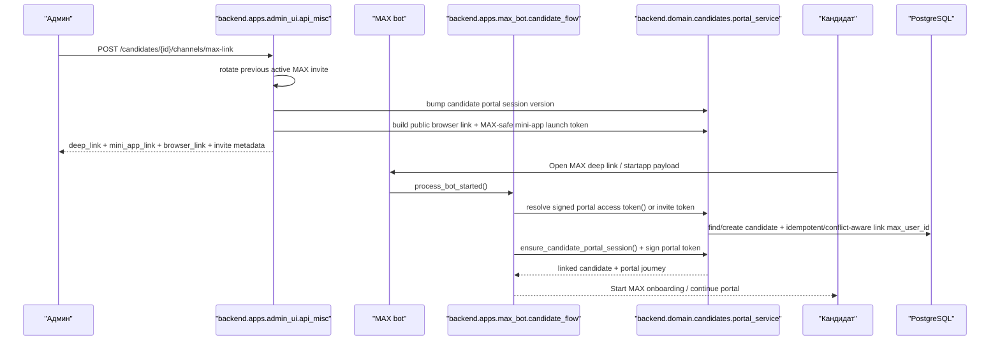

### Launch Contract
- Candidate-facing MAX messages may include `open_app` and browser link buttons that point to the same signed portal journey.
- `startapp` payload must be MAX-safe and public browser fallback must use a public HTTPS candidate portal URL; loopback or non-HTTPS portal URLs are treated as config errors and are surfaced to operators.
- Telegram and MAX adapters normalize button metadata so the same portal flow can be launched as a native web app or as a browser fallback without changing journey/session semantics.

### Recruiter Control
- `Переотправить ссылку` rotates the active MAX invite, bumps `session_version`, keeps current portal progress and emits a fresh access package.
- `Начать заново` abandons the active journey, creates a new `profile` journey, preserves history/audit trail and blocks restart when the candidate already has a confirmed interview.

### State
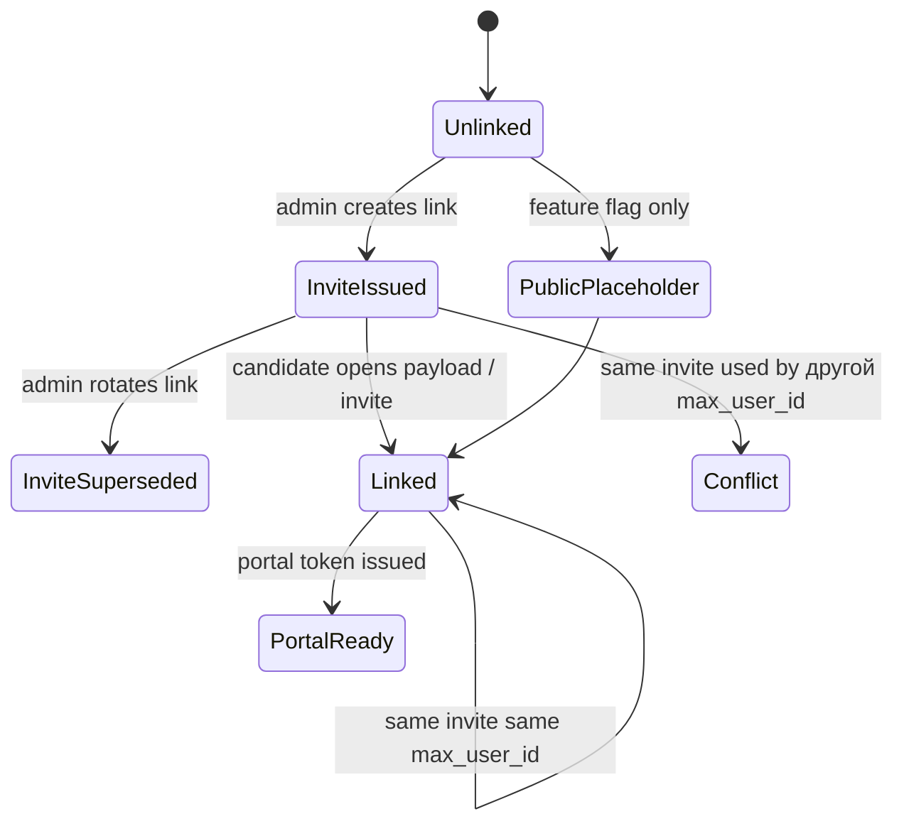

### Reliability Contract
- Only one active MAX invite is canonical per candidate. Rotation supersedes previous invite instead of leaving multiple active links.
- Same invite + same `max_user_id` is idempotent. Same invite + different `max_user_id` is conflict with no duplicate candidate/journey rows.
- `messenger_platform` becomes MAX automatically only when candidate has no existing Telegram identity; otherwise preferred channel is preserved until explicit operator action.

## 5. HH Sync And Import
### Sequence
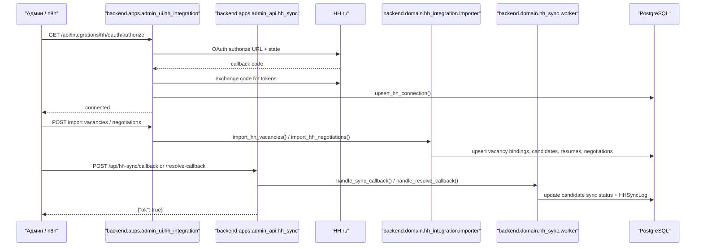

### State
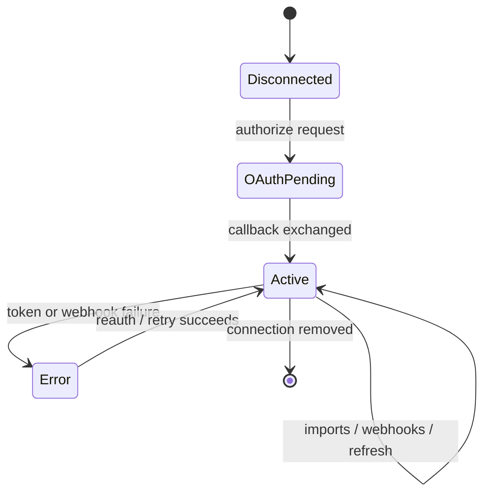

## 6. Recruiter Messenger
### Sequence
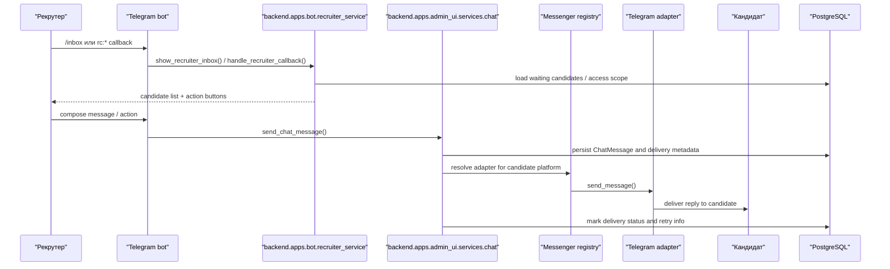

### State
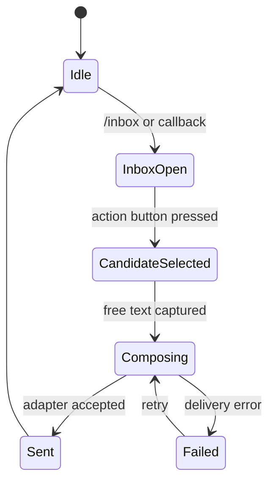

## 7. Notes On Canonical Coverage
- Candidate portal and slot flows are intentionally tied to `backend.domain` services, not to UI components.
- Outbox delivery is idempotent by design and must remain observable through retry/failure metadata.
- MAX onboarding and HH sync are separate trust boundaries, even though both produce candidate linking side effects.
- Recruiter messenger should be documented together with chat delivery and scope checks, because the user-facing bot flow and the CRM chat service are coupled.
