# RecruitSmart Core Workflows

## Purpose
Каноническое описание ключевых workflow: candidate portal, slot booking/reschedule, notification outbox, MAX onboarding/linking, HH sync/import и recruiter messenger. Это основной документ для совместной работы backend, frontend, QA, design и analytics.

## Owner
Platform Engineering

## Status
Canonical

## Last Reviewed
2026-03-25

## Source Paths
- `backend/apps/admin_ui/routers/candidate_portal.py`
- `backend/domain/candidates/portal_service.py`
- `backend/apps/admin_ui/routers/api_misc.py`
- `backend/domain/slot_assignment_service.py`
- `backend/domain/repositories.py`
- `backend/apps/bot/services/notification_flow.py`
- `backend/apps/bot/app.py`
- `backend/apps/max_bot/app.py`
- `backend/apps/max_bot/candidate_flow.py`
- `backend/apps/admin_ui/routers/hh_integration.py`
- `backend/apps/admin_api/hh_sync.py`
- `backend/domain/hh_integration/service.py`
- `backend/domain/hh_integration/importer.py`
- `backend/domain/hh_sync/worker.py`
- `backend/apps/bot/recruiter_service.py`
- `backend/apps/admin_ui/services/chat.py`

## Related Diagrams
- [overview.md](./overview.md)
- [runtime-topology.md](./runtime-topology.md)

## Change Policy
Если меняется хотя бы один входной endpoint, status transition, token contract или delivery branch, этот документ обновляется вместе с кодом и тестами. Не описывать здесь устаревшие или экспериментальные маршруты как canonical behavior.

## 1. Candidate Portal
### Sequence
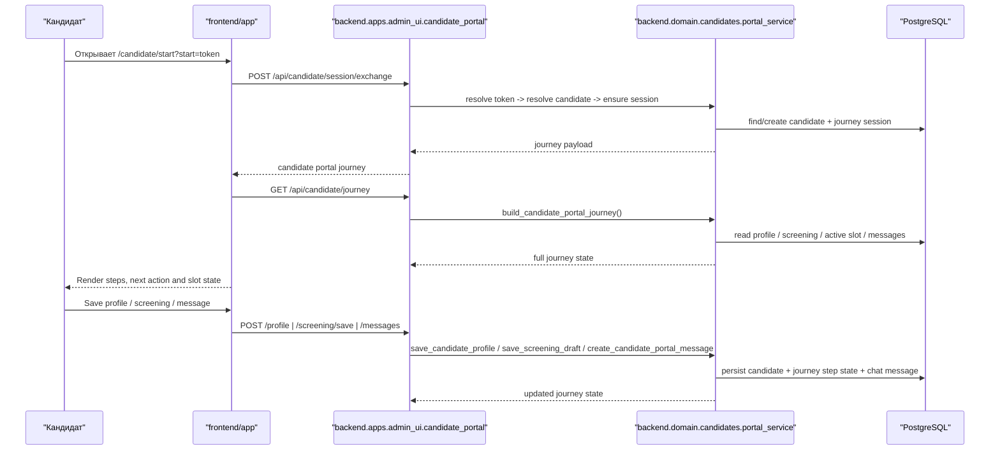

### State
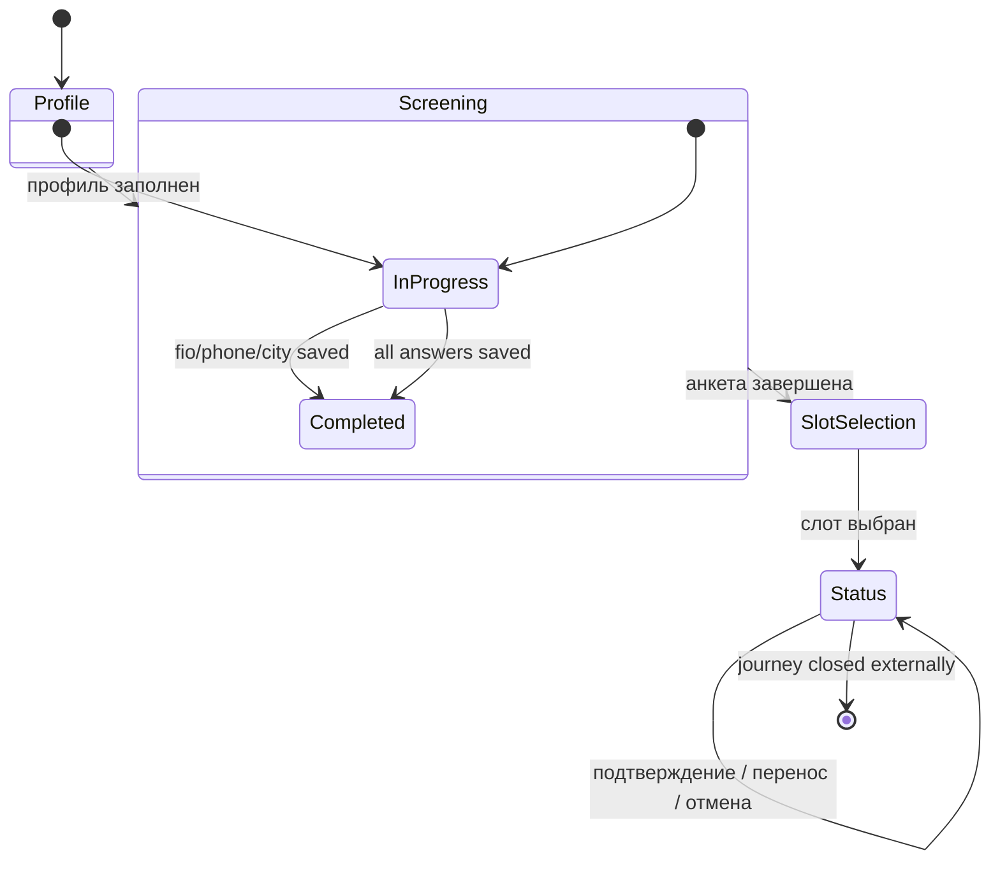

## 2. Slot Booking And Reschedule
### Sequence
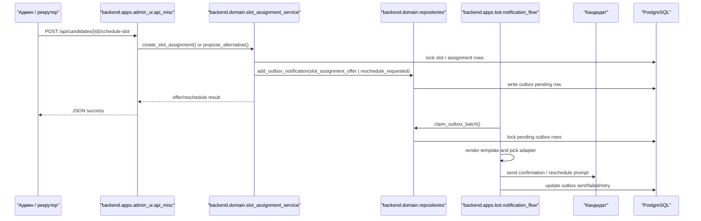

### State
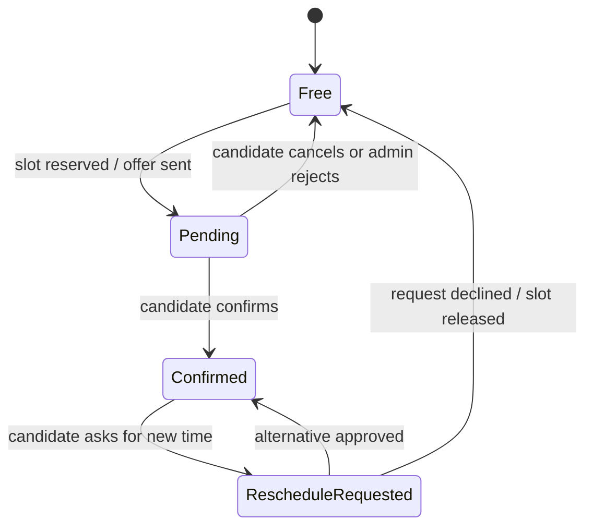

## 3. Notification Outbox
### Sequence
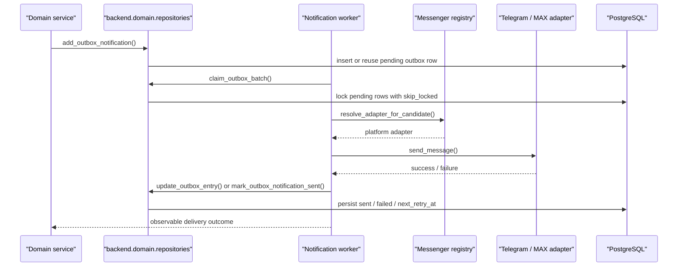

### State
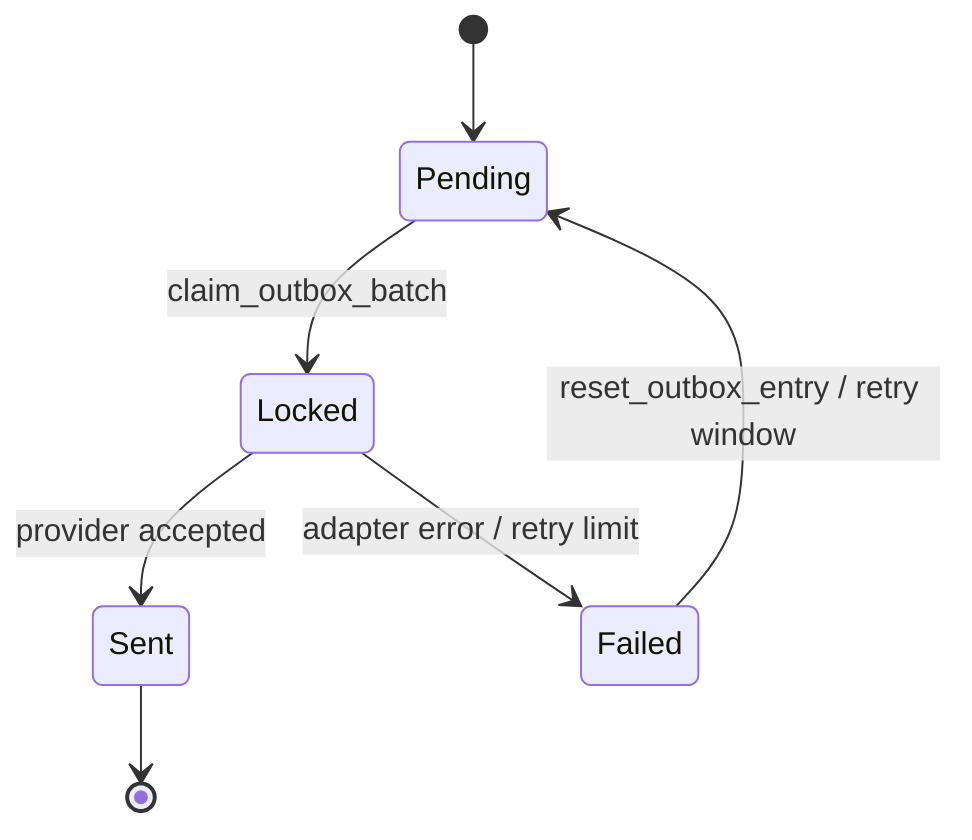

## 4. MAX Onboarding And Linking
### Sequence
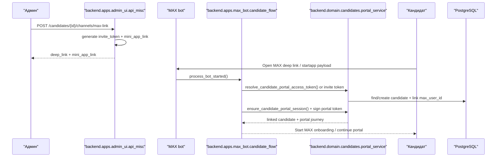

### State
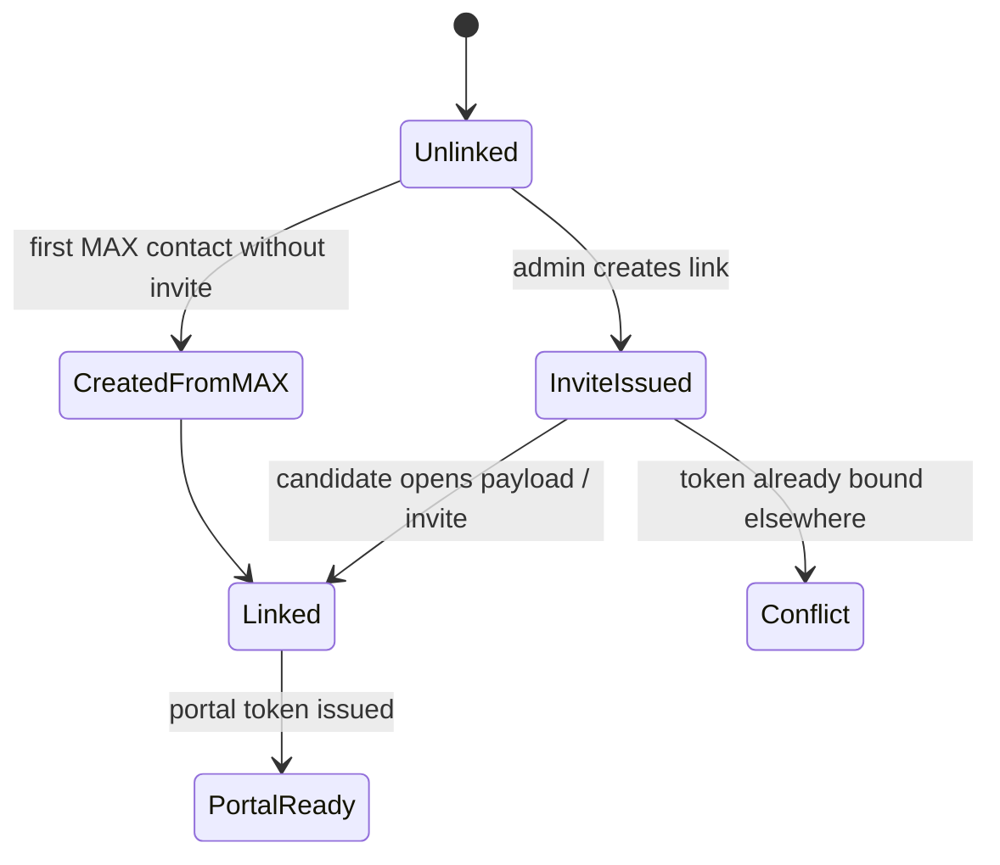

## 5. HH Sync And Import
### Sequence
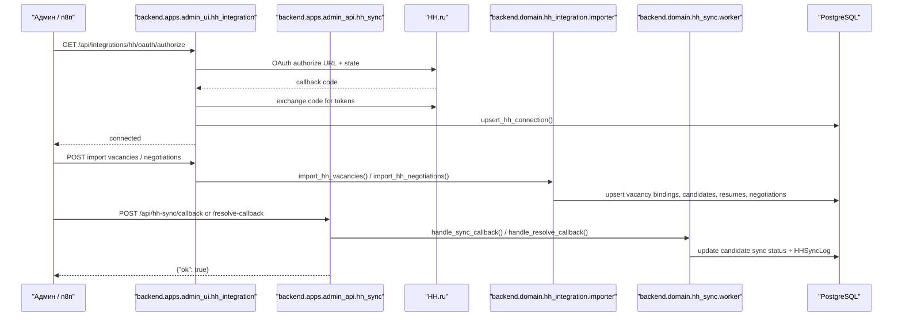

### State
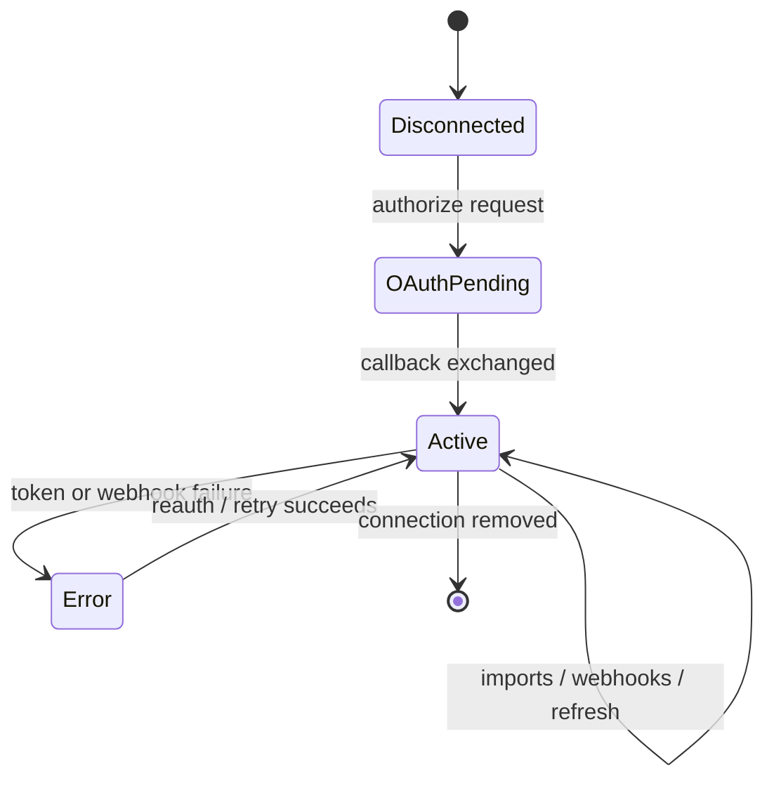

## 6. Recruiter Messenger
### Sequence
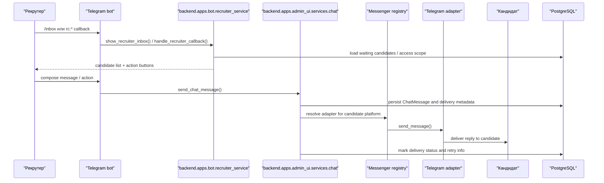

### State
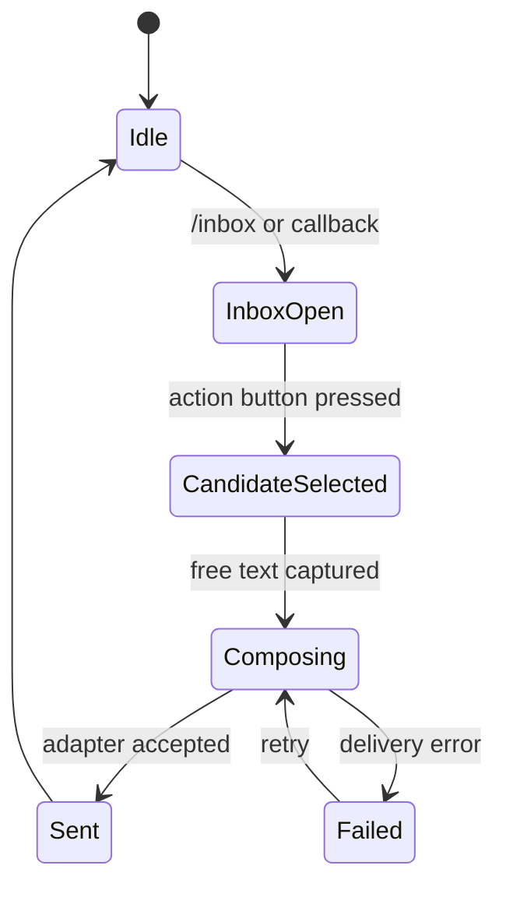

## 7. Notes On Canonical Coverage
- Candidate portal and slot flows are intentionally tied to `backend.domain` services, not to UI components.
- Outbox delivery is idempotent by design and must remain observable through retry/failure metadata.
- MAX onboarding and HH sync are separate trust boundaries, even though both produce candidate linking side effects.
- Recruiter messenger should be documented together with chat delivery and scope checks, because the user-facing bot flow and the CRM chat service are coupled.
