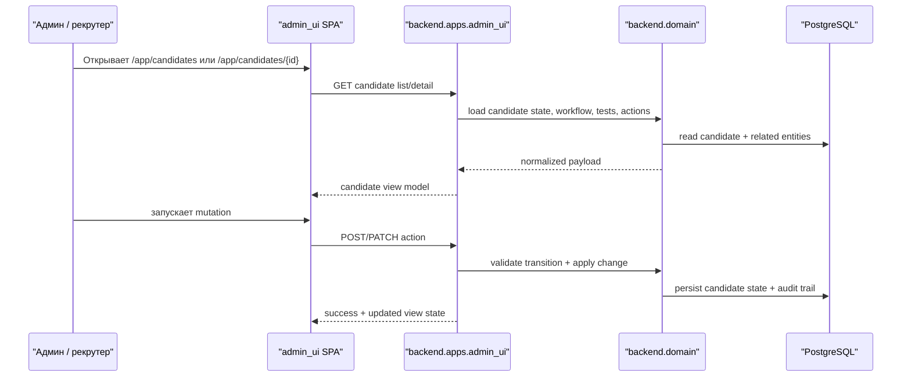
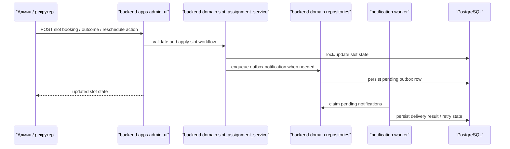
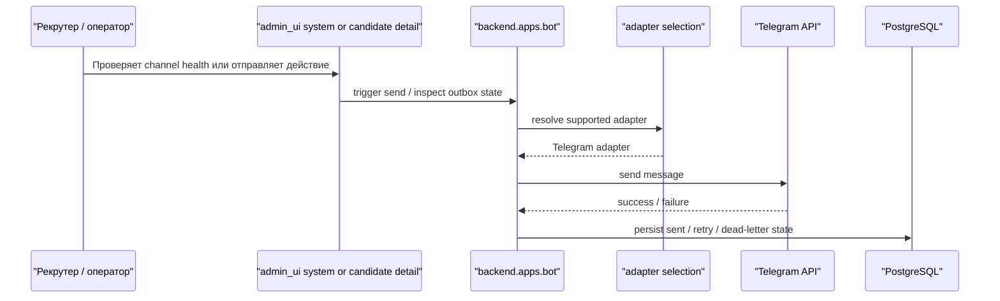
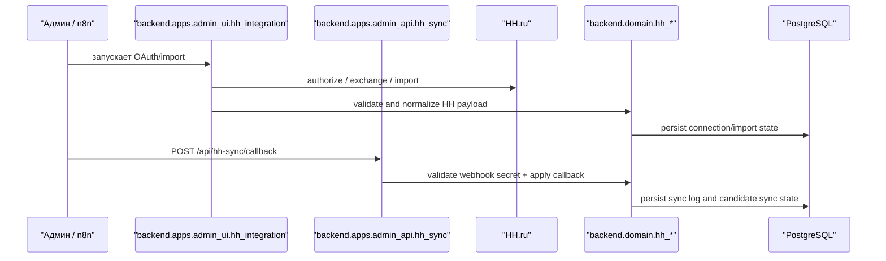

# RecruitSmart Core Workflows

## Purpose
Каноническое описание поддерживаемых workflow RecruitSmart. Документ фиксирует current runtime truth и отдельно отмечает historical implementation и target-state surfaces.

## Owner
Platform Engineering

## Status
Canonical

## Last Reviewed
2026-04-16

## Source Paths
- `backend/apps/admin_ui/routers/api_misc.py`
- `backend/apps/admin_ui/routers/candidates.py`
- `backend/apps/admin_ui/routers/slots.py`
- `backend/apps/admin_ui/routers/hh_integration.py`
- `backend/apps/admin_api/hh_sync.py`
- `backend/apps/bot/app.py`
- `backend/apps/bot/services/notification_flow.py`
- `backend/domain/slot_assignment_service.py`
- `backend/domain/repositories.py`
- `backend/domain/hh_integration/service.py`
- `backend/domain/hh_sync/worker.py`

## Related Docs
- [overview.md](./overview.md)
- [runtime-topology.md](./runtime-topology.md)
- [supported_channels.md](./supported_channels.md)

## Runtime Scope Note
- Supported runtime today: Admin SPA, Telegram bot/webapp, HH integration, n8n HH callbacks.
- Unsupported legacy implementation today: legacy candidate portal implementation, historical MAX runtime.
- Target state, not current runtime: future standalone candidate web flow, future MAX mini-app/channel adapter, SMS / voice fallback integration.
- If code and this document diverge, live runtime plus [supported_channels.md](./supported_channels.md) win.

## 1. Candidate Lifecycle In Admin SPA

### Contract
- Candidate lifecycle truth lives in `backend/domain` and admin APIs, not in historical portal flows.
- Unsupported legacy browser portal routes must not be used as an alternative write path.
- Any destructive admin action must remain behind auth, CSRF, feature flag, and explicit confirmation.

## 2. Slot Booking And Reschedule

### Contract
- Slot transitions stay in the supported admin workflow.
- Notification failures must stay observable and must not silently duplicate delivery.

## 3. Telegram Messaging And Delivery

### Contract
- Telegram is the only supported live messaging runtime.
- `/health/bot` and `/health/notifications` are operator diagnostics, not public health probes.
- Metrics and operator health must stay protected from anonymous clients.

## 4. HH Integration And n8n Callbacks

### Contract
- HH admin control plane stays in `admin_ui`.
- Automation callbacks stay in `admin_api` and are protected by webhook secret.

## 5. Historical And Target-State Notes

### Unsupported legacy / historical implementation
- Legacy candidate portal implementation is unsupported. `/candidate*` must fail closed with `410 Gone`, and `/api/candidate/*` must stay absent from tracked/live OpenAPI.
- Historical MAX runtime is unsupported. Default compose/runtime must not depend on deleted MAX runtime entrypoints.

### Target state retained for product strategy
- Future standalone candidate web flow remains a target-state surface, but it is not mounted, advertised, or covered as current runtime behavior.
- Future MAX mini-app/channel adapter remains a target-state surface, but it is not mounted, advertised, or covered as current runtime behavior.
- SMS / voice fallback remains a required integration target, but it has no active runtime contract yet.

## Canonical Exclusions
- Do not document deleted legacy portal/MAX modules as active runtime paths.
- Do not document removed legacy portal/MAX route patterns as current live routes.
- Historical/reference material can live in `docs/archive/*` or domain strategy docs, but not as current runtime truth here.
