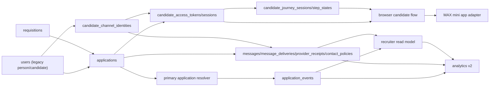

# RS-PLAN-006: Unified Migration Blueprint For Applications, Access/Journey, And Messaging

## Статус
Proposed

## Дата
2026-04-16

## Связанные документы

- [RS-ADR-002: Target Data Model For Candidate, Application, Requisition, Lifecycle, And Event Log](../adr/rs-adr-002-application-requisition-lifecycle-event-log.md)
- [RS-ADR-004: Candidate Access And Journey Surfaces For Browser / Telegram / MAX / SMS](../adr/rs-adr-004-candidate-access-and-journey-surfaces.md)
- [RS-ADR-005: Messaging Delivery Model And Channel Routing For Telegram / MAX / SMS](../adr/rs-adr-005-messaging-delivery-model-and-channel-routing.md)
- [Supported Channels](../supported_channels.md)
- [Core Workflows](../core-workflows.md)
- [Auth And Token Model](../../security/auth-and-token-model.md)

## Назначение

Этот документ связывает `RS-ADR-002`, `RS-ADR-004` и `RS-ADR-005` в один реалистичный план внедрения для текущего monorepo.

Документ описывает не "идеальную новую систему", а контролируемую миграцию текущего live runtime, где:

- `users` всё ещё является physical candidate/person table;
- scheduling всё ещё держится на `slots` и `slot_assignments`;
- recruiter/admin UI зависит от legacy candidate status и derived read models;
- candidate browser portal сейчас fail-closed через `410 Gone`;
- Telegram нельзя считать единственным candidate channel;
- `MAX` является целевым отечественным каналом для РФ-контекста;
- `browser fallback` обязателен;
- `SMS link + OTP fallback` обязателен.

## Executive Summary

Главная ось миграции не UI и не MAX-shell, а появление общего `application_id`-grain и append-only event backbone.

Практический порядок внедрения:

1. additive schema
2. `primary application resolver`
3. transactional `application_events`
4. candidate access/session layer
5. message routing/delivery layer
6. recruiter read model
7. browser rollout
8. MAX adapter rollout
9. analytics cutover
10. legacy cleanup

Пока не появились `applications + application_events + resolver`, нельзя безопасно:

- запускать dual-write;
- строить корректный recruiter read model;
- мигрировать analytics;
- запускать browser candidate flow;
- запускать MAX mini app как shell над shared journey;
- вводить устойчивый routing/fallback для Telegram / MAX / SMS / browser.

## Проверенный runtime context

Этот blueprint опирается на текущие live boundaries и hot paths:

- `backend/domain/candidates/models.py`
- `backend/domain/candidates/status_service.py`
- `backend/domain/candidate_status_service.py`
- `backend/domain/slot_assignment_service.py`
- `backend/domain/repositories.py`
- `backend/apps/admin_api/webapp/auth.py`
- `backend/apps/admin_api/webapp/routers.py`
- `backend/apps/admin_api/webapp/recruiter_routers.py`
- `backend/apps/admin_api/hh_sync.py`
- `backend/apps/admin_ui/routers/api_misc.py`
- `backend/apps/admin_ui/services/candidates/helpers.py`
- `backend/apps/admin_ui/services/candidates/write_intents.py`
- `backend/apps/admin_ui/services/detailization.py`
- `backend/apps/admin_ui/services/chat.py`
- `backend/apps/bot/services/notification_flow.py`
- `backend/apps/bot/services/slot_flow.py`
- `backend/apps/bot/services/test1_flow.py`
- `backend/apps/bot/services/test2_flow.py`
- `backend/domain/hh_sync/worker.py`
- `backend/domain/hh_integration/outbound.py`

Критичные текущие факты:

- `/candidate*` сейчас intentionally disabled в `backend/apps/admin_ui/app.py`;
- recruiter Telegram webapp привязан к `users.telegram_id` и `users.telegram_user_id`;
- scheduling write owner сегодня не `candidate_journey`, а `Slot`/`SlotAssignment`/`RescheduleRequest`;
- `users.candidate_status`, `users.final_outcome`, `users.source`, `users.hh_*`, `users.max_user_id` остаются operational truth;
- chat и notifications используют `chat_messages`, `message_logs`, `notification_logs`, `outbox_notifications`;
- HH callbacks приходят через `admin_api`, а не через domain-owned public event bus;
- Test1/Test2 и часть recruiter workflow всё ещё завязаны на bot services и legacy candidate status.

## Target Operating Principles

### 1. Applications become the canonical business grain

Человек остаётся в `users` на переходном этапе, но recruiting lifecycle, source conversion, SLA, events и candidate journey должны привязываться к `applications`.

### 2. Access/auth is not journey progress

`candidate_access_tokens` и `candidate_access_sessions` решают launch/auth problem.

`candidate_journey_sessions` и `candidate_journey_step_states` решают resume/progress problem.

Эти слои не должны смешиваться.

### 3. Browser is mandatory fallback

Browser flow не optional enhancement, а обязательный control plane для candidate journey. MAX и Telegram не должны быть единственным способом пройти Test 1, booking или resume.

### 4. MAX is a shell adapter, not a second product

Нельзя заводить:

- MAX-only screens;
- MAX-only lifecycle states;
- MAX-only data model;
- MAX-only business APIs.

MAX может отличаться только launch/auth and native bridge behavior.

### 5. Scheduling stays canonical in legacy runtime until late phases

До поздних фаз `Slot`/`SlotAssignment` остаются write owner for booking/reschedule/outcome/no-show. Новые сущности сначала mirror, then read-model source, и только потом возможна дальнейшая консолидация.

### 6. n8n never writes to PostgreSQL directly

n8n должен работать только через API/webhooks с `correlation_id` и `idempotency_key`. Delivery state, lifecycle state и event emission остаются backend-owned.

## Dependency Graph

### High-level graph

### New entities and ordering

1. Legacy base retained:
   - `users`
   - `candidate_invite_tokens`
   - `candidate_journey_sessions`
   - `candidate_journey_step_states`
   - `slots`
   - `slot_assignments`
   - `outbox_notifications`
2. Phase-1 additive foundation:
   - `candidate_channel_identities`
   - `requisitions`
   - `applications`
3. Phase-2 backbone:
   - `primary application resolver`
   - `application_events`
4. Phase-3 access foundation:
   - `candidate_access_tokens`
   - `candidate_access_sessions`
   - additive bindings on `candidate_journey_sessions`
5. Phase-4 delivery foundation:
   - `message_threads`
   - `messages`
   - `message_deliveries`
   - `provider_receipts`
   - `candidate_contact_policies`
6. Phase-5 read-side:
   - recruiter read model
7. Phase-6 public candidate surfaces:
   - browser candidate flow
   - Telegram candidate shell
   - MAX mini app shell
8. Phase-7 analytics cutover
9. Phase-8 cleanup

### What can be built independently

- `candidate_channel_identities` can be introduced before `applications`, but only as mirror over `users.telegram_*`, `users.max_user_id`, phone/email identity data.
- `requisitions` can be introduced before browser/MAX and before routing v2.
- `candidate_access_tokens/sessions` can be specified before message routing, but cannot be enabled without `application_id` binding.
- `message_threads/messages/message_deliveries/provider_receipts` can be added in shadow mode before switching any transport.

### What must appear first

- `applications`
- `primary application resolver`
- `application_events`

Without them there is no shared canonical grain for lifecycle, delivery, analytics, or access.

### What blocks dual-write

- no deterministic `primary application resolver`;
- no canonical event taxonomy;
- no transaction-safe publisher contract;
- no idempotency rules per write path;
- no compatibility projection rules back into legacy tables/DTOs.

### What blocks UI migration

- no recruiter read model by `application_id`;
- candidate detail still assembled from `users`, slots, HH, chat;
- scheduling still canonical in `Slot`/`SlotAssignment`;
- detailization still derives `final_outcome` from legacy candidate fields.

### What blocks MAX/browser rollout

- candidate browser surface returns `410 Gone`;
- no public candidate access boundary;
- no signed-link + OTP contract;
- no shared journey envelope bound to `application_id`;
- no channel-agnostic invite/reminder/fallback routing.

## Phased Implementation Plan

### Phase 0 — Stabilization Completed

| Field | Plan |
| --- | --- |
| Goal | Зафиксировать current runtime как baseline и не ломать working Telegram/admin flows |
| Changes | Без runtime behavior changes; freeze historical MAX runtime and disabled candidate portal; document live write-path ownership |
| Legacy source of truth | `users`, `candidate_status`, `slots`, `slot_assignments`, `chat_messages`, `outbox_notifications`, `users.hh_*` |
| Feature flags | Preserve `ENABLE_LEGACY_STATUS_API`, `ENABLE_LEGACY_ASSIGNMENTS_API`, `BOT_ENABLED`, `BOT_NOTIFICATION_RUNTIME_ENABLED`, `HH_SYNC_ENABLED` |
| Rollback point | Current production baseline |
| Success metrics | Documented hotspot map; no unknown write owners |
| Hard dependencies | None |
| Risks | Hidden bot/HH side effects not yet mapped |

### Phase 1 — Additive Schema

| Field | Plan |
| --- | --- |
| Goal | Add target entities without changing canonical truth |
| Changes | Add `candidate_channel_identities`, `requisitions`, `applications`, `candidate_access_tokens`, `candidate_access_sessions`, delivery tables, additive fields on `candidate_journey_sessions` |
| Legacy source of truth | `users`, `slots`, `slot_assignments`, `ChatMessage`, `OutboxNotification` |
| Feature flags | `ENABLE_APPLICATION_EVENTS=off`, `ENABLE_PRIMARY_APPLICATION_RESOLVER=off`, `ENABLE_CANDIDATE_ACCESS=off`, `ENABLE_MESSAGE_ROUTING_V2=off` |
| Rollback point | Schema additive only; no path switched |
| Success metrics | Tables exist; no runtime dependency cut over |
| Hard dependencies | Finalized entity contracts |
| Risks | Wrong FK/nullability/index decisions create later backfill pain |

### Phase 2 — Transactional Event Publisher + Primary Application Resolver

| Field | Plan |
| --- | --- |
| Goal | Create shared join grain and append-only event backbone |
| Changes | Implement `primary application resolver`; implement transactional `application_events` publisher; start shadow emission from safe flows |
| Legacy source of truth | Legacy writes remain canonical; `users.candidate_status` stays authoritative |
| Feature flags | `ENABLE_PRIMARY_APPLICATION_RESOLVER`, `ENABLE_APPLICATION_EVENTS`, `ENABLE_APPLICATION_EVENTS_SHADOW` |
| Rollback point | Disable resolver/publisher; keep legacy writes only |
| Success metrics | Resolver ambiguity near zero; sampled event mismatch = 0; no p95 regression on create/status-change |
| Hard dependencies | Phase 1 schema |
| Risks | Ambiguous candidate-to-application mapping; duplicate events; partial commit mismatch |

### Phase 3 — Candidate Access Tokens/Sessions

| Field | Plan |
| --- | --- |
| Goal | Separate access/auth plane from journey progress |
| Changes | Add candidate access API boundary; implement signed link, OTP, session refresh/revoke, Telegram candidate initData validation, MAX bootstrap spec behind flag; reuse `candidate_journey_sessions` for progress |
| Legacy source of truth | Journey progress still legacy-backed; browser portal still off by default |
| Feature flags | `ENABLE_CANDIDATE_ACCESS`, `ENABLE_OTP_FALLBACK`, `ENABLE_TG_CANDIDATE_SHELL`, `ENABLE_MAX_ADAPTER=off`, `ENABLE_BROWSER_CANDIDATE_FLOW=off` |
| Rollback point | Disable candidate access flags; keep `/candidate*` on `410` |
| Success metrics | Launch bootstrap success rate; replay rejection; no recruiter webapp regression |
| Hard dependencies | Phase 2 resolver + events |
| Risks | Public trust boundary expansion; replay/session binding mistakes |

### Phase 4 — Message Delivery Model + Routing Layer

| Field | Plan |
| --- | --- |
| Goal | Introduce canonical delivery truth and channel-aware routing |
| Changes | Add message intent/attempt/receipt model; shadow-write from recruiter chat, reminders, slot-assignment notifications, HH/system notifications; keep Telegram runtime canonical for transport |
| Legacy source of truth | `chat_messages`, `outbox_notifications`, `notification_logs`, Telegram bot delivery |
| Feature flags | `ENABLE_MESSAGE_ROUTING_V2`, `ENABLE_SMS_DELIVERY=off`, `ENABLE_DELIVERY_RECEIPTS_V2` |
| Rollback point | Turn off routing v2; legacy outbox/bot remains |
| Success metrics | Duplicate-send rate = 0; receipt completeness matches Telegram baseline; retry queue bounded |
| Hard dependencies | Phase 2 events; Phase 3 candidate access contract |
| Risks | Duplicate spam; fallback races; drift between delivery truth and chat UI |

### Phase 5 — Recruiter Read Model

| Field | Plan |
| --- | --- |
| Goal | Move recruiter/admin reads to application-centric projections without changing write owners |
| Changes | Build read model for dashboard, incoming, kanban, candidate detail, calendar, detailization, messenger ops |
| Legacy source of truth | Writes still land in legacy services; scheduling still canonical in `Slot`/`SlotAssignment` |
| Feature flags | `ENABLE_APPLICATIONS_READ_MODEL`, `ENABLE_RECRUITER_READ_MODEL_V2` |
| Rollback point | Switch reads back to legacy services |
| Success metrics | Parity on counts, statuses, actions, SLA widgets, detailization/final outcome |
| Hard dependencies | Phase 2 events; Phase 4 delivery projections |
| Risks | Duplicate analytics; wrong current application shown in UI; broken kanban/action labels |

### Phase 6 — Browser Flow + MAX Adapter Rollout

| Field | Plan |
| --- | --- |
| Goal | Launch shared candidate journey core on browser first, then MAX shell |
| Changes | Enable browser candidate flow behind new boundary; shared journey core for browser, Telegram candidate shell, MAX mini app, SMS link + OTP; MAX only as shell adapter |
| Legacy source of truth | Booking/reschedule writes still canonical through existing scheduling domain |
| Feature flags | `ENABLE_BROWSER_CANDIDATE_FLOW`, `ENABLE_TG_CANDIDATE_SHELL`, `ENABLE_MAX_ADAPTER`, `ENABLE_SMS_DELIVERY`, `ENABLE_OTP_FALLBACK` |
| Rollback point | Browser off => `/candidate*` back to `410`; MAX off => browser fallback only |
| Success metrics | Resume success across shell switch; Test1 -> booking continuity; launch success rates by surface |
| Hard dependencies | Phase 3 access; Phase 4 routing; Phase 5 recruiter read parity |
| Risks | Browser/MAX divergence; context loss; booking fallback races |

### Phase 7 — Analytics Cutover

| Field | Plan |
| --- | --- |
| Goal | Move analytics to `applications + application_events + message_deliveries` |
| Changes | Build analytics projections for funnel, source conversion, channel conversion, delivery, SLA, next action; keep legacy dashboards in parallel |
| Legacy source of truth | Old dashboards remain fallback |
| Feature flags | `ENABLE_ANALYTICS_V2`, `ENABLE_APPLICATION_FUNNEL_METRICS` |
| Rollback point | Old analytics endpoints remain active |
| Success metrics | Parity by stage, source, requisition, recruiter; no double counting |
| Hard dependencies | Phase 2 events; Phase 5 read model; Phase 6 delivery/browser surfaces |
| Risks | Double analytics; event ordering issues; incomplete receipt coverage |

### Phase 8 — Legacy Deprecation / Cleanup

| Field | Plan |
| --- | --- |
| Goal | Retire legacy fields and compatibility paths only after stable parity |
| Changes | Deprecate legacy DTO fields; stop writing selected legacy mirrors; retire unused compatibility projections |
| Legacy source of truth | None for retired areas; only explicitly retained mirrors |
| Feature flags | Phase-specific deprecation gates |
| Rollback point | Separate release window only; no schema drop in same cutover |
| Success metrics | Near-zero traffic on deprecated paths for 2 release windows; rollback drill passed |
| Hard dependencies | Stable Phases 5-7 |
| Risks | Rollback complexity; hidden consumers of legacy fields |

## Current Write-Path Map

| Write path | Runtime path(s) | Current owner | Target owner | Dual-write starts | When legacy stops being canonical | Required events |
| --- | --- | --- | --- | --- | --- | --- |
| Candidate create / import | `api_create_candidate` -> `upsert_candidate`; HH importer | admin UI candidate services + HH importer | application bootstrap + event publisher | Phase 2 | Phase 5+ | `candidate.created`, `candidate.updated`, `application.created` |
| Candidate status change | `status_service`, `write_intents`, lifecycle use cases | legacy candidate status service | application lifecycle service | Phase 2 | Phase 5+ | `application.status_changed`, `application.rejected`, `application.hired` |
| Candidate assign recruiter | `assign_candidate_recruiter`; staff task accept | legacy `users.responsible_recruiter_id` | application owner assignment | Phase 2 | Phase 5 | `application.owner_assigned`, `recruiter_task.resolved` |
| Slot booking | `api_schedule_slot`, `reserve_slot`, `create_slot_assignment` | scheduling domain | scheduling domain + `interviews` mirror | Phase 2 shadow | not before Phase 8 | `interview.scheduled`, `application.status_changed` |
| Slot reschedule | `request_reschedule`, `approve_reschedule`, `decline_reschedule` | scheduling domain | scheduling domain + `interviews` mirror | Phase 2 shadow | not before Phase 8 | `interview.rescheduled`, `application.status_changed` |
| Slot outcome | `set_slot_outcome` | slots/bot bridge | lifecycle + interview outcome service | Phase 2 shadow | Phase 7 | `interview.completed`, `application.status_changed` |
| No-show handling | bot slot/reminder flows + analytics | scheduling/bot runtime | interview attendance service | Phase 2 shadow | Phase 7 | `interview.no_show`, `recruiter_task.created`, `application.status_changed` |
| Detailization outcome | `detailization.py` + lifecycle finalizers | detailization service over legacy fields | application/detailization projection | Phase 5 | Phase 7 | `application.rejected`, `application.hired`, `application.updated` |
| HH callback / HH sync | `hh_sync.worker`, `hh_integration.outbound` | HH sync boundary + legacy `users.hh_*` | HH integration service bound to `application_events` | Phase 2 | Phase 7 | `hh.negotiation.imported`, `hh.status_sync.requested`, `hh.status_sync.completed` |
| AI recommendation acceptance | staff task accept/decline as nearest live seam | mixed staff/chat surface | `ai_decision_records` + application events | Phase 2 or 5 once modeled | Phase 7 | `ai.recommendation.generated`, `ai.recommendation.accepted`, `ai.recommendation.rejected` |
| Chat send | `send_chat_message`, `notification_flow` | legacy chat + Telegram delivery | message intent/routing service | Phase 4 shadow | Phase 6/7 | `message.sent`, `message.delivered`, `message.failed`, `message.received` |
| Reminder send / notification send | `notification_flow`, `OutboxNotification` | legacy outbox + bot worker | routing/delivery service | Phase 4 shadow | Phase 6/7 | `message.sent`, `message.delivered`, `message.failed`, `recruiter_task.sla_breached` |
| Test1/Test2 flows | `test1_flow.finalize_test1`, `test2_flow.finalize_test2` | bot services + candidate status | shared journey + application lifecycle | Phase 2 shadow | Phase 6/7 | `application.status_changed`, `candidate.updated`, `recruiter_task.created` |

## Runtime Hotspot Map

### Most migration-sensitive code

- `backend/domain/candidates/models.py`
- `backend/domain/candidates/status_service.py`
- `backend/domain/candidate_status_service.py`
- `backend/domain/slot_assignment_service.py`
- `backend/domain/repositories.py`
- `backend/apps/admin_api/webapp/routers.py`
- `backend/apps/admin_api/webapp/auth.py`
- `backend/apps/admin_ui/routers/api_misc.py`
- `backend/apps/admin_ui/services/candidates/helpers.py`
- `backend/apps/admin_ui/services/candidates/write_intents.py`
- `backend/apps/admin_ui/services/detailization.py`
- `backend/apps/admin_ui/services/chat.py`
- `backend/apps/bot/services/notification_flow.py`
- `backend/apps/bot/services/slot_flow.py`
- `backend/apps/bot/services/test1_flow.py`
- `backend/apps/bot/services/test2_flow.py`
- `backend/domain/hh_sync/worker.py`
- `backend/domain/hh_integration/outbound.py`

### Hotspot details

| Hotspot | Why risky |
| --- | --- |
| `users` and legacy candidate status fields | Mixed person, source, outcome, recruiter ownership, channel linkage, HH context and workflow truth |
| `admin_api` Telegram webapp lookup | Candidate resolution still keyed by `users.telegram_id` and `users.telegram_user_id` |
| `slots` / `slot_assignments` / `repositories.reserve_slot` | Canonical scheduling writes and reminder side effects live here |
| Candidate chat flows | Outbound/inbound history and delivery state still mix business message and transport result |
| HH integrations | Current sync callbacks and outbound sync still mirror directly into legacy candidate fields |
| Analytics derivation | Funnel, reminder, no-show and some dashboard metrics still derive from legacy status and slot events |
| AI outputs tied to legacy candidate objects | AI summaries/recommendations are rendered over legacy candidate-centric view, not `application_id` grain |

### Where legacy truth still lives

- `users.candidate_status`
- `users.workflow_status`
- `users.lifecycle_state`
- `users.final_outcome`
- `users.final_outcome_reason`
- `users.source`
- `users.telegram_id`
- `users.telegram_user_id`
- `users.max_user_id`
- `users.hh_*`
- `slots`
- `slot_assignments`
- `chat_messages`
- `outbox_notifications`
- `notification_logs`
- `message_logs`

## UI Migration Map

| Surface | Current data source | Target data source | Migration sequence | Backward compatibility notes | Rollout guard |
| --- | --- | --- | --- | --- | --- |
| Dashboard / Incoming / Kanban | `users`, candidate status, slot summaries | recruiter read model over `applications + application_events` | Phase 5 first | keep current API shapes | `ENABLE_APPLICATIONS_READ_MODEL` |
| Candidate detail | `get_candidate_detail` over `users + slots + chat + HH` | candidate/application detail projection | Phase 5 | preserve current DTO; deprecate legacy fields later | `ENABLE_RECRUITER_READ_MODEL_V2` |
| Calendar / Scheduling | `slots`, `slot_assignments`, reminders | same write domain plus read projection into `interviews`/application summary | Phase 5 after events | no early write-owner switch | `ENABLE_RECRUITER_READ_MODEL_V2` |
| Detailization | `detailization_entries` + derived legacy outcome | projection from `applications`, `interviews`, and detailization mirror | Phase 5/7 | keep current endpoints and CSV shape initially | `ENABLE_APPLICATIONS_READ_MODEL` |
| System / Health / Messenger ops | channel health + outbox views | delivery projections + channel health registry | Phase 4/5 | keep current ops screens backed by compatibility projection | `ENABLE_MESSAGE_ROUTING_V2` |
| Recruiter TG webapp | `admin_api/webapp` + `users.telegram_id` | unchanged until candidate shell exists; recruiter surface stays legacy-compatible | after Phase 5, not earlier | do not couple recruiter cutover to candidate cutover | separate candidate-shell flag only |
| Future browser candidate flow | disabled `/candidate*` | candidate access + shared journey core | Phase 6 browser first | rollback is explicit return to `410` | `ENABLE_BROWSER_CANDIDATE_FLOW` |
| Future MAX mini app | not supported | same shared journey core + MAX shell adapter | only after browser pilot | browser remains mandatory fallback | `ENABLE_MAX_ADAPTER` |

## Contract Map

### Existing APIs that remain unchanged initially

- recruiter/admin REST in `backend/apps/admin_ui/routers/api_misc.py`
- recruiter Telegram webapp APIs in `backend/apps/admin_api/webapp/recruiter_routers.py`
- existing candidate chat endpoints for admin UI
- existing HH sync callback endpoints in `backend/apps/admin_api/hh_sync.py`

### New additive APIs needed first

- `POST /api/candidate-access/invites`
- `POST /api/candidate-access/launch/validate`
- `POST /api/candidate-access/otp/send`
- `POST /api/candidate-access/otp/verify`
- `POST /api/candidate-access/session/refresh`
- `POST /api/candidate-access/session/revoke`
- `POST /api/candidate-access/surface/switch`
- `POST /api/candidate-journey/start`
- `GET /api/candidate-journey/current`
- `PATCH /api/candidate-journey/progress`
- `POST /api/candidate-journey/test1/complete`
- `GET /api/candidate-journey/slots`
- `POST /api/candidate-journey/slots/select`
- `POST /api/candidate-journey/booking/confirm`
- `POST /api/candidate-journey/booking/cancel`
- `POST /api/candidate-journey/booking/reschedule`

### DTO/fields marked deprecated later

- candidate-level status DTOs backed directly by `users.candidate_status`
- `users.telegram_*` and `users.max_user_id` as primary identity DTOs
- candidate-level `source`, `final_outcome`, `workflow_status` as canonical reporting fields
- legacy status update endpoints already marked deprecated in runtime remain available until removal window

### Compatibility projections required

- `users` mirror from `applications` for current recruiter/admin screens
- legacy chat projection from `messages/message_deliveries`
- legacy analytics projection from `application_events`
- HH mirror fields until HH read surfaces migrate
- `candidate_journey_sessions` projection bound to `application_id`

### When legacy fields can be disabled

Not before Phase 8, and only after:

- zero critical parity drift;
- near-zero traffic on deprecated endpoints for two stable release windows;
- rollback drill completed.

## Feature Flag And Rollout Policy

| Flag | Default | Environments | Rollback behavior | Observability requirement |
| --- | --- | --- | --- | --- |
| `ENABLE_APPLICATION_EVENTS` | off | dev/staging first, prod shadow-only | stop event writes | event mismatch, write latency |
| `ENABLE_PRIMARY_APPLICATION_RESOLVER` | off | dev/staging/canary | fallback to legacy candidate lookup | resolver ambiguity rate |
| `ENABLE_CANDIDATE_ACCESS` | off | staging/pilot only | deny new access bootstrap | auth success/fail/replay metrics |
| `ENABLE_BROWSER_CANDIDATE_FLOW` | off | pilot cohort only | `/candidate*` back to `410` | browser launch, resume, 4xx/5xx |
| `ENABLE_TG_CANDIDATE_SHELL` | off | pilot after browser | disable candidate TG shell only | candidate TG shell launch success |
| `ENABLE_MAX_ADAPTER` | off | pilot after browser parity | disable MAX launchers, keep browser fallback | MAX launch success, surface switch rate |
| `ENABLE_MESSAGE_ROUTING_V2` | off | shadow first | fallback to legacy outbox/bot | duplicate send rate, delivery parity |
| `ENABLE_SMS_DELIVERY` | off | isolated pilot | disable SMS transport | SMS send/receipt metrics |
| `ENABLE_OTP_FALLBACK` | off | browser pilot | require signed-link only | OTP abuse, verify success |
| `ENABLE_APPLICATIONS_READ_MODEL` | off | recruiter canary | switch reads back to legacy services | parity on dashboard/detail/scheduling |
| `ENABLE_RECRUITER_READ_MODEL_V2` | off | recruiter canary | revert to current UI services | read freshness and action parity |
| `ENABLE_ANALYTICS_V2` | off | shadow dashboards first | old analytics remain primary | KPI parity, double-count detector |

### Flag policy

- Flags must cut over one concern at a time.
- Browser and MAX cannot share one first-release enablement.
- Analytics cutover must stay independent from cleanup.
- Feature flags must gate not only routing, but also read source and side effects where applicable.

## Risk Matrix

| Risk | Why critical | Mitigation | Rollback lever |
| --- | --- | --- | --- |
| Scheduling break | Most coupled write domain in current runtime | Keep `Slot`/`SlotAssignment` canonical until late phases | Disable journey/routing/read flags |
| Primary application resolver ambiguity | Wrong application joins corrupt lifecycle and analytics | Deterministic rules + ambiguity metrics + fallback | `ENABLE_PRIMARY_APPLICATION_RESOLVER=off` |
| Duplicate analytics | Shadow and new events can double-count | Dual dashboards + parity gates | `ENABLE_ANALYTICS_V2=off` |
| Dual-write inconsistency | Legacy and new truth diverge | Transactional publisher + shadow mode | `ENABLE_APPLICATION_EVENTS=off` |
| Channel fallback race conditions | Duplicate invites/messages/bookings | Idempotency keys + session correlation + route dedupe | `ENABLE_MESSAGE_ROUTING_V2=off` |
| MAX/browser rollout divergence | Creates second product instead of shared shell | Browser first, one shared journey core | `ENABLE_MAX_ADAPTER=off` |
| Public trust boundary expansion for browser | Browser flow opens new external surface | Signed links + OTP + CSRF + pilot flagging | `ENABLE_BROWSER_CANDIDATE_FLOW=off` |
| Migration rollback complexity | Partial cutovers across many subsystems | Separate phases; do not combine cleanup with cutovers | Defer Phase 8 |
| n8n contract drift | Retry duplication and wrong side effects | n8n via API/webhooks only, never DB | Keep old `hh_sync` boundary |
| РФ market channel dependency | Telegram cannot be sole candidate channel | Browser fallback and MAX target channel are required release gates | Keep browser + SMS/OTP fallback mandatory |

## No-Go Areas

- no direct n8n writes to PostgreSQL;
- no MAX-only product surface;
- no Telegram-only candidate business flow;
- no browser rollout before candidate access/session model;
- no scheduling write-owner switch before read-model parity and event shadow stability;
- no analytics cutover in the same release as legacy cleanup;
- no destructive rename from `users` to `candidates` in this migration wave.

## First Implementation Backlog

| # | Task | Goal | Scope | Acceptance criteria | Priority |
| --- | --- | --- | --- | --- | --- |
| 1 | Unified schema RFC | Freeze entity boundaries and nullability | `applications`, `requisitions`, `candidate_channel_identities`, `application_events`, access tables, delivery tables | Reviewed RFC with FK/index/nullability and migration notes | P0 |
| 2 | Primary application resolver spec | Deterministic candidate-to-application resolution | create/import, status, recruiter assign, scheduling, HH, chat | Resolver rules, ambiguity handling, idempotency key scheme documented | P0 |
| 3 | Canonical event taxonomy and publisher contract | Define event semantics and commit rules | `application_events`, producer responsibilities, idempotency, correlation | Producer matrix per write path approved | P0 |
| 4 | Current write-path inventory document | Freeze live write owners before coding | candidate, scheduling, HH, chat, reminders, tests | Table `path -> current owner -> target owner -> first dual-write phase` | P0 |
| 5 | Candidate access boundary/API spec | Separate candidate public boundary from recruiter `admin_api/webapp` | launch validate, session bootstrap, OTP, refresh, revoke, surface switch | Endpoint spec with auth modes and rollback gates | P0 |
| 6 | Browser candidate rollout gate design | Control `/candidate*` pilot safely | feature flag, routing, fallback, observability | Browser pilot go/no-go checklist | P0 |
| 7 | Message routing v2 shadow-write design | Introduce delivery truth without replacing Telegram runtime | intent, attempt, receipt, compatibility projections | Shadow-write plan with parity checks | P0 |
| 8 | Recruiter read-model parity spec | Define projection for dashboard/detail/scheduling/detailization | read schemas, filters, counters, actions | Parity checklist against current UI | P0 |
| 9 | Legacy field ownership matrix | Declare which `users.*` fields remain canonical and until when | status, source, outcome, HH, messenger, recruiter assignment | Deactivation/deprecation staging table | P0 |
| 10 | Scheduling event bridge spec | Bind `Slot`/`SlotAssignment` lifecycle to events and future interviews | booking, confirm, reschedule, cancel, outcome, no-show | Event emission matrix and invariants | P0 |
| 11 | HH integration migration seam | Detach HH sync from direct legacy field ownership | sync request/completion events, projections, rollback | HH migration contract approved | P1 |
| 12 | AI decision audit seam | Define AI generate/accept/edit/reject ownership | current AI endpoints, staff task acceptance fallback, future `ai_decision_records` | AI write-path ownership spec | P1 |
| 13 | SMS/OTP provider-neutral contract | Support RF fallback without locking provider too early | OTP send/verify API, rate limit, receipt contract | Provider-neutral interface and abuse controls | P1 |
| 14 | MAX adapter shell contract | Keep MAX as shell only | initData/start_param validation, browser handoff, capability map | MAX adapter spec has no MAX-only business state | P1 |
| 15 | Candidate journey shared envelope schema | Unify browser, Telegram and MAX screens | access, candidate, application, journey, booking, status_center, surface capabilities | Versioned envelope contract | P1 |
| 16 | Analytics parity plan | Prepare cutover without double counting | funnel, source conversion, channel conversion, SLA | Parity dashboard definitions and thresholds | P1 |
| 17 | Feature-flag playbook | Define exact enable/rollback order by environment | all new migration flags and observability | Deploy/runbook with rollback matrix | P1 |
| 18 | Legacy cleanup readiness checklist | Prevent early field/path removal | traffic checks, parity sign-off, rollback drill | Explicit Phase-8 exit criteria | P2 |

## Success Metrics By Cutover

### Before Phase 2

- resolver ambiguity rate near zero;
- event-write mismatch = 0 on sampled flows;
- no p95 regression on candidate create/import/status change.

### Before Phase 3

- launch bootstrap success stable;
- replay/mismatch rejection behaves as expected;
- recruiter Telegram webapp 4xx/5xx does not spike.

### Before Phase 4

- delivery attempt shadowing matches Telegram baseline;
- duplicate-send rate = 0;
- retry queues remain bounded.

### Before Phase 5

- read-model parity on dashboard/incoming/detail/detailization;
- freshness lag within threshold;
- no KPI drift between legacy and projected reads.

### Before Phase 6

- browser resume success stable;
- Test1 -> booking continuity confirmed;
- candidate context survives surface switch.

### Before Phase 7

- source conversion parity achieved;
- requisition/application funnel counts match expected projections;
- no double-counting across fallback channels.

### Before Phase 8

- deprecated endpoints have near-zero traffic for 2 release windows;
- rollback drill passed;
- no critical consumer remains on deprecated DTO fields.

## Assumptions

- `users` remains the physical candidate/person table through at least Phases 1-7.
- `MAX` is a target channel in the РФ market context, but never a separate product surface.
- Browser fallback is required target state before broad candidate-shell rollout.
- `SMS + OTP` fallback is required target state, but provider selection may stay deferred until runtime implementation.
- Existing recruiter Telegram webapp must remain working throughout migration.
- Candidate browser flow must be enabled only through a new candidate access boundary, not through inherited admin/session semantics.
- This blueprint intentionally does not restore historical MAX runtime or legacy candidate portal behavior directly.
