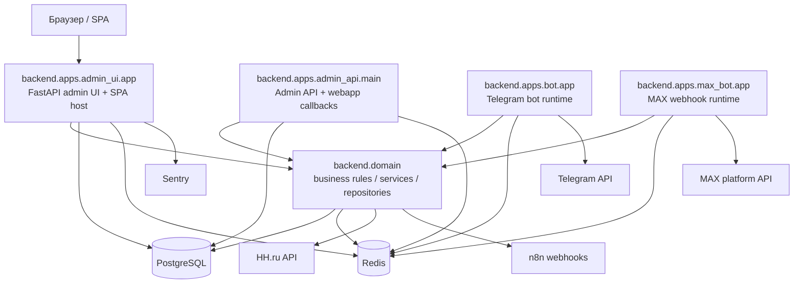

# RecruitSmart Architecture Overview

## Purpose
Это канонический обзор архитектуры текущего modular monolith RecruitSmart Admin. Документ фиксирует основные runtime-границы, владельцев подсистем, внешние интеграции и то, какие части репозитория считаются source of truth для архитектурных решений.

## Owner
Platform Engineering

## Status
Canonical

## Last Reviewed
2026-03-25

## Source Paths
- `backend/apps/admin_ui/app.py`
- `backend/apps/admin_api/main.py`
- `backend/apps/bot/app.py`
- `backend/apps/max_bot/app.py`
- `backend/domain/`
- `backend/migrations/`
- `frontend/app/src/app/main.tsx`
- `frontend/app/src/app/routes/__root.tsx`
- `README.md`
- `docs/TECHNICAL_OVERVIEW.md`
- `docs/TECH_STRATEGY.md`

## Related Diagrams
- [runtime-topology.md](./runtime-topology.md)
- [core-workflows.md](./core-workflows.md)

## Change Policy
Менять этот документ только вместе с изменением code-boundary, runtime boundary или ownership model. Исторические документы вне `docs/architecture/` не переписываются как canonical source of truth; они остаются справочным материалом.

## System Context
RecruitSmart Admin состоит из FastAPI-сервера админки, отдельного admin API, React SPA, Telegram bot runtime, MAX bot runtime, доменного слоя и Postgres/Redis-инфраструктуры. Пользовательские и операционные сценарии проходят через backend, а UI слой отвечает только за навигацию, формы и отображение состояния.

## Boundary Map
| Компонент | Владеет | Не владеет |
| --- | --- | --- |
| `backend/apps/admin_ui` | HTTP boundary для CRM UI, candidate portal, workflow, slots, AI, HH-интеграций, health и metrics | Не владеет доставкой сообщений, broker/retry логикой и правилами домена |
| `backend/apps/admin_api` | Отдельные webapp endpoints, recruiter webapp, slot assignment callbacks, HH sync callbacks | Не владеет SPA-роутингом и визуальной навигацией |
| `backend/apps/bot` | Telegram polling runtime, recruiter UX, notification worker, reminder scheduler | Не владеет бизнес-правилами назначения слотов и source of truth по данным |
| `backend/apps/max_bot` | MAX webhook runtime, MAX-specific onboarding/linking | Не владеет общей моделью кандидата и основными workflow-правилами |
| `backend/domain` | Модели, сервисы, репозитории, outbox, slot assignment, candidate portal, HH sync/import | Не владеет HTTP-transport и UI |
| `backend/migrations` | Изменение схемы БД | Не владеет бизнес-логикой runtime |
| `frontend/app` | TanStack Router, экранные состояния, запросы к API, визуальная композиция | Не владеет persistence и side effects |

## Ownership And Contracts
- `backend/domain` является местом, где должны жить инварианты данных и workflow-правила.
- `backend/apps/*` слои собирают transport, auth, middleware, router wiring и runtime bootstrap.
- `frontend/app/src/app/main.tsx` задаёт актуальную карту mounted routes для SPA.
- `backend/migrations/` остается единственным source of truth для schema evolution.
- `docs/architecture/*` это каноническая документация; дублирование сюда же допускается только в виде новых canonical страниц, а не в виде правки старых исторических описаний.

## Canonical Notes
- `admin_ui` обслуживает основной CRM boundary и candidate portal.
- `admin_api` остается отдельным сервисным boundary для Telegram webapp, recruiter webapp и HH/n8n callbacks.
- `bot` и `max_bot` реализуют delivery/runtime слой, а не domain source of truth.
- Redis используется для broker/cache/rate-limit/claim semantics там, где это требуется текущим кодом.
- PostgreSQL остается primary data store.
