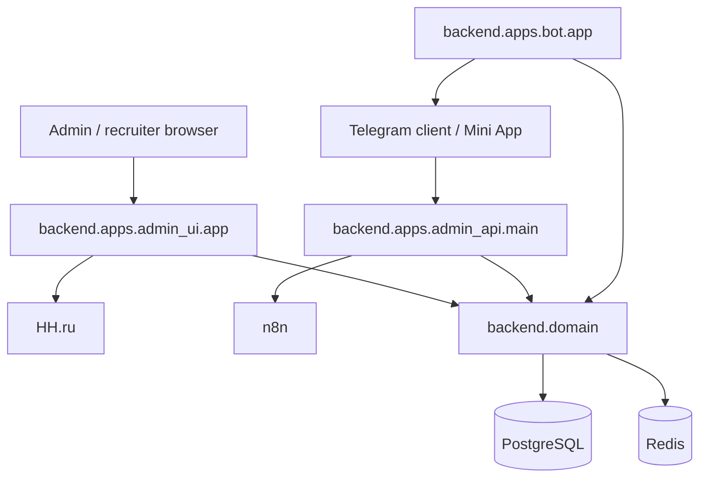

# RecruitSmart Architecture Overview

## Purpose
Канонический обзор текущего RecruitSmart runtime. Документ фиксирует активные boundaries и отдельно помечает legacy/historical implementation и future target state.

## Owner
Platform Engineering

## Status
Canonical

## Last Reviewed
2026-04-16

## Source Paths
- `backend/apps/admin_ui/app.py`
- `backend/apps/admin_api/main.py`
- `backend/apps/bot/app.py`
- `backend/domain/`
- `backend/migrations/`
- `frontend/app/src/app/main.tsx`
- `docs/architecture/supported_channels.md`

## Related Docs
- [runtime-topology.md](./runtime-topology.md)
- [supported_channels.md](./supported_channels.md)

## System Context
RecruitSmart сейчас состоит из:
- `admin_ui` как основного HTTP boundary для CRM SPA, admin/recruiter API, auth/session/CSRF, health и operator tooling;
- `admin_api` как отдельного boundary для Telegram Mini App / recruiter webapp и n8n HH callbacks;
- `bot` как единственного supported live messaging runtime;
- `backend/domain` как источника бизнес-инвариантов, workflow и persistence logic;
- PostgreSQL и Redis как инфраструктурной базы.

## Runtime Classification

| Surface class | Current truth |
| --- | --- |
| Supported runtime | Admin SPA, Telegram bot runtime, Telegram Mini App / recruiter webapp, HH integration, n8n HH callbacks |
| Unsupported legacy / historical implementation | legacy candidate portal implementation, historical MAX runtime |
| Target state, not current runtime | future standalone candidate web flow, future MAX mini-app/channel adapter, SMS / voice fallback integration |

## Boundary Map

| Component | Owns | Does not own |
| --- | --- | --- |
| `backend/apps/admin_ui` | Admin SPA host, recruiter/admin API routes, auth/session/CSRF boundary, public shallow health probes, protected observability, HH operator surfaces | Message delivery runtime, domain truth, standalone candidate web flow runtime |
| `backend/apps/admin_api` | Telegram Mini App API, recruiter webapp API, HH sync callback endpoints | SPA routing, admin browser shell |
| `backend/apps/bot` | Telegram polling runtime, reminder/notification workers, delivery semantics | Domain source of truth, admin browser flows |
| `backend/domain` | Business rules, repositories, candidate lifecycle, slot workflows, HH sync/import, auditable state transitions | HTTP transport, browser routing |
| `frontend/app` | Mounted SPA route tree, React Query client, admin UX composition | Persistence, auth enforcement, delivery side effects |
| `backend/migrations` | Schema evolution | Runtime behavior |

## Canonical Notes
- `admin_ui` is the primary supported browser runtime.
- `admin_api` remains a separate service boundary for Telegram/webapp and automation callbacks.
- Telegram is the only supported live messaging runtime today.
- Legacy candidate portal implementation is unsupported and must fail closed at `/candidate*`.
- Historical MAX runtime is unsupported and excluded from default compose/runtime.
- Future standalone candidate web flow and future MAX mini-app/channel adapter remain target-state concepts, but they are not mounted, advertised, or supported in the current runtime.
- OpenAPI truth must be generated from live app factories, not edited manually.
