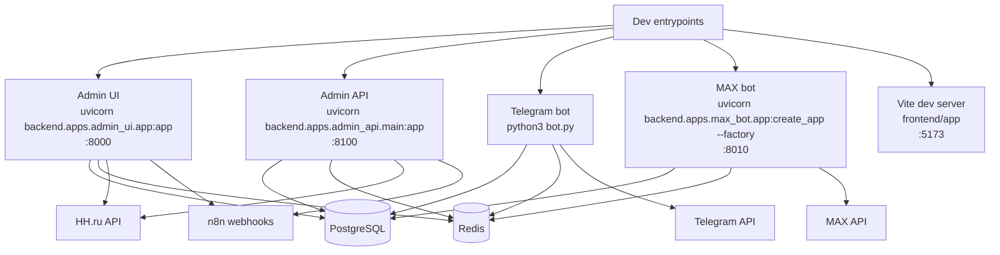

# RecruitSmart Runtime Topology

## Purpose
Каноническая карта процессов, портов, зависимостей и failure domains. Документ нужен для локального запуска, production troubleshooting и планирования расширения команды без расшифровки кода с нуля.

## Owner
Platform Engineering

## Status
Canonical

## Last Reviewed
2026-03-25

## Source Paths
- `backend/apps/admin_ui/app.py`
- `backend/apps/admin_api/main.py`
- `backend/apps/bot/app.py`
- `backend/apps/max_bot/app.py`
- `scripts/dev_admin.sh`
- `scripts/dev_bot.sh`
- `scripts/dev_max_bot.sh`
- `scripts/dev_crm.sh`
- `Makefile`
- `backend/core/settings.py`
- `backend/core/cache.py`
- `backend/core/messenger/bootstrap.py`
- `backend/apps/bot/services/notification_flow.py`

## Related Diagrams
- [overview.md](./overview.md)
- [core-workflows.md](./core-workflows.md)

## Change Policy
Любое изменение runtime boundary, порта, env-настройки, bootstrap order или background worker semantics должно отражаться здесь в том же коммите, что и код. Если runtime меняется только в dev mode, это тоже фиксируется.

## Runtime Graph

## Processes
| Process | Dev command | Port | Key responsibilities | Failure domain |
| --- | --- | --- | --- | --- |
| Admin UI | `python3 -m uvicorn backend.apps.admin_ui.app:app --host 0.0.0.0 --port 8000 --reload` | `8000` | SPA host, CRM HTTP boundary, candidate portal, workflow, slots, AI, notifications ops, HH webhooks | DB availability, Redis availability, SPA build presence |
| Admin API | `python3 -m uvicorn backend.apps.admin_api.main:app --host 0.0.0.0 --port 8100 --reload` | `8100` | Telegram webapp API, recruiter webapp API, slot assignments, HH sync callbacks | DB availability, Redis availability, webhook auth |
| Telegram bot | `python3 bot.py` | n/a | Candidate/recruiter chat UX, reminder service, notification worker, adapter registry | Telegram API, Redis, DB, scheduler |
| MAX bot | `uvicorn backend.apps.max_bot.app:create_app --factory --host 0.0.0.0 --port 8010 --reload` | `8010` | MAX webhook receiver, dedupe, candidate linking, MAX-specific flow | MAX API, Redis, DB, webhook subscription config |
| Frontend dev server | `npm --prefix frontend/app run dev` | `5173` | Local SPA development only | backend `/api` availability |
| Migrations | `python3 scripts/run_migrations.py` | n/a | Schema evolution before service start | Postgres connectivity |

## Startup Order
1. Load env from `.env.local` или `.env.local.example`.
2. Apply migrations before starting HTTP runtimes.
3. Initialize Postgres connection.
4. Initialize Redis/cache if configured.
5. Build FastAPI app, mount routers, then start background watchers/workers.
6. For bot runtimes, bootstrap scheduler, reminders, notification service, and messenger adapters.
7. For MAX runtime, reconcile webhook subscriptions and start webhook handling.

## Background Work
- `backend/apps/admin_ui/app.py` поднимает cache/database health watchers и periodic jobs.
- `backend/apps/bot/app.py` запускает reminder service, notification service, content update subscriber и heartbeat loop.
- `backend/apps/max_bot/app.py` использует dedupe cache для webhook events и управляет subscription reconciliation.
- `backend/apps/bot/services/notification_flow.py` обрабатывает outbox claim/send/retry цикл.
- `backend/apps/admin_ui/background_tasks.py` запускает periodic HH sync/import, stalled candidate checks и cleanup свободных слотов.

## Failure Domains
- Если Postgres недоступен, бизнес-операции должны деградировать, а health endpoints возвращать не-healthy статус.
- Если Redis недоступен, система должна продолжать работу в деградированном режиме там, где это допускает код, но без silent loss of retry/claim semantics.
- Если Telegram/MAX adapters не зарегистрированы, outbox items для этих платформ должны считаться недоставляемыми и попадать в retry/failure path.
- Если HH OAuth или webhook secret не настроены, HH-интеграция остается неактивной, но core CRM продолжает работать.
- Если SPA bundle отсутствует, admin UI отдает явную ошибку вместо молчаливой деградации.

## Health And Observability
| Surface | Purpose | Source |
| --- | --- | --- |
| `GET /health` on admin UI | App, DB and Redis health | `backend/apps/admin_ui/app.py` |
| `GET /health` on admin API | App, DB and Redis health | `backend/apps/admin_api/main.py` |
| `/metrics` and Prometheus instrumentation | HTTP, DB, cache and degraded-mode metrics | `backend/apps/admin_ui/perf/metrics/` |
| JSON logs and request IDs | Correlation across runtime boundaries | `backend/core/logging.py`, middleware in `backend/apps/admin_ui/app.py` |
| Sentry | Exception tracking, if configured | `backend/apps/admin_ui/app.py` |

## Configuration Surface
- `DATABASE_URL`
- `REDIS_URL`
- `SESSION_SECRET`
- `BOT_TOKEN`
- `BOT_ENABLED`
- `BOT_NOTIFICATION_RUNTIME_ENABLED`
- `MAX_BOT_ENABLED`
- `MAX_BOT_TOKEN`
- `MAX_WEBHOOK_URL`
- `MAX_WEBHOOK_SECRET`
- `MAX_BOT_LINK_BASE`
- `HH_INTEGRATION_ENABLED`
- `HH_WEBHOOK_SECRET`
- `N8N_HH_SYNC_WEBHOOK_URL`
- `N8N_HH_RESOLVE_WEBHOOK_URL`

## Operational Notes
- `admin_ui` uses the mounted SPA build under `frontend/dist` in production-style runs.
- `admin_api` is separate from the UI server and may be launched only when Telegram webapp or callback flows require it.
- The bot runtime is not a passive library; it owns message delivery and scheduling semantics.
- The MAX runtime is optional and must remain isolated from Telegram-specific logic.
