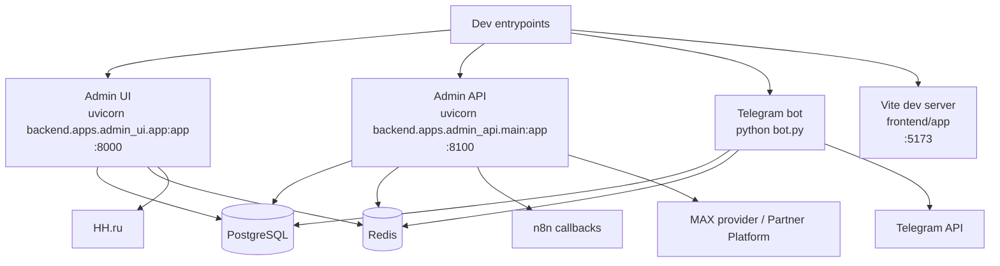

# RecruitSmart Runtime Topology

## Purpose
Каноническая карта текущих процессов, портов, зависимостей и public/operator operational surfaces.

## Owner
Platform Engineering

## Status
Canonical

## Last Reviewed
2026-04-19

## Source Paths
- `backend/apps/admin_ui/app.py`
- `backend/apps/admin_api/main.py`
- `backend/apps/admin_api/max_miniapp.py`
- `backend/apps/admin_api/candidate_access/router.py`
- `backend/apps/bot/app.py`
- `backend/apps/admin_ui/routers/system.py`
- `backend/core/settings.py`
- `docker-compose.yml`
- `max_bot.py`
- `scripts/dev_admin.sh`
- `scripts/dev_bot.sh`
- `Makefile`

## Related Docs
- [overview.md](./overview.md)
- [supported_channels.md](./supported_channels.md)

## Runtime Graph

## Processes

| Process | Dev command | Port | Responsibilities | Notes |
| --- | --- | --- | --- | --- |
| Admin UI | `python3 -m uvicorn backend.apps.admin_ui.app:app --host 0.0.0.0 --port 8000 --reload` | `8000` | SPA host, admin/recruiter HTTP boundary, auth/session/CSRF, admin UI `/api/*`, shallow health probes, protected metrics, operator diagnostics | `/candidate*` is intentionally closed with `410 Gone`. |
| Admin API | `python3 -m uvicorn backend.apps.admin_api.main:app --host 0.0.0.0 --port 8100 --reload` | `8100` | Telegram Mini App APIs, recruiter webapp APIs, HH sync callbacks, bounded MAX launch/auth and webhook shell at `/api/max/*`, MAX mini-app host shell at `/miniapp`, shared candidate-facing MAX APIs at `/api/candidate-access/*` | Separate service boundary from `admin_ui`; MAX path remains guarded, default-off, and fail-closed when disabled or unconfigured. |
| Admin UI MAX rollout surface | served by `backend.apps.admin_ui.app` | same as admin UI | protected recruiter/operator MAX invite rollout at `/api/candidates/{candidate_id}/max-launch-invite` plus revoke alias | Pilot-only control surface; preview/send split, adapter default-off, and no candidate-facing transport on `/api/webapp/*`. |
| MAX bounded candidate mini-app | served by `backend.apps.admin_api.main` + built SPA bundle | same as admin API | candidate-facing bounded pilot at `/miniapp` and `/api/candidate-access/*` | Mounted for controlled pilot only; first global launch creates a hidden draft candidate and starts shared Test1 immediately, while shared candidate journey remains canonical; not a production MAX rollout. |
| Telegram bot | `python3 bot.py` | n/a | Telegram messaging runtime, reminder service, notification worker | Supported channel runtime. |
| Frontend dev server | `npm --prefix frontend/app run dev` | `5173` | Local SPA development only | Proxies into `admin_ui`. |
| Migrations | `python3 scripts/run_migrations.py` | n/a | Schema evolution before service startup | Run before HTTP runtimes in non-ephemeral environments. |
| Historical MAX runtime | disabled by default | n/a | historical/experimental only | `docker-compose.yml` keeps it behind `profiles: [max]`; `max_bot.py` is a disabled stub. |

## Default Compose Contour
- `postgres`
- `redis_notifications`
- `redis_cache`
- `migrate`
- `admin_ui`
- `admin_api`
- `bot`

`max_bot` is excluded from the default contour and must not break standard `docker compose up`.

## Health And Observability

| Surface | Exposure | Purpose |
| --- | --- | --- |
| `GET /healthz` | public | liveness only |
| `GET /ready` | public | readiness only, no sensitive payload |
| `GET /health` | public | shallow structured dependency health |
| `GET /health/bot` | authenticated operator only | bot runtime diagnostics |
| `GET /health/notifications` | authenticated operator only | notification/reminder diagnostics |
| `GET /health/max` | authenticated operator only | bounded MAX runtime snapshot without enabling MAX rollout |
| `POST /health/max/sync` | authenticated operator only + CSRF | manual MAX `/me` + `/subscriptions` probe, syncs degraded/healthy channel state |
| `GET /metrics` | protected | Prometheus app metrics; guarded by auth and/or IP allowlist |
| `GET /metrics/notifications` | protected | notification metrics; same protection model as `/metrics` |
| `GET /api/system/messenger-health*` | authenticated admin | operator channel health and recovery |

## Configuration Surface
- `DATABASE_URL`
- `REDIS_URL`
- `SESSION_SECRET`
- `BOT_ENABLED`
- `BOT_TOKEN`
- `BOT_CALLBACK_SECRET`
- `BOT_INTEGRATION_ENABLED`
- `BOT_NOTIFICATION_RUNTIME_ENABLED`
- `HH_INTEGRATION_ENABLED`
- `HH_WEBHOOK_SECRET`
- `MAX_ADAPTER_ENABLED` (guarded pilot canonical switch)
- `MAX_BOT_ENABLED` (compatibility alias only; not the canonical pilot switch)
- `MAX_INVITE_ROLLOUT_ENABLED` (guarded operator pilot only)
- `MAX_BOT_TOKEN` (guarded pilot only)
- `MAX_PUBLIC_BOT_NAME` (guarded pilot only)
- `MAX_MINIAPP_URL` (guarded pilot only)
- `MAX_BOT_API_SECRET` (guarded pilot only; `MAX_WEBHOOK_SECRET` legacy fallback)
- `MAX_WEBHOOK_URL` (guarded pilot inventory only)
- `MAX_INIT_DATA_MAX_AGE_SECONDS` (guarded pilot only)
- `METRICS_ENABLED`
- `METRICS_IP_ALLOWLIST`
- `ALLOW_DESTRUCTIVE_ADMIN_ACTIONS`

Historical `MAX_*` settings are not part of the supported default runtime contract. Guarded MAX pilot envs exist only for bounded launch/auth, webhook, `/miniapp`, shared `/api/candidate-access/*`, and operator rollout surfaces. In the current pilot, a global `/miniapp` launch creates a hidden MAX draft candidate and keeps that draft out of operator-facing CRM surfaces until intake activation. These pilot seams do not change the default compose contour or the fact that Telegram remains the only supported live messaging runtime today. Future standalone candidate web flow, future full MAX rollout beyond the bounded pilot, and SMS/voice fallback remain target-state notes only and do not change the current runtime topology.
