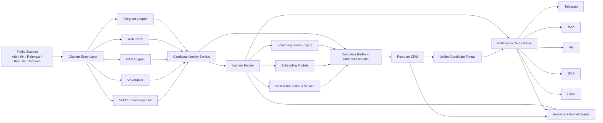
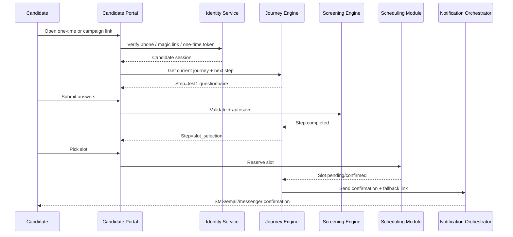
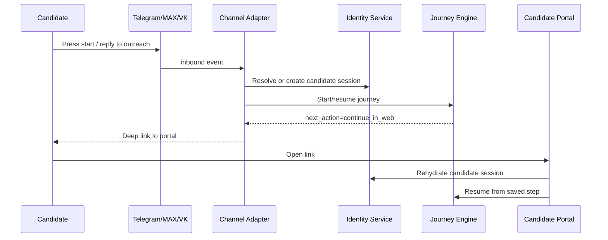
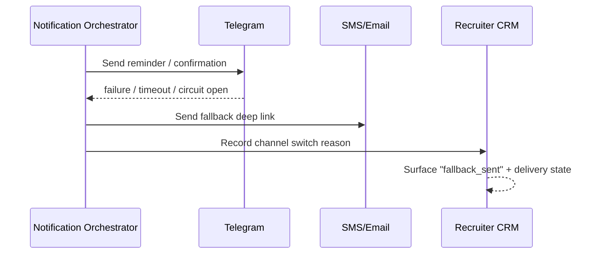

# Candidate Experience Target Architecture

## Recommended Target Model

Рекомендуемая целевая модель для этого репозитория:

**web-first candidate journey + messenger entry + SMS/email fallback + channel adapters over a shared journey engine**

Это решение лучше всего соответствует текущему коду, потому что:

- уже есть reusable storage и dispatch primitives;
- Telegram слишком глубоко встроен, чтобы второй бот решил root cause;
- самый большой gap сейчас не в отсутствии второго канала, а в отсутствии независимого candidate-facing runtime;
- web layer дает лучший UX для screening, scheduling, resume и status visibility.

## Design Principles

1. `candidate_id` становится главным business identity.
2. Канал входа не равен месту прохождения journey.
3. Journey state хранится как бизнес-сессия, а не как state конкретного бота.
4. Messenger adapters отвечают за transport, а не за orchestration.
5. Screening, scheduling, notifications и recruiter communication работают через общие сервисы.
6. Каждый шаг должен быть resume-able.
7. Любое сообщение кандидату должно иметь fallback destination и delivery telemetry.

## Target Layers

### 1. Channel adapters

Adapters принимают inbound event и нормализуют его в универсальные команды:

- Telegram adapter
- Candidate Web adapter
- MAX adapter
- VK adapter
- SMS/email notification adapters
- Web chat widget adapter

Responsibilities:

- принять transport-specific payload;
- resolve candidate/channel identity;
- пробросить action в journey engine или communication layer;
- не хранить domain state внутри адаптера.

### 2. Universal candidate journey engine

Новый слой оркестрации сценариев:

- versioned journey definitions;
- step registry;
- transition rules;
- step completion;
- resume state;
- next-best-action.

На старте не нужен тяжелый BPM/workflow product. Достаточно:

- versioned JSON/YAML step definitions;
- Python step handlers;
- persisted `journey_session` + `journey_step_state`;
- deterministic transition service.

### 3. Candidate profile layer

Нормализует все каналы в единый профиль:

- canonical candidate record;
- multiple channel identities per candidate;
- contact verification state;
- dedup rules by phone/email/external ids;
- source attribution;
- unified history.

### 4. Screening / form engine

Универсальный engine поверх текущих Test1/Test2 primitives:

- question schemas;
- validation rules;
- branching;
- scoring;
- autosave per step;
- renderable in web and optionally in messenger for short steps.

### 5. Scheduling module

Опирается на текущие `Slot`, `SlotAssignment`, `RescheduleRequest`, `ActionToken`, но выносится в neutral APIs:

- list availability;
- hold/reserve/confirm;
- candidate self-serve confirm/cancel/reschedule;
- recruiter approval;
- fallback to manual scheduling when no capacity.

### 6. Recruiter communication layer

Единый thread:

- comments;
- outbound messages;
- candidate replies;
- action cards;
- next action;
- SLA markers.

Важно: thread должен существовать даже если кандидат временно unreachable в одном канале.

### 7. Notification orchestration

Поверх текущего outbox:

- preferred channel selection;
- retry logic;
- fallback chains;
- delivery state tracking;
- deep links;
- quiet hours / throttling;
- escalation to recruiter when candidate unreachable.

### 8. Analytics / observability

Unified funnel layer:

- channel attribution;
- journey stage metrics;
- drop-off by step and by channel;
- delivery SLA;
- fallback effectiveness;
- recruiter response SLA.

## Proposed Architecture Diagram



## Key Runtime Sequences

### Web-first entry



### Messenger entry -> web continuation



### Telegram unavailable -> automatic fallback



## Reuse Plan For Existing Modules

### Reuse largely as-is

- `User.candidate_id`
- `ChatMessage`
- `OutboxNotification`
- `backend/core/messenger/protocol.py`
- `backend/core/messenger/registry.py`
- `reserve_slot()` conflict rules
- `SlotAssignment` / `RescheduleRequest` / `ActionToken`
- `CandidateInviteToken` pattern
- analytics table and dashboard aggregation baseline

### Reuse with adapter/facade

- `CandidateStatusService` and workflow service
- Test1 partial validation
- reminder scheduler
- recruiter candidate thread APIs
- webapp slot APIs

### Replace or deprecate over time

- bot state as primary journey storage
- `status_service` APIs keyed by `telegram_id`
- Telegram WebApp auth as only candidate web auth
- recruiter outbound chat sender that requires Telegram ID

## Proposed Domain Extensions

### New tables / aggregates

1. `candidate_channel_accounts`
   - `id`
   - `candidate_id`
   - `channel_type` (`telegram`, `max`, `vk`, `phone`, `email`, `web`)
   - `external_user_id`
   - `address` (phone/email/login when relevant)
   - `is_verified`
   - `is_primary`
   - `last_seen_at`
   - `meta_json`

2. `candidate_journey_sessions`
   - `id`
   - `candidate_id`
   - `journey_key`
   - `journey_version`
   - `entry_channel`
   - `current_step_key`
   - `status` (`active`, `completed`, `abandoned`, `blocked`)
   - `started_at`
   - `last_activity_at`
   - `completed_at`

3. `candidate_journey_step_states`
   - `id`
   - `session_id`
   - `step_key`
   - `step_type`
   - `status`
   - `payload_json`
   - `started_at`
   - `completed_at`

4. `candidate_access_tokens`
   - one-time and renewable deep links;
   - magic links;
   - resume tokens;
   - purpose-specific tokens (`portal_login`, `resume_flow`, `slot_action`).

5. `candidate_screening_runs`
   - canonical run for Test1/Test2/web form;
   - source channel;
   - score;
   - result;
   - started/completed timestamps.

6. `candidate_screening_answers`
   - normalized answers per step/question;
   - bridge to current `QuestionAnswer` migration path.

7. `notification_deliveries`
   - expands current logs with channel attempt lineage;
   - stores fallback reason and provider response.

### Optional later

- `candidate_documents`
- `candidate_portal_events`
- `candidate_status_timeline`

## Identity And Dedup Strategy

### Canonical identity

- canonical key: `candidate_id`
- stable human contacts:
  - phone
  - email
  - messenger external ids
- source attribution:
  - ad campaign
  - HH
  - recruiter manual
  - organic messenger start

### Dedup rules

P0:

- exact phone match -> same candidate unless explicitly overridden;
- exact verified email match -> same candidate;
- known messenger account -> same candidate;
- `candidate_access_token` always maps to single candidate.

P1:

- fuzzy merge suggestions by FIO + city + recent source;
- admin merge UI for ambiguous duplicates.

## Journey Model

### Recommended initial journey states

1. `entry`
2. `contact_verification`
3. `profile_intake`
4. `screening_test1`
5. `screening_review`
6. `slot_selection`
7. `slot_pending`
8. `interview_confirmed`
9. `awaiting_recruiter_followup`
10. `test2`
11. `intro_day`
12. `completed`
13. `rejected`
14. `abandoned`

### Why not reuse current status enum directly as engine state

Current `CandidateStatus` хорошо отражает pipeline, но плохо подходит на роль полного runtime state, потому что:

- не хранит partial step progress;
- смешивает operational и business meanings;
- привязан к historical Telegram lifecycle.

Рекомендуем:

- сохранить `CandidateStatus` как pipeline projection;
- вести journey session отдельно;
- строить `workflow_status`/candidate status как projection из journey engine + recruiter actions.

## API Draft

### Candidate portal auth

- `POST /api/candidate/auth/request-code`
- `POST /api/candidate/auth/verify-code`
- `POST /api/candidate/auth/magic-link/request`
- `POST /api/candidate/auth/token/exchange`

### Candidate session / status

- `GET /api/candidate/me`
- `GET /api/candidate/journey/current`
- `GET /api/candidate/status`
- `GET /api/candidate/timeline`
- `GET /api/candidate/next-action`

### Screening

- `GET /api/candidate/journey/steps/{stepKey}`
- `POST /api/candidate/journey/steps/{stepKey}/save`
- `POST /api/candidate/journey/steps/{stepKey}/complete`

### Scheduling

- `GET /api/candidate/slots`
- `POST /api/candidate/slots/{slotId}/reserve`
- `POST /api/candidate/bookings/{bookingId}/confirm`
- `POST /api/candidate/bookings/{bookingId}/cancel`
- `POST /api/candidate/bookings/{bookingId}/reschedule`

### Communication

- `GET /api/candidate/thread`
- `POST /api/candidate/thread/messages`
- `GET /api/candidate/notifications/preferences`
- `POST /api/candidate/notifications/preferences`

### Recruiter actions

- `POST /api/recruiter/candidates/{candidateId}/status`
- `POST /api/recruiter/candidates/{candidateId}/send-message`
- `POST /api/recruiter/slot-assignments/{assignmentId}/approve`
- `POST /api/recruiter/slot-assignments/{assignmentId}/reschedule`

## Service Interfaces Draft

### Identity service

```python
class CandidateIdentityService:
    async def resolve_or_create(self, *, entry_channel: str, phone: str | None, email: str | None,
                                external_user_id: str | None, source: str | None) -> CandidateIdentity: ...
    async def issue_access_token(self, candidate_id: str, *, purpose: str, ttl_minutes: int) -> str: ...
    async def verify_access_token(self, token: str, *, purpose: str | None = None) -> CandidateIdentity: ...
    async def link_channel_account(self, candidate_id: str, *, channel_type: str, external_user_id: str) -> None: ...
```

### Journey engine

```python
class CandidateJourneyEngine:
    async def start(self, candidate_id: str, *, journey_key: str, entry_channel: str) -> JourneySession: ...
    async def get_current(self, candidate_id: str) -> JourneySession: ...
    async def save_step(self, session_id: str, step_key: str, payload: dict) -> StepState: ...
    async def complete_step(self, session_id: str, step_key: str, payload: dict) -> TransitionResult: ...
    async def resume(self, candidate_id: str, *, token: str | None = None) -> JourneySession: ...
```

### Notification orchestration

```python
class CandidateNotificationOrchestrator:
    async def send(self, candidate_id: str, *, template_key: str, context: dict,
                   preferred_channels: list[str] | None = None) -> DeliveryResult: ...
    async def send_with_fallback(self, candidate_id: str, *, template_key: str,
                                 chain: list[str], context: dict) -> DeliveryChainResult: ...
```

## Event Schema Draft

Минимальный новый event catalog:

- `candidate.entered`
- `candidate.channel_linked`
- `candidate.channel_unreachable`
- `journey.started`
- `journey.resumed`
- `journey.abandoned`
- `journey.completed`
- `step.started`
- `step.saved`
- `step.completed`
- `screening.completed`
- `slot.reserved`
- `slot.approved`
- `slot.confirmed`
- `slot.rescheduled`
- `slot.cancelled`
- `notification.sent`
- `notification.failed`
- `notification.fallback_triggered`
- `recruiter.message_sent`
- `candidate.message_received`

## Frontend Architecture Draft

### New route group

Рекомендуем добавить отдельную candidate route group, не смешивая ее с `/tg-app`:

- `/candidate/login`
- `/candidate/start/:token`
- `/candidate/journey`
- `/candidate/screening`
- `/candidate/slots`
- `/candidate/booking/:bookingId`
- `/candidate/status`
- `/candidate/messages`
- `/candidate/documents`

### UI principles

- mobile-first;
- minimal friction auth;
- autosave every step;
- explicit progress indicator;
- persistent “next action” card;
- one-tap re-entry from SMS/email/messenger.

## Notification Strategy

### Recommended fallback order

For high-intent transactional steps:

1. preferred messenger
2. SMS with secure deep link
3. email fallback
4. recruiter task if delivery chain failed

For reminders:

1. preferred messenger or push
2. SMS only near critical steps
3. recruiter alert on repeated failure

### Delivery state visible in CRM

Recruiter должен видеть:

- last attempted channel;
- delivery success/failure;
- fallback triggered or not;
- candidate last seen;
- suggested next outreach action.

## Incremental Migration From Current Code

### Phase A

- wrap current Telegram bot as one adapter over new identity/journey services;
- keep existing bot UX while domain state moves out of bot state;
- keep current slot and status projections.

### Phase B

- add candidate portal with OTP/magic link;
- route screening and scheduling through shared APIs;
- make Telegram messages deep-link into portal.

### Phase C

- replatform reminders/chat/fallback over notification orchestrator;
- enable second messenger channel.

## New Environment Variables

- `CANDIDATE_PORTAL_BASE_URL`
- `CANDIDATE_ACCESS_TOKEN_SECRET`
- `CANDIDATE_ACCESS_TOKEN_TTL_MINUTES`
- `CANDIDATE_AUTH_SMS_PROVIDER`
- `CANDIDATE_AUTH_SMS_API_KEY`
- `CANDIDATE_AUTH_EMAIL_PROVIDER`
- `CANDIDATE_AUTH_EMAIL_API_KEY`
- `NOTIFICATION_FALLBACK_CHAIN_DEFAULT`
- `NOTIFICATION_DELIVERY_TIMEOUT_SECONDS`
- `PORTAL_UPLOADS_S3_BUCKET` or equivalent

## Non-Goals For MVP

- не строить суперприложение;
- не переписывать весь recruiter CRM;
- не убирать Telegram из системы;
- не вводить тяжелый внешний BPM engine;
- не делать full real-time chat across all channels на первом этапе.

## Target Outcome

После внедрения core journey перестает зависеть от одного transport layer:

- Telegram остается entry/notification channel;
- web portal становится главным runtime для screening, booking и status visibility;
- MAX/VK можно подключать как adapters поверх того же engine;
- SMS/email начинают работать как real fallback, а не как side process outside system.
