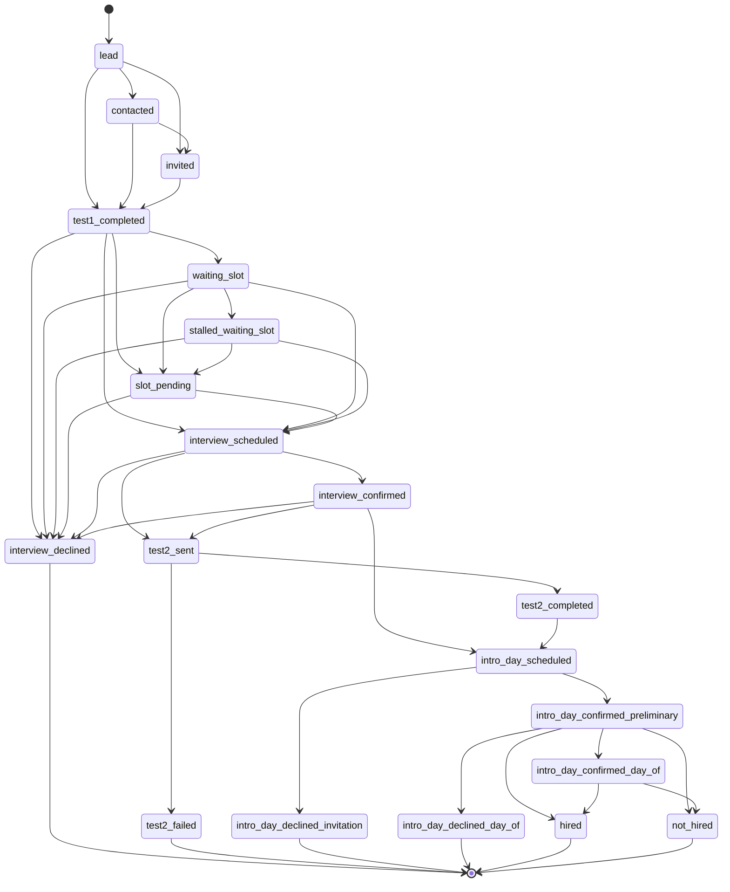
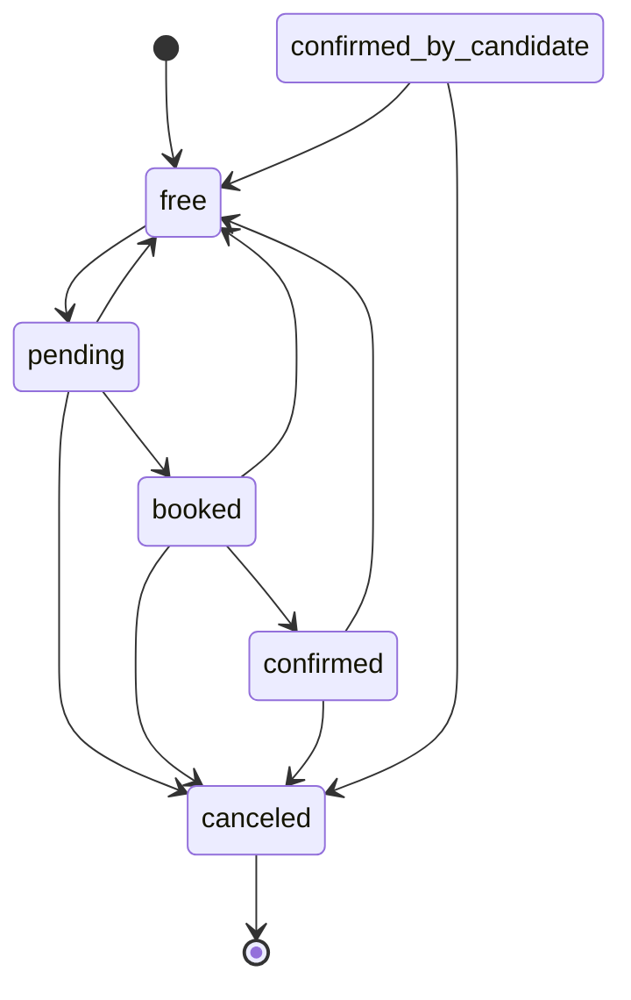

# Словарь данных RecruitSmart

## Header
- Purpose: зафиксировать канонический словарь данных RecruitSmart Admin: сущности, ownership, FK/relations, критические статусы, lifecycle-контракты и политику миграций.
- Owner: Backend / Data team
- Status: canonical
- Last Reviewed: 2026-03-25
- Source Paths: [`backend/domain/models.py`](../../backend/domain/models.py), [`backend/domain/candidates/models.py`](../../backend/domain/candidates/models.py), [`backend/domain/candidates/status.py`](../../backend/domain/candidates/status.py), [`backend/domain/candidates/workflow.py`](../../backend/domain/candidates/workflow.py), [`backend/domain/candidates/journey.py`](../../backend/domain/candidates/journey.py), [`backend/domain/detailization/models.py`](../../backend/domain/detailization/models.py), [`backend/domain/ai/models.py`](../../backend/domain/ai/models.py), [`backend/domain/hh_integration/models.py`](../../backend/domain/hh_integration/models.py), [`backend/domain/hh_integration/contracts.py`](../../backend/domain/hh_integration/contracts.py), [`backend/domain/hh_sync/models.py`](../../backend/domain/hh_sync/models.py), [`backend/domain/cities/models.py`](../../backend/domain/cities/models.py), [`backend/domain/tests/models.py`](../../backend/domain/tests/models.py), [`backend/domain/auth_account.py`](../../backend/domain/auth_account.py), [`backend/domain/analytics_models.py`](../../backend/domain/analytics_models.py), [`backend/migrations/versions/*.py`](../../backend/migrations/versions/)
- Related Diagrams: [`docs/data/erd.md`](./erd.md)
- Change Policy: любые изменения схемы/статусов делаются сначала в коде и миграциях, потом в этом словаре. Для destructive-изменений нужен переходный этап: добавить новое, backfill, переключить чтение/запись, затем удалить старое только после валидации и отката.

## Source-of-truth Notes

- Relational truth lives in SQLAlchemy models and migration files. Этот документ является производным описанием, а не альтернативной схемой.
- `candidate_status` - главный бизнес-контракт в воронке кандидата. `workflow_status` - derived compatibility layer для UI/операций.
- `lifecycle_state`, `archive_stage`, `final_outcome`, `final_outcome_reason` - производные атрибуты архива и финального исхода. Их нельзя трактовать как отдельную независимую воронку.
- `slot.status` - источник истины для жизненного цикла слота; `slot_assignments.status` - источник истины для конкретного оффера/подтверждения/переноса.
- Полиморфные поля `principal_type/principal_id` в `auth_accounts`, `ai_request_logs`, `ai_agent_threads`, `staff_*`, `audit_log` и похожих таблицах - намеренно без FK. Это контракт ownership, а не реляционная связь.
- SQLite-слой в dev/test - compatibility layer. Production target остаётся PostgreSQL.

## Миграционная Политика

- Схему меняем только через миграции в `backend/migrations/versions/`.
- Порядок безопасного изменения: добавить новое поле или таблицу, backfill данных, включить чтение/запись на новый контракт, потом ужесточить ограничения и только потом удалять старый артефакт.
- Любое изменение enum/строкового статуса должно сопровождаться обновлением сервисов, тестов и этого словаря.
- Если миграция поддерживает SQLite и PostgreSQL по-разному, в документации нужно отметить это явно. В коде не полагаться на поведение одной СУБД как на единственно верное.
- Документы `docs/data/*` обновляются в том же PR, что и schema-affecting code. Иначе описанный канон быстро становится ложным.

## Кандидатский Контур

| Сущность | Ownership | FK / relations | Назначение | Lifecycle / notes |
| --- | --- | --- | --- | --- |
| `users` | Candidate core | `responsible_recruiter_id -> recruiters.id` | Центральная запись кандидата и агрегат для портала, тестов, статусов и архива | `candidate_status` + `workflow_status` + `lifecycle_state` + `final_outcome` |
| `candidate_journey_sessions` | Candidate core | `candidate_id -> users.id` | Сессия кандидатского journey (portal/web) | `status = active/completed/abandoned/blocked`, `session_version` invalidates stale header/browser recovery |
| `candidate_journey_step_states` | Candidate core | `session_id -> candidate_journey_sessions.id` | Статус каждого шага journey | `pending/in_progress/completed/skipped` |
| `candidate_journey_events` | Candidate core | `candidate_id -> users.id` | Исторический event log по journey | stage-based журнал; не источник истины для статуса |
| `candidate_invite_tokens` | Candidate core | `candidate_id -> users.candidate_id` | Токены приглашения в бота/портал | `status`, `channel`, `superseded_at`, `used_by_external_id` делают invite lifecycle auditable |
| `test_results` | Candidate core | `user_id -> users.id` | Результат теста 1 | хранит скоринг и рейтинг |
| `question_answers` | Candidate core | `test_result_id -> test_results.id` | Ответы на вопросы теста | уникальность на `(test_result_id, question_index)` |
| `test2_invites` | Candidate core | `candidate_id -> users.id` | Приглашения на Тест 2 | `created/opened/completed/expired/revoked` |
| `interview_notes` | Candidate core | `user_id -> users.id` | Заметки интервьюера по кандидату | one-to-one с кандидатом |
| `chat_messages` | Candidate comms | `candidate_id -> users.id` | История чатов кандидата | `direction` inbound/outbound, `status` queued/sent/failed/received |
| `candidate_chat_reads` | Candidate comms | `candidate_id -> users.id` | Маркеры прочтения по principal | unique `(candidate_id, principal_type, principal_id)` |
| `candidate_chat_workspaces` | Candidate comms | `candidate_id -> users.id` | Общий workspace чата по кандидату | one-to-one, shared note + agreements |
| `candidate_hh_resumes` | Candidate integrations | `candidate_id -> users.id` | Нормализованное HH-резюме кандидата | unique per candidate, content hash for dedupe |
| `ai_interview_script_feedback` | Candidate AI | `candidate_id -> users.id` | Обратная связь по AI interview script | idempotency key обязателен |

### Ключевые поля кандидата

- `candidate_id` - бизнес-идентификатор кандидата, используемый в портале и внешних связках.
- `telegram_id`, `telegram_user_id`, `telegram_username`, `telegram_linked_at` - telegram identity layer.
- `source` - канал появления кандидата; в коде встречаются `bot`, `manual_call`, `manual_silent`.
- `candidate_status` - pipeline state по `backend/domain/candidates/status.py`.
- `workflow_status` - derived operational state по `backend/domain/candidates/workflow.py`.
- `rejection_stage`, `rejection_reason`, `rejected_at`, `rejected_by` - отказ на промежуточном этапе.
- `lifecycle_state`, `archive_stage`, `archive_reason`, `archived_at` - архивный слой.
- `final_outcome`, `final_outcome_reason` - финальный исход, используемый в отчётности и detailization.
- `hh_resume_id`, `hh_negotiation_id`, `hh_vacancy_id`, `hh_synced_at`, `hh_sync_status`, `hh_sync_error` - слой HH sync.
- `messenger_platform`, `max_user_id` - routing layer для Telegram/MAX.

## Планирование И Слоты

| Сущность | Ownership | FK / relations | Назначение | Lifecycle / notes |
| --- | --- | --- | --- | --- |
| `recruiters` | Scheduling ownership | `cities` через `recruiter_cities`, `slots.recruiter_id`, `calendar_tasks.recruiter_id` | Рекрутёр как владелец слотов и задач | `active`, `last_seen_at`, timezone-aware |
| `cities` | Org geography | `responsible_recruiter_id -> recruiters.id` | Город/локация как организационный контейнер | `tz` может быть nullable для legacy |
| `recruiter_cities` | M:N bridge | `recruiter_id -> recruiters.id`, `city_id -> cities.id` | Доступ рекрутёра к городу | bridge table, без payload |
| `slots` | Scheduling core | `recruiter_id`, `city_id`, `candidate_city_id`, `candidate_id -> users.candidate_id` | Базовый слот для интервью/intro day | `purpose`, `status`, `capacity`, `duration_min` |
| `slot_assignments` | Scheduling core | `slot_id -> slots.id`, `recruiter_id -> recruiters.id`, `candidate_id -> users.candidate_id` | Назначение кандидата на слот | отдельный lifecycle оффера/подтверждения/переноса |
| `slot_reschedule_requests` | Scheduling core | `slot_assignment_id -> slot_assignments.id`, `alternative_slot_id -> slots.id` | Запрос на перенос слота | pending/approved/declined/expired |
| `slot_reservation_locks` | Scheduling core | `slot_id -> slots.id`, `recruiter_id -> recruiters.id` | Временная блокировка слота | TTL-ориентированный lock, не бизнес-state |
| `slot_reminder_jobs` | Scheduling ops | `slot_id -> slots.id` | Идемпотентные reminder jobs | unique `(slot_id, kind)` и `job_id` |
| `manual_slot_audit_logs` | Audit | `slot_id -> slots.id`, `recruiter_id -> recruiters.id`, `city_id -> cities.id` | Аудит ручного назначения слота | immutable audit trail |
| `calendar_tasks` | Recruiter ops | `recruiter_id -> recruiters.id` | Личные календарные задачи рекрутёра | `is_done` как operational flag |

### Слоты И Назначения

- `slots.purpose`:
  - `interview` - обычное собеседование.
  - `intro_day` - ознакомительный день; такие слоты могут пересекаться по времени, если это допускает доменная логика.
- `slots.status`:
  - `free` -> `pending` -> `booked` -> `confirmed` -> `canceled`
  - legacy alias: `confirmed_by_candidate`
  - `canceled` считается terminal для повторного использования; слот создаётся заново.
- `slot_assignments.status`:
  - `offered`
  - `confirmed`
  - `reschedule_requested`
  - `reschedule_confirmed`
  - terminal/operational outcomes: `rejected`, `cancelled`, `no_show`, `completed`
- Активные назначение и слот должны быть согласованы по purpose. В коде активные типы ограничены, чтобы кандидат не находился одновременно в конфликтующих встречах.

## Организационный Контур

| Сущность | Ownership | FK / relations | Назначение | Lifecycle / notes |
| --- | --- | --- | --- | --- |
| `city_reminder_policies` | Ops policy | `city_id -> cities.id` | Пороговые reminder-настройки по городу | per-city one-to-one |
| `city_experts` | Reference data | `city_id -> cities.id` | Эксперты города | активность через `is_active` |
| `city_executives` | Reference data | `city_id -> cities.id` | Руководители города | активность через `is_active` |
| `recruiter_plan_entries` | Ops planning | `recruiter_id -> recruiters.id`, `city_id -> cities.id` | Плановые записи по рекрутёру и городу | хранит `last_name` как рабочую опорную метку |
| `vacancies` | Reference data | `city_id -> cities.id` | Позиции/вакансии | `slug` уникален |
| `tests` | Assessment catalog | none | Каталог тестов | legacy/static catalogue |
| `questions` | Assessment catalog | `test_id -> tests.id` | Вопросы теста | имеет `type`, `payload`, `order`, `is_active` |
| `answer_options` | Assessment catalog | `question_id -> questions.id` | Варианты ответов | `points` и `is_correct` |

## Сообщения, Шаблоны И Outbox

| Сущность | Ownership | FK / relations | Назначение | Lifecycle / notes |
| --- | --- | --- | --- | --- |
| `message_templates` | Comms content | `city_id -> cities.id` | Канонические markdown-шаблоны сообщений | unique `(key, locale, channel, city_id, version)` |
| `message_template_history` | Comms content | `template_id -> message_templates.id`, `city_id -> cities.id` | История версий шаблона | immutable history row |
| `outbox_notifications` | Delivery ops | `booking_id -> slots.id` | Outbox для отправки уведомлений | `status`, `attempts`, `locked_at`, `next_retry_at`, `correlation_id`, `failure_class`, `failure_code`, `dead_lettered_at`, `last_channel_attempted` |
| `notification_logs` | Delivery audit | `booking_id -> slots.id` | Delivery log для уведомлений по слоту | channel-aware audit trail with `channel`, `attempt_no`, `failure_class`, `provider_message_id` |
| `message_logs` | Delivery audit | `slot_assignment_id -> slot_assignments.id` | Лог сообщений по каналу | `channel`, `recipient_type`, `delivery_status` |
| `bot_message_logs` | Bot audit | `slot_id -> slots.id` | Логи сообщений бота | raw payload for diagnostics |
| `telegram_callback_logs` | Bot audit | none | Дедупликация callback updates | `callback_id` unique |
| `bot_runtime_configs` | Bot ops | none | Runtime config key/value store | ключевой feature-flag/operational store |
| `action_tokens` | Security / delivery | none | Одноразовые токены действий | `action`, `entity_id`, `used_at`, `expires_at` |

### Канонические Статусы Сообщений

- `chat_messages.direction`: `inbound` | `outbound`
- `chat_messages.status`: `queued` | `sent` | `failed` | `received`
- `candidate_invite_tokens.status`: `active`, `used`, `superseded`, `conflict`. Для MAX canonical policy допускает один active invite на кандидата и канал.
- `candidate_invite_tokens.channel`: `generic`, `telegram`, `max`; sprint reliability hardening использует `max` для operator-issued MAX links и сохраняет `generic` как backward-compatible legacy default.
- `candidate_journey_sessions.session_version`: integer version of recoverable portal session. Любой relink/rotation/security action инкрементирует версию и делает stale portal/header token недействительным.
- `outbox_notifications.status`: строковый delivery lifecycle: `pending`, `failed`, `sent`, `cancelled`, `dead_letter`. `dead_letter` означает terminal delivery stop до явного operator requeue.
- `outbox_notifications.failure_class`: `transient`, `permanent`, `misconfiguration`; совместно с `failure_code` объясняет retry/dead-letter/degraded branch.
- `notification_logs.delivery_status`: строковый delivery lifecycle, используется для мониторинга отправки и должен совпадать по смыслу с outbox outcome.
- `notification_logs.channel` и `outbox_notifications.last_channel_attempted`: source of truth для per-channel Telegram/MAX observability.

## HH / AI / Analytics / Ops

| Сущность | Ownership | FK / relations | Назначение | Lifecycle / notes |
| --- | --- | --- | --- | --- |
| `hh_connections` | HH integration | `principal_type/principal_id` | OAuth/connection state для HH | `active`, `error`, `revoked` |
| `candidate_external_identities` | HH integration | `candidate_id -> users.id` | External identity binding на HH | `sync_status`: `linked`, `pending_sync`, `synced`, `failed_sync`, `conflicted`, `stale` |
| `external_vacancy_bindings` | HH integration | `vacancy_id -> vacancies.id`, `connection_id -> hh_connections.id` | Привязка вакансии к external vacancy | snapshot-ориентированная таблица |
| `hh_negotiations` | HH integration | `connection_id -> hh_connections.id`, `candidate_identity_id -> candidate_external_identities.id` | Negotiation mirror из HH | `employer_state`/`applicant_state` как строковые контракты |
| `hh_resume_snapshots` | HH integration | `candidate_id -> users.id` | Снимки резюме из HH | unique external_resume_id |
| `hh_sync_jobs` | HH integration | `connection_id -> hh_connections.id` | Job queue для HH sync | `pending`, `running`, `done`, `error`, `dead` |
| `hh_webhook_deliveries` | HH integration | `connection_id -> hh_connections.id` | Приём и обработка HH webhook delivery | `received`, `processed`, `error` |
| `hh_sync_log` | HH audit | `candidate_id -> users.id` | Legacy audit log синхронизации HH | `status` чаще всего `pending`/`success`/`error`/`skipped` |
| `ai_outputs` | AI cache | scope-polymorphic | Cached AI outputs by scope/kind/hash | TTL-driven cache, unique per scope/kind/input_hash |
| `ai_request_logs` | AI audit | scope-polymorphic | Request metrics и cost/latency logging | `status` - строковой контракт, success path использует `ok` |
| `knowledge_base_documents` | AI knowledge | none | Внутренняя база знаний для AI Copilot | `category` - taxonomy, не жёсткий enum |
| `knowledge_base_chunks` | AI knowledge | `document_id -> knowledge_base_documents.id` | Разбиение документа на чанки | unique `(document_id, chunk_index)` |
| `ai_agent_threads` | AI chat | polymorphic principal | Тред AI Copilot на principal | unique `(principal_type, principal_id)` |
| `ai_agent_messages` | AI chat | `thread_id -> ai_agent_threads.id` | Сообщения в треде AI Copilot | `role = user|assistant` |
| `candidate_hh_resumes` | AI/HH hybrid | `candidate_id -> users.id` | Нормализованное резюме кандидата из HH | one row per candidate |
| `ai_interview_script_feedback` | AI QA | `candidate_id -> users.id` | Обратная связь по interview script | `outcome`, `idempotency_key` |
| `analytics_events` | Analytics | partial business IDs only | Сырые аналитические события | без FK, чтобы не ломать write-path |
| `kpi_weekly` | Analytics | none | Агрегированные недельные KPI | report table |
| `detailization_entries` | Reporting | `slot_assignment_id`, `slot_id`, `candidate_id`, `recruiter_id`, `city_id` | Отчётный слой intro day / финального исхода | `is_deleted` soft-delete, `final_outcome` mirror |
| `simulator_runs` | QA / simulator | none | Прогоны сценариев-симуляций | `status` + `summary_json` |
| `simulator_steps` | QA / simulator | `run_id -> simulator_runs.id` | Шаги симулятора | step-order audit trail |
| `auth_accounts` | Platform security | none | Локальные auth accounts для principal | `principal_type = admin|recruiter` |
| `audit_log` | Platform audit | none | Общий audit trail админских действий | polymorphic `entity_type/entity_id` |

### HH Статусы И Контракты

| Контракт | Канонические значения | Источник | Примечание |
| --- | --- | --- | --- |
| `HHConnectionStatus` | `active`, `error`, `revoked` | `backend/domain/hh_integration/contracts.py` | состояние OAuth-соединения |
| `HHWebhookDeliveryStatus` | `received`, `processed`, `error` | `backend/domain/hh_integration/contracts.py` | webhook ingestion lifecycle |
| `HHSyncJobStatus` | `pending`, `running`, `done`, `error`, `dead` | `backend/domain/hh_integration/contracts.py` | job runner lifecycle |
| `HHSyncDirection` | `inbound`, `outbound` | `backend/domain/hh_integration/contracts.py` | направление синхронизации |
| `HHIdentitySyncStatus` | `linked`, `pending_sync`, `synced`, `failed_sync`, `conflicted`, `stale` | `backend/domain/hh_integration/contracts.py` | binding-state кандидата |

### Candidate Pipeline И Lifecycle

| Уровень | Канонические значения | Источник истины | Что считается derived |
| --- | --- | --- | --- |
| `candidate_status` | `lead`, `contacted`, `invited`, `test1_completed`, `waiting_slot`, `stalled_waiting_slot`, `slot_pending`, `interview_scheduled`, `interview_confirmed`, `interview_declined`, `test2_sent`, `test2_completed`, `test2_failed`, `intro_day_scheduled`, `intro_day_confirmed_preliminary`, `intro_day_declined_invitation`, `intro_day_confirmed_day_of`, `intro_day_declined_day_of`, `hired`, `not_hired` | `backend/domain/candidates/status.py` | ничего, это базовый pipeline state |
| `workflow_status` | `WAITING_FOR_SLOT`, `INTERVIEW_SCHEDULED`, `INTERVIEW_CONFIRMED`, `INTERVIEW_COMPLETED`, `TEST_SENT`, `ONBOARDING_DAY_SCHEDULED`, `ONBOARDING_DAY_CONFIRMED`, `REJECTED` | `backend/domain/candidates/workflow.py` | derived compatibility state для UI и старых маршрутов |
| `lifecycle_state` | `active`, `archived` | `backend/domain/candidates/journey.py` | derived архивный слой |
| `archive_stage` | `lead`, `testing`, `interview`, `intro_day`, `outcome` | `backend/domain/candidates/journey.py` | derived stage для archived-кандидатов |
| `final_outcome` | `attached`, `not_attached`, `not_counted` | `backend/domain/candidates/journey.py` | derived outcome для отчётности |

#### Каноническое Группирование Кандидатских Статусов

- Lead: `lead`, `contacted`, `invited`
- Testing: `test1_completed`, `waiting_slot`, `stalled_waiting_slot`, `slot_pending`, `test2_sent`, `test2_completed`, `test2_failed`
- Interview: `interview_scheduled`, `interview_confirmed`, `interview_declined`
- Intro day: `intro_day_scheduled`, `intro_day_confirmed_preliminary`, `intro_day_declined_invitation`, `intro_day_confirmed_day_of`, `intro_day_declined_day_of`
- Outcome: `hired`, `not_hired`

#### Mermaid State Diagram: Candidate Lifecycle

### Slot И Assignment Lifecycle

| Контракт | Канонические значения | Источник | Примечание |
| --- | --- | --- | --- |
| `SlotStatus` | `free`, `pending`, `booked`, `confirmed`, `confirmed_by_candidate`, `canceled` | `backend/domain/models.py` | `confirmed_by_candidate` - legacy alias |
| `SlotAssignmentStatus` | `offered`, `confirmed`, `reschedule_requested`, `reschedule_confirmed`, `rejected`, `cancelled`, `no_show`, `completed` | `backend/domain/models.py` + `backend/domain/slot_assignment_service.py` | active assignment states: offered / confirmed / reschedule_requested / reschedule_confirmed |
| `RescheduleRequestStatus` | `pending`, `approved`, `declined`, `expired` | `backend/domain/models.py` | request-level lifecycle |

#### Mermaid State Diagram: Slot Lifecycle

### Session / Chat / AI Contracts

| Контракт | Канонические значения | Источник | Примечание |
| --- | --- | --- | --- |
| `CandidateJourneySessionStatus` | `active`, `completed`, `abandoned`, `blocked` | `backend/domain/candidates/models.py` | session-level portal state |
| `CandidateJourneyStepStatus` | `pending`, `in_progress`, `completed`, `skipped` | `backend/domain/candidates/models.py` | step-level state |
| `ChatMessageDirection` | `inbound`, `outbound` | `backend/domain/candidates/models.py` | message direction |
| `ChatMessageStatus` | `queued`, `sent`, `failed`, `received` | `backend/domain/candidates/models.py` | delivery state |
| `AIRequestLog.status` | строковой контракт; success path использует `ok` | `backend/domain/ai/models.py`, `backend/core/ai/service.py` | не считать hard enum без проверки сервиса |
| `knowledge_base_documents.category` | taxonomy string, default `general` | `backend/domain/ai/models.py` | не жёсткий enum |

## Derived Fields И Что Не Считать Источником Истинности

- `workflow_status`, `lifecycle_state`, `archive_stage`, `archive_reason`, `final_outcome`, `final_outcome_reason` - derived overlays над `candidate_status` и reason fields.
- `status_changed_at`, `last_activity`, `hh_synced_at`, `created_at`, `updated_at` - технические timestamps, не бизнес-state.
- `summary_json`, `payload_json`, `labels_json`, `payload_snapshot`, `content_text`, `metadata` - projection/log fields. Их можно использовать для аналитики и UI, но не как основную бизнес-истину.
- `is_active`, `is_deleted`, `is_done` - operational flags, а не полноценный lifecycle, если рядом уже существует status column.

## Практическое Правило Для Команды

Если изменяется:
- форма кандидата или статус кандидата, обновляй `candidate_status`, `workflow_status`, `journey`, `archive` и UI labels вместе;
- слот или перенос, обновляй `slots`, `slot_assignments`, `slot_reschedule_requests`, outbox notifications и связанные audit logs;
- HH-интеграция, обновляй contracts, models, migration и sync/import tests;
- AI/knowledge base, обновляй `ai/*`, `backend/core/ai/service.py`, логи и этот словарь.
