# Канонический ERD RecruitSmart

## Header
- Purpose: зафиксировать каноническую реляционную карту данных RecruitSmart Admin: ключевые сущности, ownership, FK/relations и границы контуров.
- Owner: Backend / Data team
- Status: canonical
- Last Reviewed: 2026-03-25
- Source Paths: [`backend/domain/models.py`](../../backend/domain/models.py), [`backend/domain/candidates/models.py`](../../backend/domain/candidates/models.py), [`backend/domain/detailization/models.py`](../../backend/domain/detailization/models.py), [`backend/domain/ai/models.py`](../../backend/domain/ai/models.py), [`backend/domain/hh_integration/models.py`](../../backend/domain/hh_integration/models.py), [`backend/domain/hh_sync/models.py`](../../backend/domain/hh_sync/models.py), [`backend/domain/cities/models.py`](../../backend/domain/cities/models.py), [`backend/domain/tests/models.py`](../../backend/domain/tests/models.py), [`backend/domain/auth_account.py`](../../backend/domain/auth_account.py), [`backend/domain/analytics_models.py`](../../backend/domain/analytics_models.py), [`backend/migrations/versions/0001_initial_schema.py`](../../backend/migrations/versions/0001_initial_schema.py), [`backend/migrations/versions/0062_slot_assignments.py`](../../backend/migrations/versions/0062_slot_assignments.py), [`backend/migrations/versions/0091_add_hh_integration_foundation.py`](../../backend/migrations/versions/0091_add_hh_integration_foundation.py), [`backend/migrations/versions/0095_add_candidate_portal_journey.py`](../../backend/migrations/versions/0095_add_candidate_portal_journey.py), [`backend/migrations/versions/0097_add_candidate_journey_archive_foundation.py`](../../backend/migrations/versions/0097_add_candidate_journey_archive_foundation.py), [`backend/migrations/versions/0098_tg_max_reliability_foundation.py`](../../backend/migrations/versions/0098_tg_max_reliability_foundation.py)
- Related Diagrams: [`docs/data/data-dictionary.md`](./data-dictionary.md)
- Change Policy: схема данных меняется только через миграции и согласованные изменения моделей; сначала добавление и backfill, потом ограничения и только затем возможное удаление старого поля или таблицы. Если код и docs расходятся, приоритет у live code + migrations.

## Контекст

Эта диаграмма показывает только канонический relational core. Полиморфные таблицы с `principal_type/principal_id`, аналитические логи и часть служебных таблиц осознанно упрощены, чтобы не перегружать диаграмму. Для полного словаря полей и статусов см. [`data-dictionary.md`](./data-dictionary.md).

## Mermaid ERD

```mermaid
erDiagram
    RECRUITERS {
        int id PK
        string name
        bigint tg_chat_id UK
        string tz
        bool active
        datetime last_seen_at
    }

    CITIES {
        int id PK
        string name UK
        string tz
        bool active
        int responsible_recruiter_id FK
    }

    RECRUITER_CITIES {
        int recruiter_id PK, FK
        int city_id PK, FK
    }

    SLOTS {
        int id PK
        int recruiter_id FK
        int city_id FK
        int candidate_city_id FK
        string purpose
        string tz_name
        datetime start_utc
        int duration_min
        int capacity
        string status
        string candidate_id FK
    }

    SLOT_ASSIGNMENTS {
        int id PK
        int slot_id FK
        int recruiter_id FK
        string candidate_id FK
        string status
        string origin
        datetime offered_at
        datetime confirmed_at
        datetime reschedule_requested_at
        datetime cancelled_at
        datetime completed_at
    }

    SLOT_RESCHEDULE_REQUESTS {
        int id PK
        int slot_assignment_id FK
        datetime requested_start_utc
        datetime requested_end_utc
        string requested_tz
        string status
        int alternative_slot_id FK
    }

    SLOT_RESERVATION_LOCKS {
        int id PK
        int slot_id FK
        string candidate_id
        bigint candidate_tg_id
        int recruiter_id FK
        date reservation_date
        datetime expires_at
    }

    SLOT_REMINDER_JOBS {
        int id PK
        int slot_id FK
        string kind
        string job_id UK
        datetime scheduled_at
    }

    MANUAL_SLOT_AUDIT_LOGS {
        int id PK
        int slot_id FK
        bigint candidate_tg_id
        int recruiter_id FK
        int city_id FK
        string purpose
        bool custom_message_sent
        string admin_username
    }

    USERS {
        int id PK
        string candidate_id UK
        bigint telegram_id UK
        bigint telegram_user_id UK
        string fio
        string city
        int responsible_recruiter_id FK
        string candidate_status
        string workflow_status
        string lifecycle_state
        string final_outcome
    }

    TEST_RESULTS {
        int id PK
        int user_id FK
        int raw_score
        float final_score
        string rating
        string source
        int total_time
    }

    QUESTION_ANSWERS {
        int id PK
        int test_result_id FK
        int question_index
        string question_text
    }

    TEST2_INVITES {
        int id PK
        int candidate_id FK
        string token_hash UK
        string status
        datetime expires_at
    }

    INTERVIEW_NOTES {
        int id PK
        int user_id FK
        string interviewer_name
        json data
    }

    CHAT_MESSAGES {
        int id PK
        int candidate_id FK
        string direction
        string channel
        string status
        string client_request_id UK
    }

    CANDIDATE_CHAT_READS {
        int id PK
        int candidate_id FK
        string principal_type
        int principal_id
        datetime last_read_at
        datetime archived_at
    }

    CANDIDATE_CHAT_WORKSPACES {
        int id PK
        int candidate_id FK
        string shared_note
        json agreements_json
        datetime follow_up_due_at
    }

    CANDIDATE_INVITE_TOKENS {
        int id PK
        string candidate_id FK
        string token UK
        string status
        string channel
        datetime used_at
        datetime superseded_at
        string used_by_external_id
    }

    CANDIDATE_JOURNEY_SESSIONS {
        int id PK
        int candidate_id FK
        string journey_key
        string journey_version
        string entry_channel
        string current_step_key
        string status
        int session_version
    }

    CANDIDATE_JOURNEY_STEP_STATES {
        int id PK
        int session_id FK
        string step_key
        string status
    }

    CANDIDATE_JOURNEY_EVENTS {
        int id PK
        int candidate_id FK
        string event_key
        string stage
        string status_slug
        json payload_json
    }

    DETAILIZATION_ENTRIES {
        int id PK
        int slot_assignment_id FK
        int slot_id FK
        int candidate_id FK
        int recruiter_id FK
        int city_id FK
        string final_outcome
        bool is_deleted
    }

    CITY_REMINDER_POLICIES {
        int id PK
        int city_id FK
        bool confirm_6h_enabled
        bool confirm_3h_enabled
        bool confirm_2h_enabled
        bool intro_remind_3h_enabled
        int quiet_hours_start
        int quiet_hours_end
    }

    RECRUITER_PLAN_ENTRIES {
        int id PK
        int recruiter_id FK
        int city_id FK
        string last_name
        datetime created_at
    }

    CALENDAR_TASKS {
        int id PK
        int recruiter_id FK
        string title
        datetime start_utc
        datetime end_utc
        bool is_done
    }

    CITY_EXPERTS {
        int id PK
        int city_id FK
        string name
        bool is_active
    }

    CITY_EXECUTIVES {
        int id PK
        int city_id FK
        string name
        bool is_active
    }

    VACANCIES {
        int id PK
        int city_id FK
        string slug UK
        string title
        bool is_active
    }

    TEST_QUESTIONS {
        int id PK
        int vacancy_id FK
        string test_id
        int question_index
        string title
        bool is_active
    }

    MESSAGE_TEMPLATES {
        int id PK
        int city_id FK
        string key
        string locale
        string channel
        int version
        bool is_active
    }

    MESSAGE_TEMPLATE_HISTORY {
        int id PK
        int template_id FK
        int city_id FK
        string key
        string locale
        string channel
        int version
    }

    OUTBOX_NOTIFICATIONS {
        int id PK
        int booking_id FK
        string type
        string status
        string messenger_channel
        string failure_class
        string failure_code
        string provider_message_id
        datetime dead_lettered_at
        string last_channel_attempted
        string correlation_id
    }

    NOTIFICATION_LOGS {
        int id PK
        int booking_id FK
        bigint candidate_tg_id
        string type
        string channel
        string delivery_status
        int attempt_no
        string failure_class
        string provider_message_id
    }

    ACTION_TOKENS {
        string token PK
        string action
        string entity_id
        datetime used_at
        datetime expires_at
    }

    MESSAGE_LOGS {
        int id PK
        int slot_assignment_id FK
        string channel
        string recipient_type
        bigint recipient_id
        string message_type
        string delivery_status
    }

    BOT_MESSAGE_LOGS {
        int id PK
        bigint candidate_tg_id
        string message_type
        int slot_id
        json payload_json
        datetime sent_at
    }

    TELEGRAM_CALLBACK_LOGS {
        int id PK
        string callback_id UK
        datetime created_at
    }

    BOT_RUNTIME_CONFIGS {
        string key PK
        json value_json
        datetime updated_at
    }

    AUTH_ACCOUNTS {
        int id PK
        string username UK
        string principal_type
        int principal_id
        bool is_active
    }

    AUDIT_LOG {
        int id PK
        datetime created_at
        string username
        string action
        string entity_type
        string entity_id
    }

    ANALYTICS_EVENTS {
        int id PK
        string event_name
        bigint user_id
        int candidate_id
        int city_id
        int slot_id
        int booking_id
        text metadata
    }

    HH_CONNECTIONS {
        int id PK
        string principal_type
        int principal_id
        string status
        string webhook_url_key UK
        datetime token_expires_at
    }

    CANDIDATE_EXTERNAL_IDENTITIES {
        int id PK
        int candidate_id FK
        string source
        string external_resume_id
        string external_negotiation_id
        string external_vacancy_id
        string sync_status
    }

    EXTERNAL_VACANCY_BINDINGS {
        int id PK
        int vacancy_id FK
        int connection_id FK
        string source
        string external_vacancy_id
        string title_snapshot
    }

    HH_NEGOTIATIONS {
        int id PK
        int connection_id FK
        int candidate_identity_id FK
        string external_negotiation_id
        string external_resume_id
        string external_vacancy_id
        string employer_state
        string applicant_state
    }

    HH_RESUME_SNAPSHOTS {
        int id PK
        int candidate_id FK
        string external_resume_id UK
        string content_hash
        datetime fetched_at
    }

    HH_SYNC_JOBS {
        int id PK
        int connection_id FK
        string job_type
        string direction
        string status
        string idempotency_key UK
    }

    HH_WEBHOOK_DELIVERIES {
        int id PK
        int connection_id FK
        string delivery_id
        string action_type
        string status
        datetime received_at
    }

    HH_SYNC_LOG {
        int id PK
        int candidate_id FK
        string event_type
        string rs_status
        string hh_status
        string status
    }

    AI_OUTPUTS {
        int id PK
        string scope_type
        int scope_id
        string kind
        string input_hash
        datetime expires_at
    }

    AI_REQUEST_LOGS {
        int id PK
        string principal_type
        int principal_id
        string scope_type
        int scope_id
        string kind
        string provider
        string model
        string status
    }

    KNOWLEDGE_BASE_DOCUMENTS {
        int id PK
        string title
        string filename
        string mime_type
        string category
        bool is_active
    }

    KNOWLEDGE_BASE_CHUNKS {
        int id PK
        int document_id FK
        int chunk_index
        string content_hash
    }

    AI_AGENT_THREADS {
        int id PK
        string principal_type
        int principal_id
        string title
    }

    AI_AGENT_MESSAGES {
        int id PK
        int thread_id FK
        string role
        json metadata_json
    }

    CANDIDATE_HH_RESUMES {
        int id PK
        int candidate_id FK
        string format
        string content_hash
        bool source_quality_ok
    }

    AI_INTERVIEW_SCRIPT_FEEDBACK {
        int id PK
        int candidate_id FK
        string principal_type
        int principal_id
        string outcome
        string idempotency_key UK
    }

    SIMULATOR_RUNS {
        int id PK
        string scenario
        string status
        string created_by_type
        int created_by_id
    }

    SIMULATOR_STEPS {
        int id PK
        int run_id FK
        string step_key
        string status
        int duration_ms
    }

    TESTS {
        int id PK
        string title
        string slug UK
    }

    QUESTIONS {
        int id PK
        int test_id FK
        string title
        string type
        int order
        bool is_active
    }

    ANSWER_OPTIONS {
        int id PK
        int question_id FK
        string text
        bool is_correct
        float points
    }

    RECRUITERS ||--o{ SLOTS : "owns"
    RECRUITERS ||--o{ CALENDAR_TASKS : "has"
    RECRUITERS ||--o{ RECRUITER_PLAN_ENTRIES : "plans"
    RECRUITERS ||--o{ MANUAL_SLOT_AUDIT_LOGS : "audits"
    RECRUITERS }o--o{ CITIES : "assigned via recruiter_cities"

    CITIES ||--o{ SLOTS : "context"
    CITIES ||--o{ CITY_EXPERTS : "has"
    CITIES ||--o{ CITY_EXECUTIVES : "has"
    CITIES ||--o| CITY_REMINDER_POLICIES : "policy"
    CITIES ||--o{ RECRUITER_PLAN_ENTRIES : "planning"
    CITIES ||--o{ DETAILIZATION_ENTRIES : "reporting"
    CITIES ||--o{ MESSAGE_TEMPLATES : "template scope"
    CITIES ||--o{ MESSAGE_TEMPLATE_HISTORY : "template history"
    CITIES ||--o{ VACANCIES : "vacancy scope"

    SLOTS ||--o{ SLOT_ASSIGNMENTS : "offers"
    SLOTS ||--o{ SLOT_RESERVATION_LOCKS : "locks"
    SLOTS ||--o{ SLOT_REMINDER_JOBS : "reminders"
    SLOTS ||--o{ MANUAL_SLOT_AUDIT_LOGS : "audit"
    SLOTS ||--o{ OUTBOX_NOTIFICATIONS : "outbox"
    SLOTS ||--o{ NOTIFICATION_LOGS : "notifications"
    SLOTS ||--o{ DETAILIZATION_ENTRIES : "intro day"

    SLOT_ASSIGNMENTS ||--o{ SLOT_RESCHEDULE_REQUESTS : "requests"
    SLOT_ASSIGNMENTS ||--o{ MESSAGE_LOGS : "delivery trace"

    USERS ||--o{ TEST_RESULTS : "tests"
    USERS ||--o{ TEST2_INVITES : "invites"
    USERS ||--o| INTERVIEW_NOTES : "notes"
    USERS ||--o{ CHAT_MESSAGES : "chat"
    USERS ||--o| CANDIDATE_CHAT_WORKSPACES : "workspace"
    USERS ||--o{ CANDIDATE_CHAT_READS : "read markers"
    USERS ||--o{ CANDIDATE_INVITE_TOKENS : "invite tokens"
    USERS ||--o{ CANDIDATE_JOURNEY_SESSIONS : "journeys"
    USERS ||--o{ CANDIDATE_JOURNEY_EVENTS : "journey events"
    USERS ||--o{ DETAILIZATION_ENTRIES : "reporting"
    USERS ||--o{ CANDIDATE_EXTERNAL_IDENTITIES : "HH link"
    USERS ||--o{ CANDIDATE_HH_RESUMES : "HH resume"
    USERS ||--o{ AI_INTERVIEW_SCRIPT_FEEDBACK : "AI feedback"
    USERS ||--o{ HH_RESUME_SNAPSHOTS : "HH snapshots"
    USERS ||--o{ HH_SYNC_LOG : "HH sync audit"

    CANDIDATE_JOURNEY_SESSIONS ||--o{ CANDIDATE_JOURNEY_STEP_STATES : "steps"

    TESTS ||--o{ QUESTIONS : "questions"
    QUESTIONS ||--o{ ANSWER_OPTIONS : "answers"
    TEST_RESULTS ||--o{ QUESTION_ANSWERS : "answers"

    HH_CONNECTIONS ||--o{ HH_WEBHOOK_DELIVERIES : "webhooks"
    HH_CONNECTIONS ||--o{ HH_SYNC_JOBS : "jobs"
    HH_CONNECTIONS ||--o{ EXTERNAL_VACANCY_BINDINGS : "vacancy bindings"
    HH_CONNECTIONS ||--o{ HH_NEGOTIATIONS : "negotiations"
    HH_CONNECTIONS ||--o{ CANDIDATE_EXTERNAL_IDENTITIES : "candidate links"

    CANDIDATE_EXTERNAL_IDENTITIES ||--o{ HH_NEGOTIATIONS : "identity ref"

    RECRUITERS ||--o{ RECRUITER_CITIES : "bridge"
    CITIES ||--o{ RECRUITER_CITIES : "bridge"

    MESSAGE_TEMPLATES ||--o{ MESSAGE_TEMPLATE_HISTORY : "versions"

    KNOWLEDGE_BASE_DOCUMENTS ||--o{ KNOWLEDGE_BASE_CHUNKS : "chunks"
    AI_AGENT_THREADS ||--o{ AI_AGENT_MESSAGES : "messages"

    SIMULATOR_RUNS ||--o{ SIMULATOR_STEPS : "steps"

    AUTH_ACCOUNTS
    ANALYTICS_EVENTS
    AI_OUTPUTS
    AI_REQUEST_LOGS
    AUDIT_LOG
    BOT_MESSAGE_LOGS
    BOT_RUNTIME_CONFIGS
    TELEGRAM_CALLBACK_LOGS
```

## Что важно знать о связях

- `users.candidate_id` - бизнес-ключ кандидата; его используют `candidate_invite_tokens`, `slot_assignments`, часть HH/AI таблиц и порталные сценарии.
- `recruiters` и `cities` связаны через `recruiter_cities`; `cities.responsible_recruiter_id` - прямой FK на основного ответственного рекрутёра.
- `slots` - центральная таблица планирования. Слот принадлежит рекрутёру, может быть привязан к городу, кандидату и типу события (`purpose`).
- `slot_assignments` - отдельный слой оффера/подтверждения/переноса. Это не замена `slots`, а журнал назначения кандидата на слот.
- `candidate_journey_*` хранит журнальный слой процесса: сессии, шаги и события. Эти таблицы не заменяют `users.candidate_status`, а дополняют его.
- `detailization_entries` - отчётный слой для intro day и финального outcome. Здесь intentionally хранится стабилизированный срез даже после очистки активной связки слота и кандидата.
- Таблицы интеграции HH используют полиморфную ownership-модель (`principal_type`, `principal_id`) там, где внешний FK невозможен или нежелателен.
- `ai_agent_threads`, `ai_request_logs`, `audit_log`, `analytics_events`, `staff_*`, `bot_runtime_configs` и `telegram_callback_logs` являются служебными или журнальными таблицами. Они важны для трассировки, но не должны управлять доменной логикой напрямую.

## Source-of-truth notes

- Live schema authority: SQLAlchemy models в `backend/domain/**/models.py` + migration chain в `backend/migrations/versions/*.py`.
- `docs/data/erd.md` - производный human-readable view. Он должен отставать от кода только временно в пределах одной задачи.
- Если модель, миграция и документ расходятся, приоритет такой: миграция, затем модель, затем документ, но документ обязан быть обновлён в том же PR.
- SQLite-совместимость в этом проекте - compatibility layer для локальной разработки и тестов. Истинный production target - PostgreSQL.
