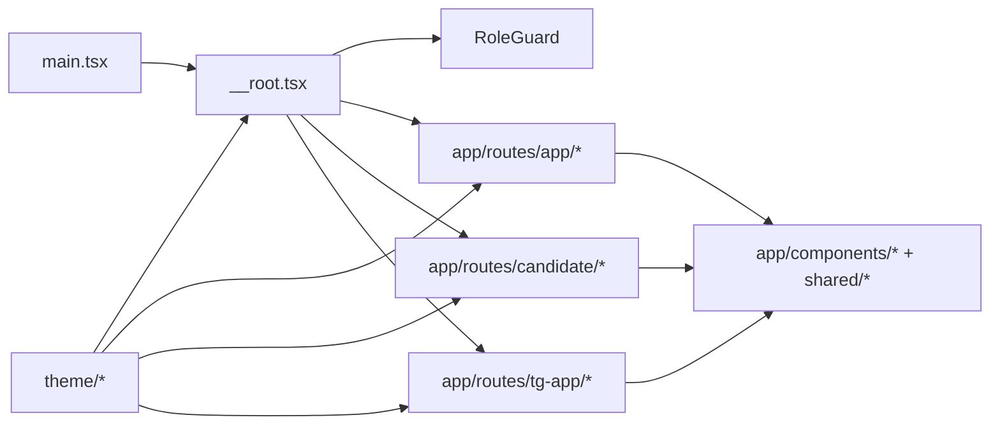

# Component Ownership

## Purpose
Фиксирует границы владения по frontend-модулям: где живет shell, где живут route modules, где тема, где shared components, и что нельзя смешивать.

## Owner
Frontend platform / UI engineering.

## Status
Canonical.

## Last Reviewed
2026-03-25.

## Source Paths
- `frontend/app/src/app/main.tsx`
- `frontend/app/src/app/routes/__root.tsx`
- `frontend/app/src/app/components/*`
- `frontend/app/src/app/routes/app/*`
- `frontend/app/src/app/routes/candidate/*`
- `frontend/app/src/app/routes/tg-app/*`
- `frontend/app/src/theme/*`

## Related Diagrams
- `docs/frontend/route-map.md`
- `docs/frontend/state-flows.md`

## Change Policy
- Не переносите shell concerns в page modules.
- Не переносите page-specific data fetching в shared components, если это не переиспользуемый visual primitive.
- Если модуль начинает владеть несколькими flows, сначала обновите ownership map, потом меняйте код.

## Ownership Map

| Area | Owns | Primary source paths | Boundary notes |
| --- | --- | --- | --- |
| Route tree and code splitting | Route registration, lazy boundaries, entry composition | `frontend/app/src/app/main.tsx` | Single source of truth for path topology. |
| Admin shell and navigation | Header, desktop nav, mobile tabs, more sheet, unread chat state, route title resolution | `frontend/app/src/app/routes/__root.tsx` | Do not duplicate shell state in pages. |
| Role gating | Principal-type gate and redirect UI | `frontend/app/src/app/components/RoleGuard.tsx` | Page-level access control, not routing. |
| Theme system | Tokens, surfaces, motion, media-query overrides | `frontend/app/src/theme/*` | Token semantics belong here, not in pages. |
| Candidate list experience | List/board/calendar views and filtering model | `frontend/app/src/app/routes/app/candidates.tsx` | Owns candidate collection UX. |
| Candidate detail experience | Header, pipeline, tests, AI, chat, insights, modals | `frontend/app/src/app/routes/app/candidate-detail/*`, `frontend/app/src/app/components/InterviewScript/*`, `frontend/app/src/app/components/RecruitmentScript/*` | Highest-complexity ops screen; keep logic co-located. |
| Slots experience | List, filters, bulk actions, booking, reschedule | `frontend/app/src/app/routes/app/slots.tsx`, `frontend/app/src/app/routes/app/slots-modals.tsx` | Scheduling is sensitive; keep mutations local to the module. |
| Dashboard experience | KPI + incoming queue + recruiter leaderboard | `frontend/app/src/app/routes/app/dashboard.tsx`, `frontend/app/src/app/routes/app/incoming*.ts` | Dashboard owns executive/recruiter summary state. |
| Messenger workspace | Thread list, thread view, template tray, drafts | `frontend/app/src/app/routes/app/messenger/*` | Conversation state lives in the messenger module. |
| Admin CRUD | Recruiters, cities, templates, questions, test builder | `frontend/app/src/app/routes/app/recruiters*.tsx`, `cities*.tsx`, `template-*.tsx`, `question-*.tsx`, `test-builder*.tsx`, `message-templates.tsx` | Keep CRUD editor logic inside the owning route family. |
| Candidate portal | Token exchange, journey state machine, candidate self-service | `frontend/app/src/app/routes/candidate/*` | Separate product surface; no admin shell dependency. |
| Telegram Mini App | Telegram-initData UX and recruiter actions | `frontend/app/src/app/routes/tg-app/*` | Separate runtime constraints; keep Telegram-specific UI here. |
| Shared primitives | Generic modal portal, error banners, low-level reusable pieces | `frontend/app/src/app/components/*`, `frontend/app/src/shared/*` | Only truly reusable UI primitives belong here. |

## Boundary Diagram

## Practical Rules
- `main.tsx` owns route topology, not the visual shell.
- `__root.tsx` owns cross-route runtime concerns: theme data attributes, nav presentation, unread messages, mobile behavior.
- Route modules own fetch/mutation logic for their domain surface.
- Shared components should remain domain-agnostic unless the domain-specific behavior is their explicit purpose.

