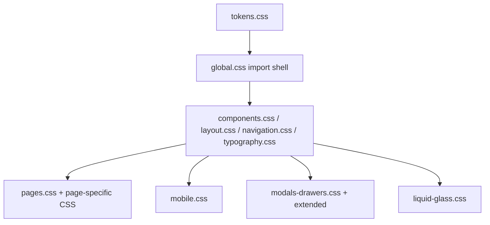

# Design System

## Purpose
Описывает текущую визуальную систему фронтенда: токены, темы, surfaces, навигацию, motion и responsive-правила.

## Owner
Frontend platform / UI engineering.

## Status
Canonical.

## Last Reviewed
2026-03-25.

## Source Paths
- `frontend/app/src/theme/tokens.css`
- `frontend/app/src/theme/global.css`
- `frontend/app/src/theme/navigation.css`
- `frontend/app/src/theme/pages.css`
- `frontend/app/src/theme/mobile.css`
- `frontend/app/src/theme/components*.css`
- `frontend/app/src/theme/modals-drawers*.css`
- `frontend/app/src/theme/liquid-glass.css`

## Related Diagrams
- `docs/frontend/state-flows.md`
- `docs/frontend/component-ownership.md`

## Change Policy
- Токены и semantics обновляются в `tokens.css`, а не на уровне отдельных страниц.
- Если добавляется новый UI pattern, сначала ищите существующий utility/primitive в `components.css`, `pages.css`, `navigation.css` или `mobile.css`.
- Page CSS допускается для локальной композиции, но не для повторного изобретения цветов, теней, радиусов и motion.

## Visual Stack

## Token System

| Token family | Source | Meaning |
| --- | --- | --- |
| Breakpoints | `--bp-desktop`, `--bp-mobile` | Main responsive thresholds. |
| Typography | `--font-sans`, `--font-display`, `--text-*`, `--leading-*` | Base font stack and scale. |
| Spacing | `--space-*`, `--card-padding`, `--section-gap` | Layout rhythm and component spacing. |
| Radius | `--radius-*` | Surface curvature. |
| Motion | `--duration-*`, `--transition-*`, `--ease-*`, `--press-scale` | Interaction timing and easing. |
| Surfaces | `--bg-*`, `--surface-*`, `--glass-*` | Theme surfaces and elevated cards. |
| Text | `--text-*`, `--fg`, `--muted`, `--subtle` | Foreground color semantics. |
| Accents | `--accent`, `--success`, `--warning`, `--danger` | Semantic colors and state tones. |
| Focus | `--border-focus`, `--focus-ring` | Keyboard focus affordances. |

## Theme Model
- Dark theme is the default baseline in `:root`.
- Light theme is enabled through `:root[data-theme='light']`.
- `window.TGTheme.apply('light' | 'dark' | 'auto')` is the runtime entry point for theme switching.
- The selected theme is persisted in browser storage and mirrored to `document.documentElement.dataset.theme`.
- Liquid Glass v2 is a separate UI mode controlled by `ui:liquidGlassV2` and mirrored to `data-ui='liquid-glass-v2'`.

## Surface Hierarchy

| Surface | Typical usage | Notes |
| --- | --- | --- |
| Canvas/background | App shell background, ambient scenes | Lowest level; should stay quiet and non-distracting. |
| Glass panel | Default content container | Primary card/panel treatment across the app. |
| Raised surface | Navigation, top controls, floating elements | Higher elevation and stronger contrast. |
| Modal/drawer | Scheduling, chat, detail actions | Must stay on top of shell and preserve focus. |
| Mobile sheet | Mobile tab drawer, side panels | Full-width behavior where needed. |

## Typography And Tone
- Fonts are `Manrope` and `Space Grotesk` via `--font-sans` and `--font-display`.
- Use display font for headings and product language; use sans for body and controls.
- The design language favors dense CRM surfaces with readable hierarchy, not decorative marketing pages.

## Motion Rules
- Prefer short, purposeful transitions over continuous motion.
- Respect `prefers-reduced-motion`; motion tokens collapse to zero in reduced mode.
- Motion belongs in shared tokens/keyframes, not ad hoc per-screen animation stacks.

## Responsive Rules
- Mobile-specific layout changes live in `mobile.css`.
- Touch targets should stay at or above the minimum size defined in tokens.
- Desktop and mobile can differ structurally, but they should share the same semantic data model and actions.

## Accessibility Rules
- Every interactive control must have visible focus state.
- Contrast for chip/badge/pill states should stay readable on both themes.
- Role gating and navigation state must remain keyboard accessible.

