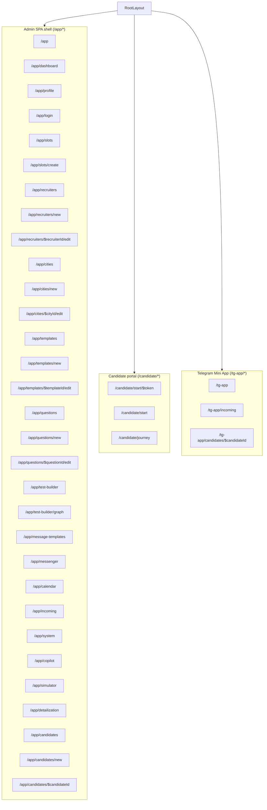

# Route Map

## Purpose
Каноническая карта роутов фронтенда RecruitSmart Admin. Описывает route tree из `frontend/app/src/app/main.tsx`, точки входа, shell-границы и правила доступа.

## Owner
Frontend platform / UI engineering.

## Status
Canonical.

## Last Reviewed
2026-03-25.

## Source Paths
- `frontend/app/src/app/main.tsx`
- `frontend/app/src/app/routes/__root.tsx`
- `frontend/app/src/app/components/RoleGuard.tsx`
- `frontend/app/src/app/routes/candidate/*`
- `frontend/app/src/app/routes/tg-app/*`

## Related Diagrams
- Mermaid route tree ниже
- `docs/frontend/component-ownership.md`
- `docs/frontend/state-flows.md`

## Change Policy
- Любое добавление/удаление/переназначение route path обновляет этот документ в том же PR.
- Отдельные page docs не должны переопределять route tree, описанный в `main.tsx`.
- Если меняется роль или shell для маршрута, обновляются `screen-inventory.md` и `component-ownership.md`.

## Route Tree (37 routes)

## Route Count Note
- `37 routes` в этом документе относятся только к SPA route tree из `frontend/app/src/app/main.tsx`.
- Это число не равно количеству backend FastAPI routes. На 2026-03-25 runtime `admin_ui` поднимается примерно с `290 routes`, потому что туда входят API, health, metrics, static assets и служебные endpoints.
- При появлении расхождения проверять сначала `main.tsx` для frontend и live app router bootstrap для backend.

## Admin Routes

| Route | Entry component | Shell | Access | Notes |
| --- | --- | --- | --- | --- |
| `/app` | `IndexPage` | Admin shell | Authenticated | Landing page, points users to primary sections. |
| `/app/login` | `LoginPage` | No shell nav | Public entry | Auth screen; shell navigation is hidden. |
| `/app/dashboard` | `DashboardPage` | Admin shell | `RoleGuard` recruiter/admin | Main recruiter/admin dashboard, with incoming and KPIs. |
| `/app/profile` | `ProfilePage` | Admin shell | `RoleGuard` recruiter/admin | Personal cabinet, theme toggle, settings. |
| `/app/slots` | `SlotsPage` | Admin shell | `RoleGuard` recruiter/admin | Slots list, filters, bulk actions, booking/reschedule. |
| `/app/slots/create` | `SlotsCreateForm` | Admin shell | `RoleGuard` recruiter/admin | Slot creation form. |
| `/app/recruiters` | `RecruitersPage` | Admin shell | `RoleGuard` admin | Admin-only recruiter management. |
| `/app/recruiters/new` | `RecruiterNewPage` | Admin shell | `RoleGuard` admin | Recruiter create screen. |
| `/app/recruiters/$recruiterId/edit` | `RecruiterEditPage` | Admin shell | `RoleGuard` admin | Recruiter edit screen. |
| `/app/cities` | `CitiesPage` | Admin shell | `RoleGuard` admin | City management. |
| `/app/cities/new` | `CityNewPage` | Admin shell | `RoleGuard` admin | City create screen. |
| `/app/cities/$cityId/edit` | `CityEditPage` | Admin shell | `RoleGuard` admin | City edit screen. |
| `/app/templates` | `TemplateListPage` | Admin shell | `RoleGuard` admin | Template catalog/editor. |
| `/app/templates/new` | `TemplateNewPage` | Admin shell | `RoleGuard` admin | Template create. |
| `/app/templates/$templateId/edit` | `TemplateEditPage` | Admin shell | `RoleGuard` admin | Template edit. |
| `/app/questions` | `QuestionsPage` | Admin shell | `RoleGuard` admin | Question catalog. |
| `/app/questions/new` | `QuestionNewPage` | Admin shell | `RoleGuard` admin | Question create. |
| `/app/questions/$questionId/edit` | `QuestionEditPage` | Admin shell | `RoleGuard` admin | Question edit. |
| `/app/test-builder` | `TestBuilderPage` | Admin shell | `RoleGuard` admin | Test builder workspace. |
| `/app/test-builder/graph` | `TestBuilderGraphPage` | Admin shell | `RoleGuard` admin | Graph/editor variant. |
| `/app/message-templates` | `MessageTemplatesPage` | Admin shell | `RoleGuard` admin/recruiter | Message templates catalog and editor. |
| `/app/messenger` | `MessengerPage` | Admin shell | `RoleGuard` recruiter/admin | Thread list + conversation workspace. |
| `/app/calendar` | `CalendarPage` | Admin shell | `RoleGuard` recruiter/admin | Calendar-centric scheduling view. |
| `/app/incoming` | `IncomingPage` | Admin shell | `RoleGuard` recruiter/admin | Incoming candidate queue. |
| `/app/system` | `SystemPage` | Admin shell | `RoleGuard` admin only | Health, bot/HH integration, delivery, reminders. |
| `/app/copilot` | `CopilotPage` | Admin shell | `RoleGuard` recruiter/admin | AI assistant workspace. |
| `/app/simulator` | `SimulatorPage` | Admin shell | Feature flag gated | Dev/ops simulation route. |
| `/app/detailization` | `DetailizationPage` | Admin shell | `RoleGuard` recruiter/admin | Detailization/attribution workbench. |
| `/app/candidates` | `CandidatesPage` | Admin shell | `RoleGuard` recruiter/admin | Candidate list, kanban, calendar views. |
| `/app/candidates/new` | `CandidateNewPage` | Admin shell | `RoleGuard` recruiter/admin | Candidate create flow. |
| `/app/candidates/$candidateId` | `CandidateDetailPage` | Admin shell | `RoleGuard` recruiter/admin | Full candidate workspace. |

## Candidate Portal Routes

| Route | Entry component | Shell | Access | Notes |
| --- | --- | --- | --- | --- |
| `/candidate/start/$token` | `CandidateStartPage` | Portal shell only | Public token entry | Exchanges portal token and opens journey. |
| `/candidate/start` | `CandidateStartPage` | Portal shell only | Public/session fallback | Uses existing journey if token absent or already resolved. |
| `/candidate/journey` | `CandidateJourneyPage` | Portal shell only | Token/session-backed | Candidate profile, screening, slot reservation/confirmation, messages. |

## Telegram Mini App Routes

| Route | Entry component | Shell | Access | Notes |
| --- | --- | --- | --- | --- |
| `/tg-app` | `TgAppLayout` + `TgDashboardPage` | Telegram mini app shell | Telegram initData | Recruiter dashboard inside Telegram. |
| `/tg-app/incoming` | `TgIncomingPage` | Telegram mini app shell | Telegram initData | Incoming candidates view. |
| `/tg-app/candidates/$candidateId` | `TgCandidatePage` | Telegram mini app shell | Telegram initData | Candidate detail view inside Telegram. |

## Notes
- Root route tree is lazy-loaded for heavy screens and eager-loaded for lightweight pages.
- `RootLayout` hides the admin shell for `/app/login`, `/tg-app/*` and `/candidate/*`.
- `RoleGuard` is the page-level access boundary; the router itself does not encode permissions beyond entry path.
