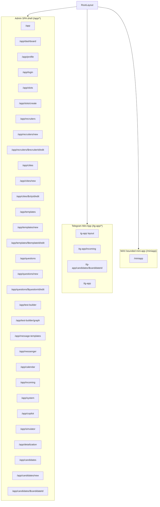

# Route Map

## Purpose
Каноническая карта mounted frontend routes из `frontend/app/src/app/main.tsx`.

## Owner
Frontend platform / UI engineering

## Status
Canonical

## Last Reviewed
2026-04-19

## Source Paths
- `frontend/app/src/app/main.tsx`
- `frontend/app/src/app/routes/__root.tsx`
- `frontend/app/src/app/routes/miniapp/*`
- `frontend/app/src/app/components/RoleGuard.tsx`
- `docs/architecture/supported_channels.md`

## Route Tree

## Current Runtime Truth
- `frontend/app/src/app/main.tsx` does not mount legacy candidate portal routes.
- `frontend/app/src/app/main.tsx` mounts `/miniapp` as the candidate-facing bounded MAX pilot route.
- Historical files under `frontend/app/src/app/routes/candidate/*` are not part of the active route tree.
- Backend requests to `/candidate*` are intentionally closed with `410 Gone`, so legacy candidate portal implementation is not a supported frontend surface in the current runtime.
- `RootLayout` hides the admin shell chrome for `/miniapp` and `/tg-app`.
- Backend hosting for `/miniapp` is fail-closed: when MAX is disabled the shell is not served, and when the bundle is missing the host returns service-unavailable instead of silently degrading into another route.

## Reserved Future Surfaces
- Future standalone candidate web flow remains a target-state concept, but it is not mounted in `main.tsx` and has no live route contract today.
- Full MAX runtime/channel rollout beyond the bounded pilot remains a target-state concept. The mounted `/miniapp` route is only the current guarded controlled-pilot surface.

## Admin Routes

| Route | Entry component | Access | Notes |
| --- | --- | --- | --- |
| `/app` | `IndexPage` | authenticated | Landing page |
| `/app/login` | `LoginPage` | public | Auth entry |
| `/app/dashboard` | `DashboardPage` | recruiter/admin | Main dashboard |
| `/app/profile` | `ProfilePage` | recruiter/admin | Personal settings |
| `/app/slots` | `SlotsPage` | recruiter/admin | Slots list and bulk actions |
| `/app/slots/create` | `SlotsCreateForm` | recruiter/admin | Slot creation |
| `/app/recruiters*` | recruiter pages | admin | Recruiter management |
| `/app/cities*` | city pages | admin | City management |
| `/app/templates*` | template pages | admin | Template catalog/editor |
| `/app/questions*` | question pages | admin | Question catalog |
| `/app/test-builder*` | test builder pages | admin | Test graph/editor |
| `/app/message-templates` | `MessageTemplatesPage` | recruiter/admin | Message templates |
| `/app/messenger` | `MessengerPage` | recruiter/admin | Candidate/staff messaging UI |
| `/app/calendar` | `CalendarPage` | recruiter/admin | Scheduling calendar |
| `/app/incoming` | `IncomingPage` | recruiter/admin | Incoming candidates |
| `/app/system` | `SystemPage` | admin | Health, integrations, operator tools |
| `/app/copilot` | `CopilotPage` | recruiter/admin | AI workspace |
| `/app/simulator` | `SimulatorPage` | feature-flag/dev | Ops simulation |
| `/app/detailization` | `DetailizationPage` | recruiter/admin | Detailization workspace |
| `/app/candidates` | `CandidatesPage` | recruiter/admin | Candidate list/kanban/calendar |
| `/app/candidates/new` | `CandidateNewPage` | recruiter/admin | Candidate create |
| `/app/candidates/$candidateId` | `CandidateDetailPage` | recruiter/admin | Candidate workspace |

## Telegram Mini App Routes

| Route | Entry component | Access | Notes |
| --- | --- | --- | --- |
| `/tg-app` | `TgDashboardPage` | Telegram initData | Recruiter dashboard |
| `/tg-app/incoming` | `TgIncomingPage` | Telegram initData | Incoming queue |
| `/tg-app/candidates/$candidateId` | `TgCandidatePage` | Telegram initData | Lightweight candidate detail and status actions |

## MAX Mini App Routes

| Route | Entry component | Access | Notes |
| --- | --- | --- | --- |
| `/miniapp` | `MaxMiniAppPage` | MAX signed `initData` + bounded launch bootstrap | Mounted and implemented for bounded controlled pilot; global entry now starts a hidden-draft intake flow on shared `/api/max/launch` + `/api/candidate-access/*`; not a production MAX rollout. |
