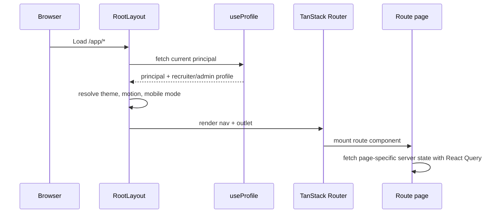
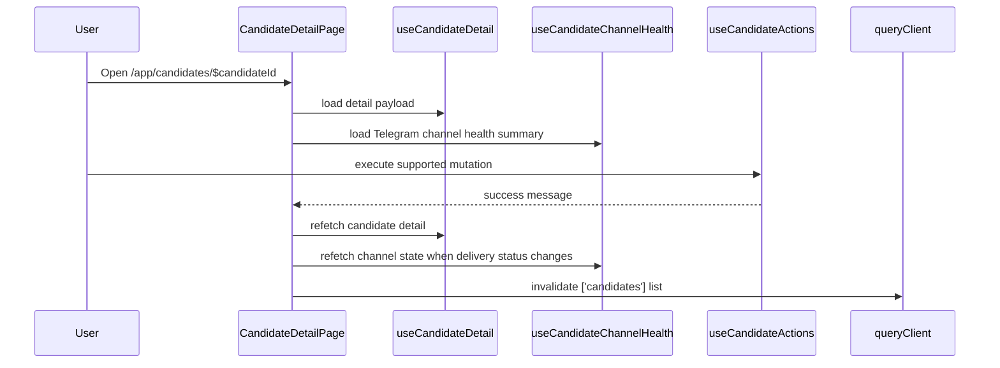
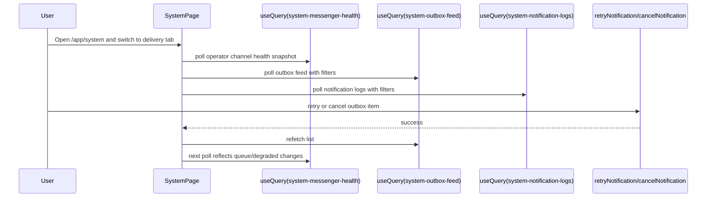
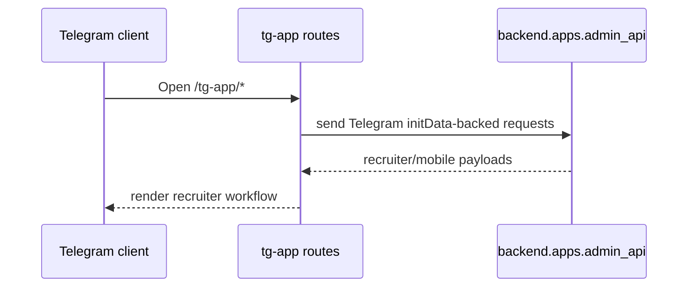
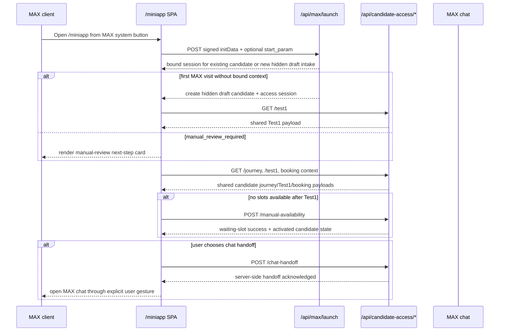

# State Flows

## Purpose
Описывает ключевые пользовательские и UI state flows для текущего supported frontend runtime.

Важно:
- legacy candidate portal implementation не является supported mounted runtime surface;
- future standalone candidate web flow остаётся target state, но не описывается здесь как live route contract;
- bounded MAX mini-app at `/miniapp` уже смонтирован и описывается здесь как guarded controlled-pilot flow;
- full MAX runtime/channel rollout beyond the bounded pilot остаётся target state и не описывается здесь как production live contract.

## Owner
Frontend platform / UI engineering

## Status
Canonical

## Last Reviewed
2026-04-19

## Source Paths
- `frontend/app/src/app/main.tsx`
- `frontend/app/src/app/routes/__root.tsx`
- `frontend/app/src/app/routes/app/candidate-detail/*`
- `frontend/app/src/app/routes/miniapp/*`
- `frontend/app/src/app/routes/tg-app/*`
- `backend/apps/admin_api/max_launch.py`
- `backend/apps/admin_api/candidate_access/router.py`
- `frontend/app/src/app/components/RoleGuard.tsx`

## Related Docs
- `docs/frontend/route-map.md`
- `docs/frontend/screen-inventory.md`

## State Ownership Model

| State type | Owner | Source of truth | Examples |
| --- | --- | --- | --- |
| Server state | React Query | Backend API | Candidate detail, slots, dashboard, profile, messenger threads/messages |
| Route state | TanStack Router | URL | `candidateId`, route selection |
| Local UI state | React component | Component state | Open/close drawers, active tab, filters, modals, draft text |
| Persistent browser state | `localStorage` / session storage | Browser | Theme, UI preferences, persisted filters |
| Shell runtime state | `RootLayout` | `__root.tsx` | Nav mode, unread chat count, mobile sheet state |
| MAX bridge runtime state | MAX WebApp bridge wrapper | MAX client runtime | `initData`, `BackButton`, contact capture, closing confirmation, `openMaxLink()` |

## Admin Shell Bootstrap

## Candidate Detail Flow

### What matters
- Detail screen keeps the canonical view model inside `CandidateDetailPage`.
- Mutations must invalidate both detail and list views when they affect candidate status.
- Channel-health UI reflects current supported runtime only; it must not advertise historical MAX runtime as live behavior.

## System Delivery Flow

### What matters
- Delivery tab combines operator health, outbox feed, and notification logs.
- Operator diagnostics must stay behind authenticated admin surfaces.
- Telegram is the only supported live messaging runtime today.

## Telegram Mini App Flow

## MAX Mini App Candidate Flow

### What matters
- `/miniapp` is a bounded controlled-pilot surface, not a production MAX rollout.
- Critical candidate state stays server-backed through shared `/api/max/launch` and `/api/candidate-access/*`; MAX bridge APIs only supply client runtime helpers.
- Shared candidate journey, Test1, screening, booking, and chat-handoff semantics remain canonical and must not fork into MAX-only business logic.
- Global MAX entry now follows an intake-first path: a hidden draft candidate is created on first launch, Test1 starts immediately, and phone/contact restore remains a bounded recovery path instead of the primary entry flow.
- The surface stays default-off and fail-closed when MAX is disabled or unconfigured.

## Reserved Future Surfaces
- Future standalone candidate web flow remains a target-state surface. It is intentionally excluded from the mounted SPA route tree and from live OpenAPI today.
- Full MAX runtime/channel rollout beyond the bounded pilot remains a target-state surface. The mounted `/miniapp` flow described above is the guarded pilot-only exception, not a production channel commitment.
- SMS / voice fallback remains a target-state integration concern, not a current frontend flow.
