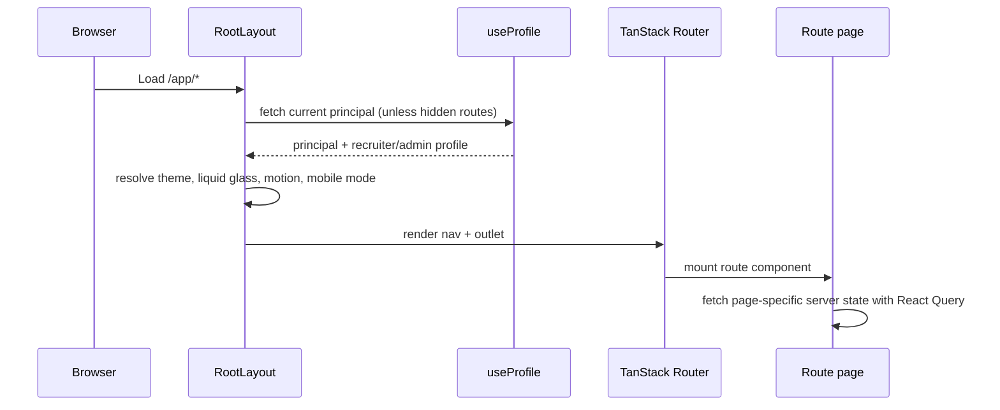
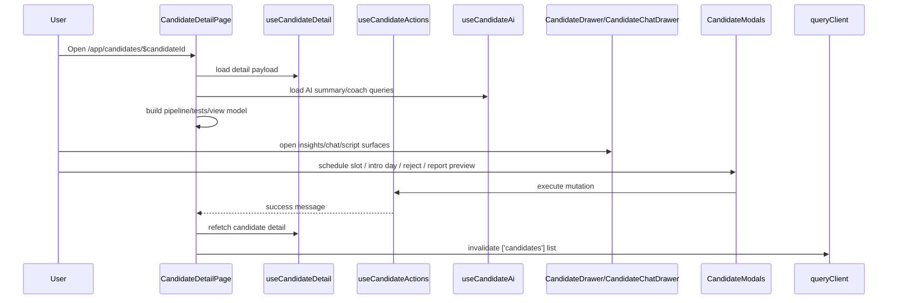
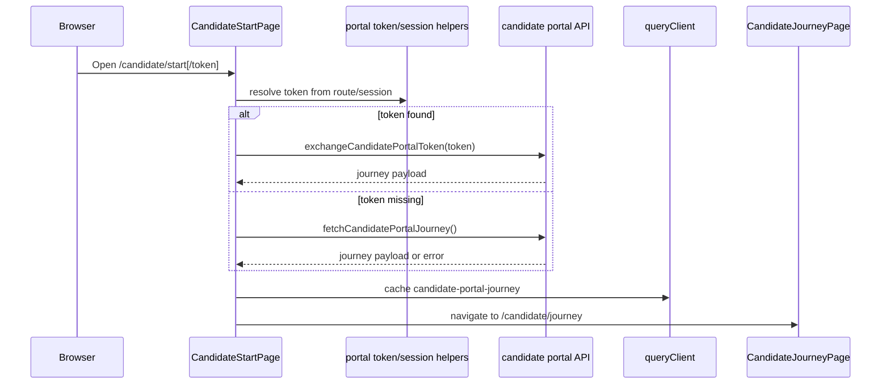
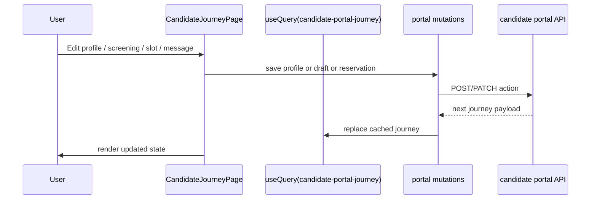
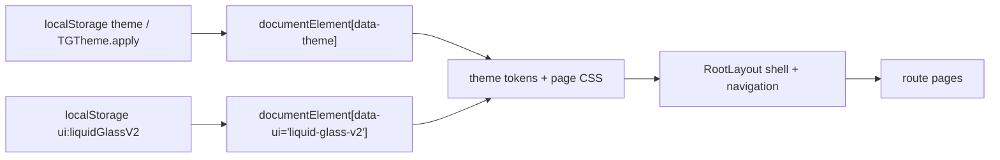

# State Flows

## Purpose
Описывает ключевые пользовательские и UI state flows: где state живет, как он меняется, какие запросы/мутации запускаются и что является источником истины.

## Owner
Frontend platform / UI engineering.

## Status
Canonical.

## Last Reviewed
2026-03-25.

## Source Paths
- `frontend/app/src/app/main.tsx`
- `frontend/app/src/app/routes/__root.tsx`
- `frontend/app/src/app/routes/app/candidate-detail/*`
- `frontend/app/src/app/routes/candidate/*`
- `frontend/app/src/app/routes/tg-app/*`
- `frontend/app/src/app/components/RoleGuard.tsx`

## Related Diagrams
- `docs/frontend/route-map.md`
- `docs/frontend/screen-inventory.md`

## Change Policy
- Любой новый экран или значимый state transition должен получить описание здесь.
- Если mutation влияет на несколько экранов, фиксируйте invalidate/refetch paths вместе с flow.

## State Ownership Model

| State type | Owner | Source of truth | Examples |
| --- | --- | --- | --- |
| Server state | React Query | Backend API | Candidate detail, slots, dashboard, profile, messenger threads/messages |
| Route state | TanStack Router | URL | `candidateId`, `token`, route selection |
| Local UI state | React component | Component state | Open/close drawers, active tab, filters, modals, draft text |
| Persistent browser state | `localStorage` / session storage | Browser | Theme, Liquid Glass override, persisted filters, candidate portal token/session |
| Shell runtime state | `RootLayout` | `__root.tsx` | Nav mode, unread chat count, mobile sheet state, motion mode |

## Admin Shell Bootstrap

### What matters
- `__root.tsx` owns shell, navigation and unread chat polling.
- Page components own their own queries and mutations.
- `RoleGuard` is a page-level gate, not the primary routing mechanism.

## Candidate Detail Flow

### What matters
- Detail screen keeps the canonical view model inside `CandidateDetailPage`.
- Mutations must invalidate both detail and list views when they affect candidate status.
- Drawer state is local; server truth remains in `useCandidateDetail`.

## Candidate Portal Start Flow

### What matters
- `/candidate/start` is a bridge, not the main experience.
- If token exchange fails with recoverable state, the flow falls back to the journey payload.
- Candidate portal uses its own CSS bundle and intentionally bypasses the admin shell.

## Candidate Portal Journey Flow

### What matters
- Journey screen is a self-service state machine.
- Each mutation returns a fresh journey snapshot and replaces cache state.
- Screen state must remain recoverable after refresh.

## Theme And Shell Flow

### What matters
- Theme selection is browser state, not server state.
- Liquid Glass v2 is a UI mode toggle layered on top of the theme.
- Pages read from CSS variables and should not hard-code a second design system.

