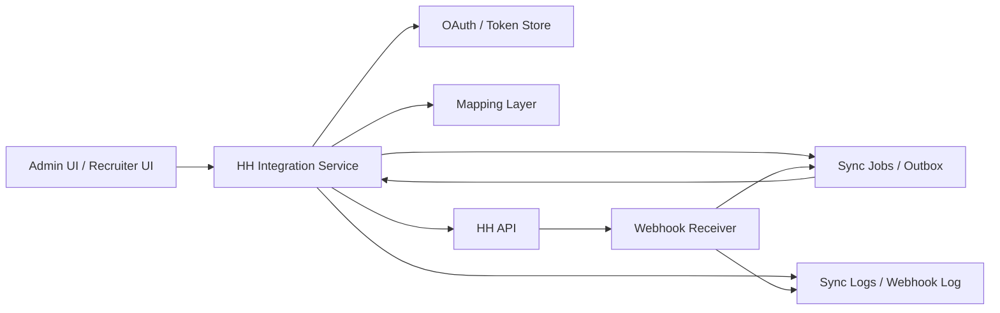

# HH Integration Architecture

## Recommended target model
HH should become a dedicated integration domain in backend, independent from legacy `backend/domain/hh_sync`.

## Module boundaries
### 1. OAuth / connection layer
Responsibilities:
- build authorize URL
- exchange code
- refresh tokens
- resolve `/me` + `/manager_accounts/mine`
- persist encrypted tokens and connection metadata

### 2. Identity layer
Responsibilities:
- candidate ↔ HH identity binding
- vacancy ↔ HH vacancy binding
- negotiation snapshot persistence
- resume snapshot persistence

### 3. Import layer
Responsibilities:
- initial employer vacancy import
- negotiation import
- resume import
- reconciliation polling

### 4. Action orchestration layer
Responsibilities:
- fetch allowed actions
- translate CRM action into HH command
- execute action
- persist resulting state and audit log

### 5. Reliability layer
Responsibilities:
- webhook ingestion
- delivery dedupe
- sync jobs
- retries/backoff
- dead letter handling
- conflict registration

## Source of truth model
- Candidate core record: CRM is source of truth for internal pipeline/work ownership.
- Candidate origin / resume / negotiation lifecycle: HH is external source of truth for imported HH data.
- Final model: hybrid, not single-source.

## Runtime design rules
- Never mutate HH lifecycle by “set status”; always discover and execute allowed action.
- Never trust webhook delivery completeness; reconcile by polling.
- Never bind candidate only by HH link text.
- Keep raw payload snapshots for support/debug/replay.

## Legacy coexistence
Current `backend/domain/hh_sync` remains active as compatibility path for existing n8n workflow. New `backend/domain/hh_integration` is introduced in parallel and becomes migration target.

## Phase structure
- Phase 1: connection + foundation tables + webhook receiver
- Phase 2: import vacancies / negotiations / resume identities
- Phase 3: outbound action orchestration
- Phase 4: event processor + reconciliation
- Phase 5: UX hardening and scale
