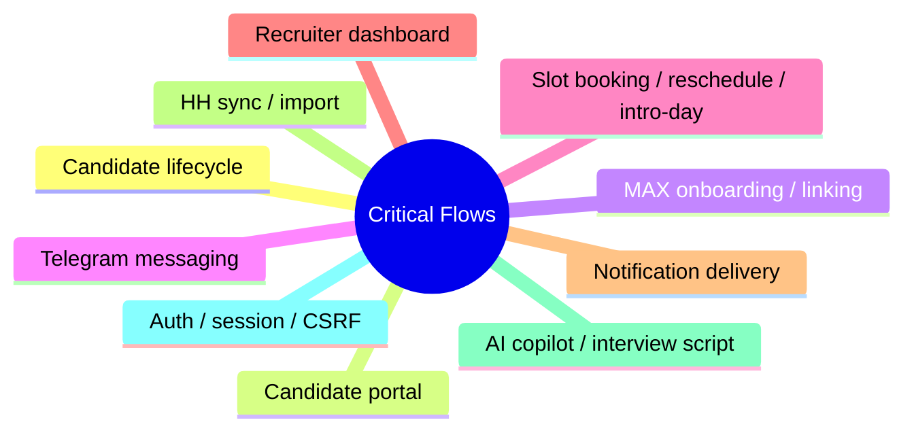

# Critical Flow Catalog

## Header
- Purpose: Каталог критичных бизнес- и операционных flow, которые должны быть покрыты docs, тестами и релизным контролем.
- Owner: QA / Architecture
- Status: Canonical, P0
- Last Reviewed: 2026-03-25
- Source Paths: `docs/architecture/*`, `docs/data/*`, `docs/security/*`, `backend/`, `frontend/app/`
- Related Diagrams: `docs/architecture/core-workflows.md`, `docs/qa/traceability-matrix.md`
- Change Policy: Обновлять при изменении пользовательского flow, API contract, статусов, маршрутов или интеграций.

## Каталог
| Flow | Description | Primary surface | Source of truth |
| --- | --- | --- | --- |
| Candidate lifecycle | Создание, просмотр, изменение, перевод между статусами | backend + SPA | `docs/data/data-dictionary.md`, `docs/architecture/core-workflows.md` |
| Candidate portal | Доступ кандидата к своим данным и действиям | portal runtime + backend | `docs/architecture/core-workflows.md`, `docs/security/auth-and-token-model.md` |
| MAX onboarding / linking | Связка кандидата с MAX каналом и идентификацией | max_bot + backend | `docs/security/trust-boundaries.md`, `docs/architecture/core-workflows.md` |
| Telegram messaging | Отправка и обработка сообщений | bot runtime + backend | `docs/architecture/core-workflows.md` |
| Slot booking / reschedule / intro-day | Запись, перенос, подтверждение временных слотов | backend + SPA + portal | `docs/data/data-dictionary.md`, `docs/architecture/core-workflows.md` |
| Recruiter dashboard | Рабочий стол рекрутера, навигация, drawer, фильтры | frontend SPA | `docs/frontend/route-map.md`, `docs/frontend/screen-inventory.md` |
| Notification delivery | Очереди, outbox, retry, idempotency | backend + Redis | `docs/architecture/core-workflows.md`, `docs/security/trust-boundaries.md` |
| HH sync / import | Синхронизация и импорт из HeadHunter | backend integration | `docs/architecture/core-workflows.md`, `docs/data/data-dictionary.md` |
| AI copilot / interview script | Генерация и отображение подсказок и сценариев | backend + frontend | `docs/security/trust-boundaries.md`, `docs/architecture/core-workflows.md` |
| Auth / session / CSRF | Сессии, токены, защита от подделки запросов | backend + frontend | `docs/security/auth-and-token-model.md`, `docs/security/trust-boundaries.md` |

## Критичность
- P0: ломает доступ к кандидату, рекрутеру, scheduling, auth или delivery
- P1: затрагивает основной рабочий процесс, но есть безопасный обход
- P2: не блокирует работу, но ухудшает UX или поддержку

## Рекомендуемое покрытие
- backend unit / integration
- frontend unit / browser smoke
- security / observability regression
- миграционный или contract check при необходимости

## Mermaid

