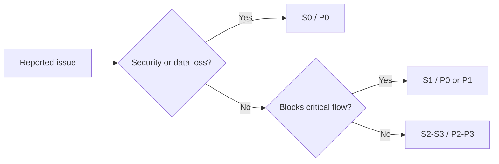

# Defect Taxonomy

## Header
- Purpose: Единая таксономия дефектов для triage, release blocking и QA reporting.
- Owner: QA / Release Engineering
- Status: Canonical, P0
- Last Reviewed: 2026-03-25
- Source Paths: `docs/qa/*`, `backend/`, `frontend/app/`, `docs/security/*`, `docs/data/*`
- Related Diagrams: `docs/qa/critical-flow-catalog.md`, `docs/qa/release-gate-v2.md`
- Change Policy: Обновлять при появлении новых классов дефектов, изменении severity policy или release decision rules.

## Классы дефектов
| Class | Примеры | Effect |
| --- | --- | --- |
| Auth / session | неверный токен, сломанный login, CSRF bypass | Security / access block |
| Data integrity | некорректные статусы, дубли, потеря записей | High risk |
| Scheduling | слоты, перенос, конфликт времени | User-facing blocker |
| Messaging / notification | не доставляются сообщения, дублирование | Operational blocker |
| Portal access | кандидат не может войти или увидеть данные | P0 candidate-facing |
| Recruiter dashboard | сломанная навигация, drawer, фильтры, пустые экраны | P1/P0 depending on coverage |
| HH sync / import | расхождение данных, импорт ломается | Integration blocker |
| AI output safety | неподходящий или опасный output, prompt leakage | Security / product risk |
| Performance | медленные страницы, таймауты, деградация API | Release risk |
| Observability | нет логов/метрик/алертов на критичный flow | Ops risk |

## Severity
| Severity | Definition |
| --- | --- |
| S0 | Полный стоп критичного flow, риск потери данных или безопасности |
| S1 | Серьёзная регрессия в core flow без полного обхода |
| S2 | Частичная деградация с обходом или ограниченной зоной влияния |
| S3 | Косметика, не мешающая основному workflow |

## Priority
| Priority | When used |
| --- | --- |
| P0 | Блокирует релиз-кандидат |
| P1 | Исправляется в ближайшем цикле |
| P2 | Планируется по capacity |
| P3 | Низкий приоритет / backlog |

## Triage rule
1. Определить impact на critical flow.
2. Оценить data / security / availability risk.
3. Привязать к owner и docs.
4. Решить, блокирует ли defect Release Gate v2.

## Mermaid

