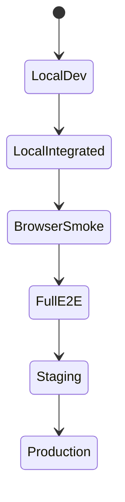

# Environment Matrix

## Header
- Purpose: Матрица сред и условий, в которых проверяются backend, frontend, browser flows и release candidate.
- Owner: QA / Platform
- Status: Canonical, P0
- Last Reviewed: 2026-03-25
- Source Paths: `backend/`, `frontend/app/`, `Makefile`, `package.json`, `docs/qa/*`
- Related Diagrams: `docs/qa/release-gate-v2.md`, `docs/qa/master-test-plan.md`
- Change Policy: Обновлять при изменении окружений, переменных, портов, тестовых стендов и команд верификации.

## Матрица сред
| Среда | Назначение | Данные | Типичные проверки | Примечания |
| --- | --- | --- | --- | --- |
| Local dev | Быстрая разработка и точечная отладка | Локальные, часто синтетические | unit, lint, typecheck, targeted pytest | Не является единственным сигналом качества |
| Local integrated | Полная проверка monolith на машине разработчика | Локальная БД/Redis при необходимости | `make test`, `make test-cov`, browser smoke | Используется для быстрой регрессии |
| Frontend test runtime | Проверка SPA и визуальных flow | Тестовые фикстуры | `npm --prefix frontend/app run test`, `build:verify` | Покрывает рендер, навигацию, формы |
| Backend test runtime | Проверка API и бизнес-логики | Тестовая БД/fixtures | `make test`, `make test-cov` | Источник истины для server-side contract |
| Browser smoke | Критичные сквозные потоки | Стабильный test data set | `npm --prefix frontend/app run test:e2e:smoke` | Должен быть коротким и стабильным |
| Full E2E / RC | Релиз-кандидат | Зафиксированное тестовое состояние | `npm --prefix frontend/app run test:e2e` | Выполняется перед выпуском |
| Staging / preprod | Предрелизная валидация | Ближе к production | smoke, auth, scheduling, notification, observability checks | При наличии стенда |
| Production | Работа системы для пользователей | Реальные данные | health, logs, metrics, alert verification | Только read-only / safe checks |

## Переменные и зависимости
- Backend: PostgreSQL, Redis, env settings, secrets, webhook endpoints
- Frontend: API base URL, auth/session context, feature flags если есть
- Bots: runtime-specific credentials и transport-specific endpoints
- Browser E2E: стабильный base URL, test users, seeded records

## Минимальный набор команд по средам
```bash
make test
make test-cov
npm --prefix frontend/app run lint
npm --prefix frontend/app run typecheck
npm --prefix frontend/app run test
npm --prefix frontend/app run build:verify
npm --prefix frontend/app run test:e2e:smoke
npm --prefix frontend/app run test:e2e
```

## Mermaid


