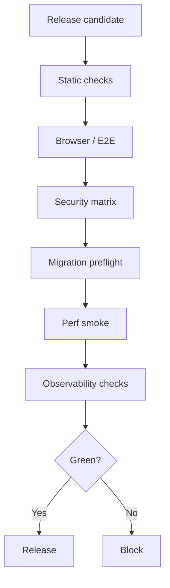

# Release Gate v2

## Header
- Purpose: Описать обязательный релизный гейт для release candidate в RecruitSmart Admin.
- Owner: QA / Release Engineering
- Status: Canonical, P0
- Last Reviewed: 2026-03-25
- Source Paths: `backend/`, `frontend/app/`, `docs/qa/*`, `docs/security/*`, `docs/data/*`
- Related Diagrams: `docs/qa/critical-flow-catalog.md`, `docs/qa/traceability-matrix.md`
- Change Policy: Менять только через согласование QA, backend и frontend owner'ов. Не снижать baseline без отдельного ADR.

## Назначение
Release Gate v2 применяется ко всем release candidate и блокирует выпуск, пока не выполнены обязательные проверки по качеству, безопасности, миграциям, наблюдаемости и критичным flow.

## Обязательные проверки
### 1. Static checks
- `make test`
- `make test-cov`
- `npm --prefix frontend/app run lint`
- `npm --prefix frontend/app run typecheck`
- `npm --prefix frontend/app run test`
- `npm --prefix frontend/app run build:verify`

### 2. Browser / E2E
- `npm --prefix frontend/app run test:e2e:smoke`
- `npm --prefix frontend/app run test:e2e`

### 3. Security regression matrix
- admin session
- recruiter session / bearer flows
- candidate portal token / session / header recovery version match
- Telegram / MAX identity / invite conflict / preferred channel policy
- CSRF
- RBAC / scope leaks
- webhook trust
- rate limiting

### 4. Migration preflight
- Проверка совместимости миграций с текущей схемой
- Проверка rollback surface
- Проверка критичных таблиц и nullable / default изменений

### 5. Perf smoke
- `/api/candidates`
- `/api/dashboard/*`
- slot booking / reschedule
- portal APIs
- messenger updates
- `/api/system/messenger-health`

### 6. Observability verification
- health checks
- logs без токенов и лишнего PII
- ключевые метрики и алерты
- наличие runbook для известных failure domains
- Telegram/MAX degraded state surfaced in operator UI or system API

## Gate decision
| Состояние | Решение |
| --- | --- |
| Все проверки зелёные | Можно выпускать |
| Падает static check | Блокировать release candidate |
| Падает security / migration / perf smoke | Блокировать release candidate |
| Есть незадокументированная критичная регрессия | Блокировать release candidate |
| Есть только некритичный known issue с явным допуском | Требуется явное решение release owner |

## Evidence pack
Для каждого release candidate сохраняются:

- список выполненных команд
- результаты тестов
- per-channel degraded-mode verification
- invite rotation / conflict regression report
- список известных рисков
- ссылки на релевантные docs и ADR
- дата и owner решения

## Mermaid

