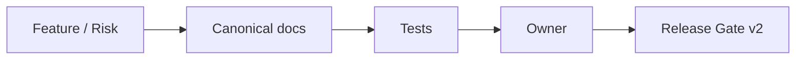

# Traceability Matrix

## Header
- Purpose: Матрица трассировки от критичных рисков и flow к docs, тестам, owner и release gate.
- Owner: QA / Architecture
- Status: Canonical, P0
- Last Reviewed: 2026-03-25
- Source Paths: `docs/architecture/*`, `docs/data/*`, `docs/security/*`, `docs/qa/*`, `backend/tests/`, `frontend/app/tests/`
- Related Diagrams: `docs/qa/critical-flow-catalog.md`, `docs/qa/release-gate-v2.md`
- Change Policy: Обновлять вместе с изменением flow, owner, тестов или release criteria.

## Назначение
Матрица нужна, чтобы любой critical flow можно было проследить до:

- canonical docs
- набора проверок
- ответственного владельца
- шага релизного гейта

## Матрица
| Flow / риск | Source of truth docs | Основные тесты | Owner | Gate |
| --- | --- | --- | --- | --- |
| Candidate lifecycle | `docs/architecture/core-workflows.md`, `docs/data/data-dictionary.md` | backend pytest, API integration, browser smoke | Backend + QA | Release Gate v2 |
| Portal / MAX onboarding | `docs/architecture/core-workflows.md`, `docs/security/auth-and-token-model.md`, `docs/runbooks/portal-max-deeplink-failure.md` | portal browser smoke, token/session regression, MAX linking integration | Backend + Frontend + Security | Release Gate v2 |
| Slot booking / reschedule / intro-day | `docs/architecture/core-workflows.md`, `docs/data/data-dictionary.md` | backend pytest, browser flow, DB integration | Backend / QA | Release Gate v2 |
| Recruiter dashboard / candidate drawer | `docs/frontend/route-map.md`, `docs/frontend/screen-inventory.md` | frontend unit, browser smoke, a11y spot checks | Frontend | Release Gate v2 |
| Recruiter messenger | `docs/architecture/core-workflows.md`, `docs/security/trust-boundaries.md`, `docs/frontend/state-flows.md` | backend integration, ThreadView unit, smoke | Backend / Frontend / Ops | Release Gate v2 |
| Telegram/MAX delivery reliability | `docs/architecture/core-workflows.md`, `docs/runbooks/broker-degradation.md`, `docs/frontend/state-flows.md` | integration, retry/idempotency tests, delivery health unit, system delivery smoke | Backend / Frontend / QA | Release Gate v2 |
| HH sync / import | `docs/architecture/core-workflows.md`, `docs/data/data-dictionary.md` | integration tests, mapping regressions | Backend | Release Gate v2 |
| AI copilot / interview script | `docs/security/trust-boundaries.md`, `docs/architecture/core-workflows.md` | backend tests, frontend smoke, prompt/output guardrails | Backend + Security + QA | Release Gate v2 |
| Auth / session / CSRF | `docs/security/auth-and-token-model.md`, `docs/security/trust-boundaries.md` | security regression matrix, integration tests | Security + Backend | Release Gate v2 |
| Migrations / schema changes | `docs/data/data-dictionary.md` | migration preflight, backend suite, rollback check | Backend / DB | Release Gate v2 |

## Правило трассировки
Каждая новая feature, риск или regression должна быть отражена в трёх местах:

1. canonical doc
2. тест или набор тестов
3. owner / release gate

## Mermaid

## Sprint Reliability Addendum
- Telegram/MAX reliability tranche must map each known failure class (`transient`, `permanent`, `misconfiguration`) to at least one backend regression and one operator-facing doc/runbook.
- Portal session invalidation and invite conflict handling are treated as release-blocking regressions, not support-only issues.
