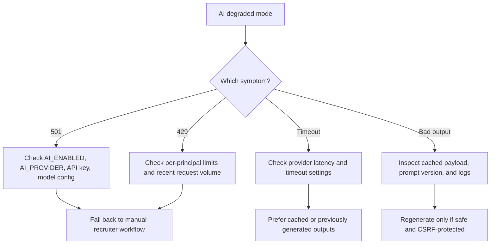

# AI Degraded Mode

## Purpose
Описать режим работы и поддержку AI endpoints, когда генерация недоступна, лимитирована или медленная.

## Owner
AI Platform / Backend Platform / On-call

## Status
Canonical

## Last Reviewed
2026-03-25

## Source Paths
- `/Users/mikhail/Projects/recruitsmart_admin/backend/apps/admin_ui/routers/ai.py`
- `/Users/mikhail/Projects/recruitsmart_admin/backend/core/ai/service.py`
- `/Users/mikhail/Projects/recruitsmart_admin/backend/core/settings.py`
- `/Users/mikhail/Projects/recruitsmart_admin/docs/AI_COACH_RUNBOOK.md`
- `/Users/mikhail/Projects/recruitsmart_admin/docs/AI_INTERVIEW_SCRIPT_RUNBOOK.md`
- `/Users/mikhail/Projects/recruitsmart_admin/frontend/app/src/app/routes/app/candidate-detail`

## Related Diagrams
- `docs/security/trust-boundaries.md`
- `docs/security/auth-and-token-model.md`

## Change Policy
- AI fallback should preserve recruiter workflow and must not silently fabricate business actions.
- If AI behavior changes, update this runbook and the linked AI docs in the same batch.

## Incident Entry Points
- `GET /api/ai/candidates/{candidate_id}/summary`
- `POST /api/ai/candidates/{candidate_id}/summary/refresh`
- `GET /api/ai/candidates/{candidate_id}/coach`
- `POST /api/ai/candidates/{candidate_id}/coach/refresh`
- `POST /api/ai/candidates/{candidate_id}/coach/drafts`
- `GET /api/ai/candidates/{candidate_id}/interview-script`
- `POST /api/ai/candidates/{candidate_id}/interview-script/refresh`
- `POST /api/ai/candidates/{candidate_id}/interview-script/feedback`

## Degraded Modes

- `501 ai_disabled` when AI is off or provider unavailable.
- `429 rate_limited` when principal quota or service rate limit is hit.
- Slow provider responses that do not complete within configured timeout.
- Partial success where cached output exists but refresh fails.

## Triage Flow

## First Response

1. Confirm whether the failure is global or candidate-specific.
2. Check if cached output exists and is still usable.
3. Avoid repeated refresh clicks that can amplify rate limits.
4. If AI is disabled, continue with manual coaching/interview-script workflow.

## Recovery Steps

1. Verify `AI_ENABLED`, provider credentials, model name, timeout, and max token settings.
2. If provider returns consistent errors, keep feature in degraded mode and rely on cached content.
3. If the issue is budget or rate-limit related, lower refresh frequency and alert owners.
4. If prompt/output regression is suspected, roll back the prompt version or service config that introduced it.

## Verification

- Summary and coach endpoints return cached results or explicit degraded responses.
- Interview script can still be read when available.
- CSRF-protected refresh endpoints work only for authenticated principals.
- Candidate detail page remains usable without AI.

## Escalation Criteria

- Provider outage or repeated 5xx.
- Unexpected content quality regression.
- Budget overrun or per-principal abuse pattern.

