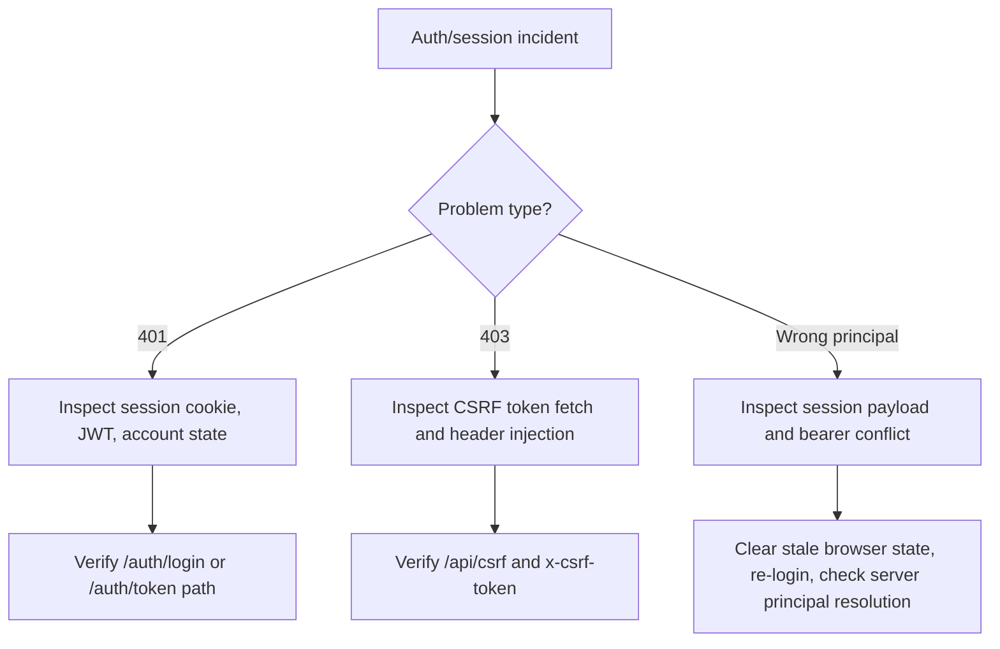

# Auth Session Incident

## Purpose
Описать действия при инцидентах вокруг логина, сессий, JWT, CSRF и перепутанных principal-состояний.

## Owner
Security / Backend Platform / On-call

## Status
Canonical

## Last Reviewed
2026-03-25

## Source Paths
- `/Users/mikhail/Projects/recruitsmart_admin/backend/apps/admin_ui/security.py`
- `/Users/mikhail/Projects/recruitsmart_admin/backend/apps/admin_ui/routers/auth.py`
- `/Users/mikhail/Projects/recruitsmart_admin/backend/apps/admin_ui/app.py`
- `/Users/mikhail/Projects/recruitsmart_admin/backend/core/auth.py`
- `/Users/mikhail/Projects/recruitsmart_admin/frontend/app/src/api/client.ts`
- `/Users/mikhail/Projects/recruitsmart_admin/docs/access-control.md`

## Related Diagrams
- `docs/security/trust-boundaries.md`
- `docs/security/auth-and-token-model.md`

## Change Policy
- Любое изменение cookie/JWT/CSRF поведения требует обновления этого runbook.
- Не ослаблять проверки ради обхода инцидента.

## Incident Entry Points
- `POST /auth/login`
- `POST /auth/token`
- `GET /api/csrf`
- SPA API calls with `x-csrf-token`
- Browser session cookie

## Symptoms
- Пользователи получают `401 Authentication required`.
- POST-запросы на SPA API падают с `403 CSRF token missing or invalid`.
- Рекрутер внезапно выглядит как admin или наоборот.
- Локальная сессия “откатывается” на другое principal-состояние.

## Immediate Triage

1. Проверить `ENVIRONMENT`, `SESSION_SECRET`, `SESSION_COOKIE_SECURE`, `SESSION_COOKIE_SAMESITE`.
2. Убедиться, что браузер шлёт cookie и `x-csrf-token`.
3. Проверить, нет ли конфликтующего bearer JWT в заголовках.
4. Проверить логи на `login_failed`, `login_blocked`, `Invalid authentication token`.
5. Проверить, не включены ли локальные dev-bypass флаги вне dev/test.

## Triage Flow

## Recovery Steps

1. Ask user to fully sign out and clear site cookies/storage for the domain.
2. Refresh `/api/csrf` by reloading the SPA.
3. Re-authenticate using the intended method only: session login or bearer token.
4. If a bad secret rotation happened, roll out a corrected `SESSION_SECRET` consistently.
5. For local dev only, review whether `ALLOW_LEGACY_BASIC`, `ALLOW_DEV_AUTOADMIN`, or CSRF allowlist polluted the flow.

## Verification

- Open the SPA and confirm `/app` loads without auth loop.
- Perform one GET and one POST admin API call.
- Confirm `require_csrf_token()` passes on a state-changing request.
- Confirm `/health` and `/api/csrf` respond.

## Escalation Criteria

- Suspected secret leakage.
- Cross-user session exposure.
- Repeated auth failures across all clients.
- Production session cookie misconfiguration.

