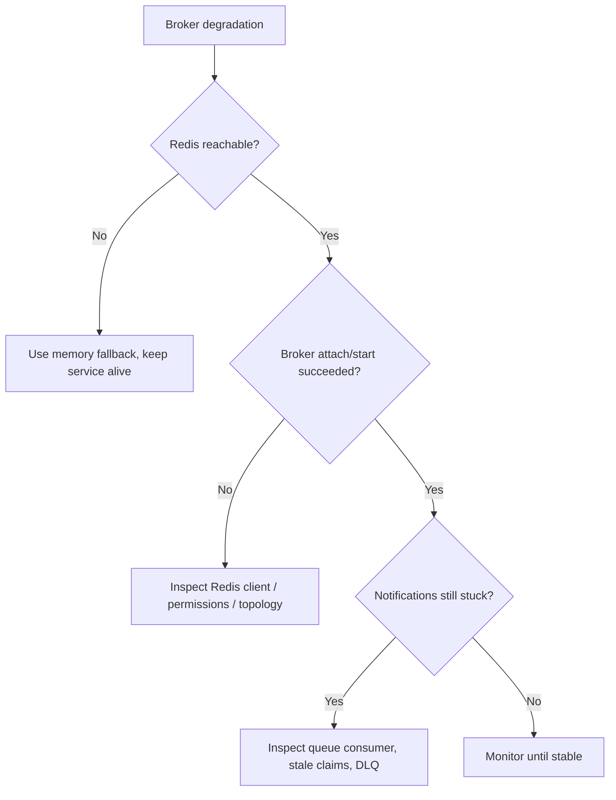

# Broker Degradation

## Purpose
Описать действия при деградации Redis-backed notification broker или content update pub/sub, чтобы сохранить доступность системы и не потерять бизнес-события.

## Owner
Platform / Bot Runtime / On-call

## Status
Canonical

## Last Reviewed
2026-03-25

## Source Paths
- `/Users/mikhail/Projects/recruitsmart_admin/backend/apps/admin_ui/state.py`
- `/Users/mikhail/Projects/recruitsmart_admin/backend/apps/bot/broker.py`
- `/Users/mikhail/Projects/recruitsmart_admin/backend/core/content_updates.py`
- `/Users/mikhail/Projects/recruitsmart_admin/backend/apps/admin_ui/app.py`
- `/Users/mikhail/Projects/recruitsmart_admin/backend/core/redis_factory.py`

## Related Diagrams
- `docs/security/trust-boundaries.md`
- `docs/security/auth-and-token-model.md`

## Change Policy
- Runbook covers observable degradation and safe fallback, not code changes.
- Broker fallback must remain idempotent and best-effort.

## Incident Entry Points
- `/health/notifications`
- `app.state.notification_broker_status`
- `app.state.notification_broker_available`
- Redis ping/publish logs
- `CONTENT_UPDATES_CHANNEL`

## Symptoms
- Notifications stop draining.
- Bot or admin runtime reports `degraded` broker status.
- Content updates do not reach the bot.
- Redis is unreachable or Redis client library is missing.

## Immediate Response

1. Confirm whether the app has switched to in-memory fallback.
2. Check whether `REDIS_URL` is missing, malformed, or unreachable.
3. Inspect broker logs for reconnect attempts and publish failures.
4. Separate delivery degradation from data corruption.

## Triage Flow

## Recovery Steps

1. Restore Redis reachability or credentials.
2. Restart affected runtime only if reconnect loop does not recover.
3. Verify notification broker transitions from `degraded` to `ok`.
4. Verify content updates can be published again.
5. Check whether any messages were moved to DLQ and triage them separately.

## Verification

- `/health/notifications` shows healthy delivery state.
- `app.state.notification_broker_status` is `ok` or `memory` where that is the explicit dev fallback.
- Bot/admin critical message flow works end-to-end.

## Escalation Criteria

- Redis outage affects all critical delivery paths.
- DLQ growth is unexpected.
- Reconnect loops cause request latency or process churn.

