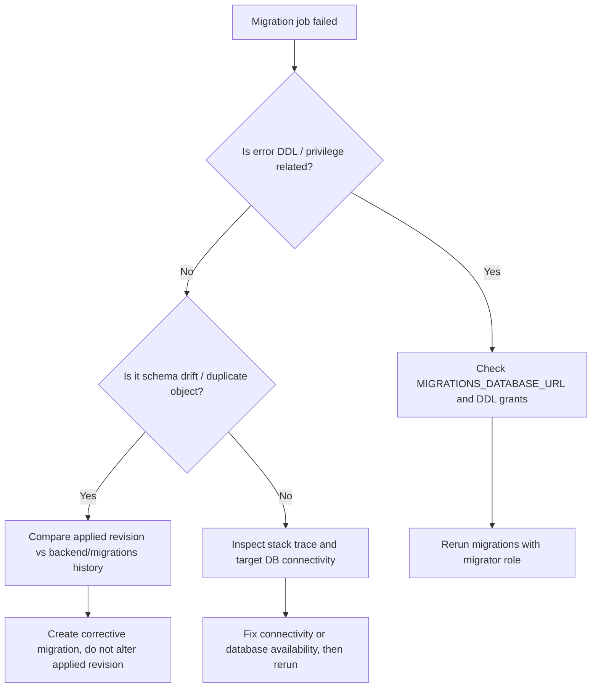

# Migration Failure

## Purpose
Описать порядок действий, если миграции БД не применяются, застревают или расходятся со схемой приложения.

## Owner
Backend Platform / On-call

## Status
Canonical

## Last Reviewed
2026-03-25

## Source Paths
- `/Users/mikhail/Projects/recruitsmart_admin/docs/MIGRATIONS.md`
- `/Users/mikhail/Projects/recruitsmart_admin/backend/migrations`
- `/Users/mikhail/Projects/recruitsmart_admin/scripts/run_migrations.py`
- `/Users/mikhail/Projects/recruitsmart_admin/backend/core/db.py`
- `/Users/mikhail/Projects/recruitsmart_admin/backend/apps/admin_ui/app.py`
- `/Users/mikhail/Projects/recruitsmart_admin/README.md`

## Related Diagrams
- `docs/security/trust-boundaries.md`
- `docs/security/auth-and-token-model.md`

## Change Policy
- Runbooks must describe live entrypoints, rollback-safe steps, and exact verification commands.
- Do not edit applied migrations; add a corrective migration instead.

## Incident Entry Points
- `python scripts/run_migrations.py`
- `make dev-migrate`
- `make test`
- `backend/apps/admin_ui/app.py` startup logs

## Symptoms
- `run_migrations.py` fails with DDL permission error.
- App starts but schema is missing expected tables/columns.
- Startup health checks fail after deploy.
- New code assumes columns that are not present in target database.

## First Response

1. Stop rollout of app containers if schema mismatch is active.
2. Capture the exact migration revision and error text.
3. Confirm whether the migration job is using `MIGRATIONS_DATABASE_URL`.
4. Check whether an app role was used where a DDL-capable migrator role was required.
5. Do not hand-edit production tables.

## Triage Flow

## Verification Steps

1. Run `python scripts/run_migrations.py` with the migrator role.
2. Confirm head revision matches the latest migration in `backend/migrations/versions`.
3. Start `admin_ui` and check `/health`.
4. Run `make test` if code touched migration-adjacent models or services.

## Rollback / Recovery

- If migration partially applied but is reversible, downgrade only in a controlled non-production environment.
- In production, prefer forward-fix migration over destructive rollback.
- If a deploy is blocked by incompatible schema, keep old app version until the new schema is ready or the corrective migration lands.

## Escalation Criteria

- Data loss risk.
- Unknown migration state across nodes.
- DDL privilege failure in production.
- Repeated conflict on the same revision.

