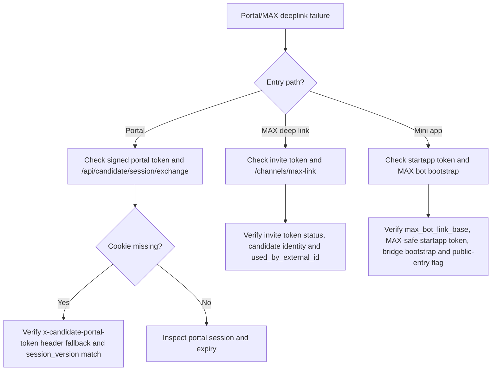

# Portal And MAX Deep Link Failure

## Purpose
Описать действия при поломке candidate portal входа, MAX deep link, mini-app startapp flow и candidate linking.

## Owner
Product Platform / Bot Runtime / On-call

## Status
Canonical

## Last Reviewed
2026-03-26

## Source Paths
- `/Users/mikhail/Projects/recruitsmart_admin/backend/apps/admin_ui/routers/candidate_portal.py`
- `/Users/mikhail/Projects/recruitsmart_admin/backend/apps/admin_ui/routers/api_misc.py`
- `/Users/mikhail/Projects/recruitsmart_admin/backend/domain/candidates/portal_service.py`
- `/Users/mikhail/Projects/recruitsmart_admin/backend/apps/max_bot/app.py`
- `/Users/mikhail/Projects/recruitsmart_admin/backend/apps/max_bot/candidate_flow.py`
- `/Users/mikhail/Projects/recruitsmart_admin/backend/core/messenger/registry.py`
- `/Users/mikhail/Projects/recruitsmart_admin/frontend/app/src/api/candidate.ts`

## Related Diagrams
- `docs/security/trust-boundaries.md`
- `docs/security/auth-and-token-model.md`

## Change Policy
- Never weaken token validation or bypass candidate identity checks to “make link work”.
- URL and token semantics must stay documented together.

## Incident Entry Points
- `POST /api/candidates/{id}/channels/max-link`
- `POST /api/candidate/session/exchange`
- `GET /api/candidate/journey`
- `MAX_BOT_LINK_BASE`
- `max_bot` webhook runtime

## Symptoms
- Candidate cannot open portal from invite link.
- `start=` or `startapp=` link opens but session is not established.
- MAX deep link fails to bind to existing CRM candidate.
- Portal expires immediately after open.
- Candidate closes and reopens browser and loses access even though a fresh resume cookie should have restored the cabinet.
- Browser cookie is missing, but header token should have recovered the session and did not.
- Freshly rotated MAX link works, but older link still circulates and now fails.
- Same invite reused from another `max_user_id` produces conflict.
- Portal link works in browser once, then fails after relink or security recovery.

## Immediate Response

1. Determine which entry path failed: portal URL, MAX invite link, or mini-app startapp link.
2. Confirm whether the token is expired, malformed, or for the wrong candidate.
3. Check whether the invite is `active`, `superseded`, `used`, or `conflict`.
4. Check whether portal `session_version` changed after link rotation, relink or manual security recovery.
5. If browser restart is involved, verify that the resume cookie is still present and that the frontend retries journey bootstrap without a stale stored token.
6. Check whether `MAX_BOT_LINK_BASE`, `CANDIDATE_PORTAL_PUBLIC_URL`, `CRM_PUBLIC_URL` and webhook settings are present and public over HTTPS.
7. Verify `max_bot` adapter is registered and webhook updates are being received.
8. If mini app fails but browser fallback works, verify that MAX mini-app entry in `business.max.ru` points to the same public candidate portal URL and that MAX Bridge is loaded on `/candidate/start`.

## Triage Flow

## Recovery Steps

1. Если invite `superseded`, не переиспользовать старую ссылку. Сгенерировать новый MAX access package через `/api/candidates/{id}/channels/max-link`.
2. Если invite в `conflict`, подтвердить `used_by_external_id` и не пытаться “лечить” это повторным retry. Нужен явный relink/rotation decision.
3. Если browser restart сработал не сразу, проверить, что frontend очистил stale session storage token и повторно попытался `GET /api/candidate/journey` без него.
4. Если portal token не проходит после relink/rotation, проверить `candidate_journey_sessions.session_version`; stale browser/header token должен быть отброшен и заменён новым signed token.
5. Если resume cookie stale или `session_version` не совпадает, портал должен вернуть structured `needs_new_link` state и очистить cookie.
6. Если нужно выдать кандидату свежий доступ без потери прогресса, использовать `Переотправить ссылку`; если нужен retake анкеты, использовать `/api/candidates/{id}/portal/restart`, а не удаление чата в MAX.
7. Re-test token exchange with a clean browser session or MAX mini-app restart.
8. If MAX bot is degraded, verify adapter registration, credentials and webhook health before requeue/retry.
9. If only the mini app is broken, inspect `startapp` payload: it must be URL-safe, shorter than MAX limits and must not contain raw signed portal token segments.
10. If only the browser link is broken, confirm that `portal_entry_ready=true` in `/api/system/messenger-health` and `/api/candidates/{id}/channel-health`.

## Verification

- Candidate opens the portal and sees journey payload.
- Candidate can close and reopen the browser and recover the portal if the short-lived resume cookie is still valid.
- Candidate can continue via `x-candidate-portal-token` when cookies are unavailable and `session_version` still matches.
- Admin-generated MAX link returns `deep_link`, `mini_app_link`, `browser_link`, journey metadata and config status.
- MAX `startapp` payload is URL-safe and accepted by the mini app.
- Recruiter can distinguish `Переотправить ссылку` from `Начать заново` and does not need DB access to reset a candidate.
- MAX updates are processed once, not duplicated.
- Same invite + same `max_user_id` is idempotent; same invite + different `max_user_id` produces conflict without duplicate candidate rows.

## Escalation Criteria

- Multiple candidates affected.
- Token exchange returns consistent 401/403 for valid links.
- Provider-side deep link format changed.
