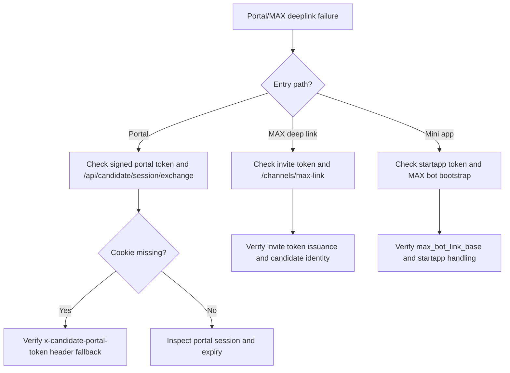

# Portal And MAX Deep Link Failure

## Purpose
Описать действия при поломке candidate portal входа, MAX deep link, mini-app startapp flow и candidate linking.

## Owner
Product Platform / Bot Runtime / On-call

## Status
Canonical

## Last Reviewed
2026-03-25

## Source Paths
- `/Users/mikhail/Projects/recruitsmart_admin/backend/apps/admin_ui/routers/candidate_portal.py`
- `/Users/mikhail/Projects/recruitsmart_admin/backend/apps/admin_ui/routers/api_misc.py`
- `/Users/mikhail/Projects/recruitsmart_admin/backend/domain/candidates/portal_service.py`
- `/Users/mikhail/Projects/recruitsmart_admin/backend/apps/max_bot/app.py`
- `/Users/mikhail/Projects/recruitsmart_admin/backend/apps/max_bot/candidate_flow.py`
- `/Users/mikhail/Projects/recruitsmart_admin/backend/core/messenger/registry.py`
- `/Users/mikhail/Projects/recruitsmart_admin/frontend/app/src/api/candidate.ts`

## Related Diagrams
- `docs/security/trust-boundaries.md`
- `docs/security/auth-and-token-model.md`

## Change Policy
- Never weaken token validation or bypass candidate identity checks to “make link work”.
- URL and token semantics must stay documented together.

## Incident Entry Points
- `POST /api/candidates/{id}/channels/max-link`
- `POST /api/candidate/session/exchange`
- `GET /api/candidate/journey`
- `MAX_BOT_LINK_BASE`
- `max_bot` webhook runtime

## Symptoms
- Candidate cannot open portal from invite link.
- `start=` or `startapp=` link opens but session is not established.
- MAX deep link fails to bind to existing CRM candidate.
- Portal expires immediately after open.
- Browser cookie is missing, but header token should have recovered the session and did not.

## Immediate Response

1. Determine which entry path failed: portal URL, MAX invite link, or mini-app startapp link.
2. Confirm whether the token is expired, malformed, or for the wrong candidate.
3. Check whether `MAX_BOT_LINK_BASE`, portal public URL, and webhook settings are present.
4. Verify `max_bot` adapter is registered and webhook updates are being received.

## Triage Flow

## Recovery Steps

1. Regenerate a fresh candidate link or invite token.
2. Re-test token exchange with a clean browser session.
3. If MAX bot is degraded, verify adapter registration and webhook health.
4. Confirm portal session can recover via header token when cookie storage is unavailable.
5. If only the deep link is broken, check the provider-specific base URL and query parameter encoding.

## Verification

- Candidate opens the portal and sees journey payload.
- Candidate can continue via `x-candidate-portal-token` when cookies are unavailable.
- Admin-generated MAX link returns `deep_link` and `mini_app_link`.
- MAX updates are processed once, not duplicated.

## Escalation Criteria

- Multiple candidates affected.
- Token exchange returns consistent 401/403 for valid links.
- Provider-side deep link format changed.

