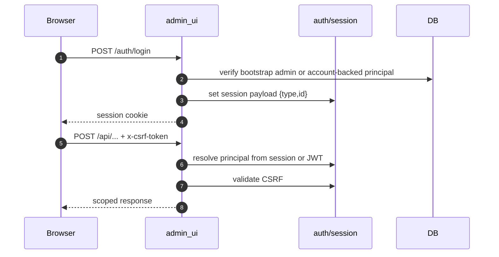
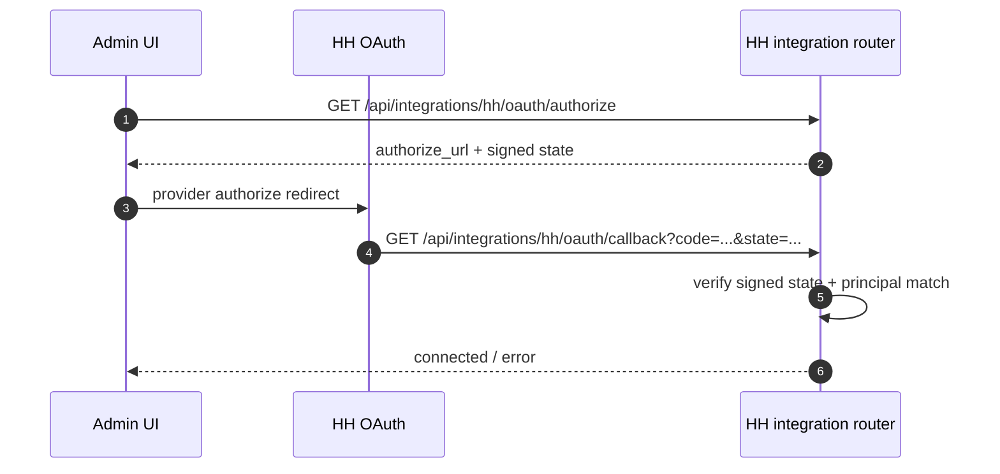
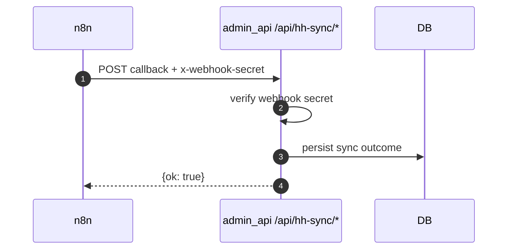

# Auth And Token Model

## Purpose
Описать текущую supported auth/token модель RecruitSmart runtime. Historical candidate-portal/MAX token flows не считаются active production contract.

## Owner
Security / Backend Platform

## Status
Canonical

## Last Reviewed
2026-04-16

## Source Paths
- `backend/apps/admin_ui/security.py`
- `backend/apps/admin_ui/routers/auth.py`
- `backend/apps/admin_ui/routers/system.py`
- `backend/apps/admin_ui/routers/hh_integration.py`
- `backend/apps/admin_api/hh_sync.py`
- `backend/core/auth.py`
- `frontend/app/src/api/client.ts`
- `docs/architecture/supported_channels.md`

## Token Inventory

| Token / secret | Where issued | Where used | Scope / TTL | Storage |
| --- | --- | --- | --- | --- |
| Session cookie | `SessionMiddleware` | admin/recruiter browser session | session-bound | browser cookie |
| Bearer JWT | `/auth/token` | API clients / explicit bearer flows | `access_token_ttl_hours` | `Authorization: Bearer` |
| CSRF token | `/api/csrf` | state-changing admin UI requests | session-bound | browser memory / request header |
| HH OAuth state | `sign_hh_oauth_state()` | `/api/integrations/hh/oauth/callback` | short-lived callback correlation | query param |
| HH webhook secret | config | `/api/hh-sync/*` and HH webhook surfaces | long-lived secret | header / config |
| Bot callback secret | config | bot/webapp related runtime checks | long-lived secret | config |

## Supported Auth Flows

## Rules
- Session and bearer auth are admin/recruiter-only auth surfaces.
- State-changing admin routes require CSRF unless they are explicitly non-browser machine callbacks.
- Destructive admin actions require three gates:
  1. authenticated admin principal;
  2. CSRF token;
  3. `ALLOW_DESTRUCTIVE_ADMIN_ACTIONS=true` plus typed confirmation payload.
- `/metrics` and `/metrics/notifications` are not public auth-free observability contracts.
- Health probes may remain public only if they expose no sensitive operational data.

## Unsupported / Historical Token Families
- Candidate portal tokens, portal resume cookies and `/api/candidate/*` auth flows are not part of the supported runtime contract.
- MAX invite/deeplink/mini-app tokens are not part of the supported default runtime contract.
- If these flows are reintroduced, this document must be expanded in the same change set as the runtime restoration.

## Security Regression Areas
- session fixation or cross-principal session reuse;
- CSRF bypass on admin mutations;
- metrics exposure without auth/allowlist boundary;
- destructive admin endpoints callable in staging/production without explicit opt-in;
- HH OAuth callback state mismatch;
- callback/webhook secret leakage in logs.
