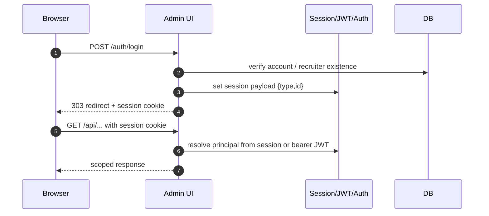
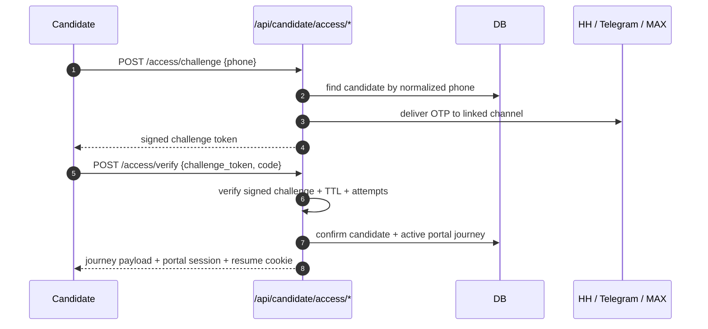
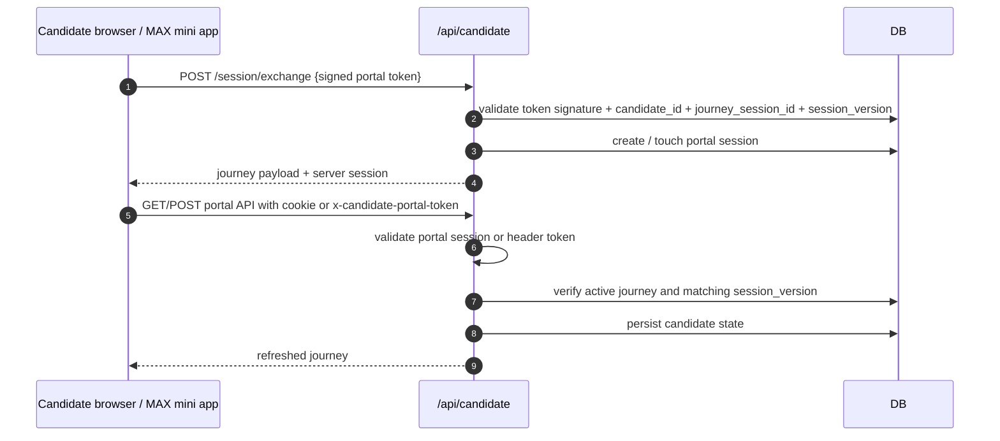

# Auth And Token Model

## Purpose
Описать модель аутентификации и токенов RecruitSmart Admin: session cookie, bearer JWT, CSRF token, candidate portal token, MAX invite/deeplink token, HH OAuth state, webhook secrets и правила их использования.

## Owner
Security / Backend Platform

## Status
Canonical

## Last Reviewed
2026-03-28

## Source Paths
- `/Users/mikhail/Projects/recruitsmart_admin/backend/apps/admin_ui/security.py`
- `/Users/mikhail/Projects/recruitsmart_admin/backend/apps/admin_ui/routers/auth.py`
- `/Users/mikhail/Projects/recruitsmart_admin/backend/apps/admin_ui/routers/candidate_portal.py`
- `/Users/mikhail/Projects/recruitsmart_admin/backend/apps/admin_ui/routers/api_misc.py`
- `/Users/mikhail/Projects/recruitsmart_admin/backend/apps/admin_ui/routers/ai.py`
- `/Users/mikhail/Projects/recruitsmart_admin/backend/apps/admin_ui/routers/hh_integration.py`
- `/Users/mikhail/Projects/recruitsmart_admin/backend/core/auth.py`
- `/Users/mikhail/Projects/recruitsmart_admin/backend/domain/candidates/portal_service.py`
- `/Users/mikhail/Projects/recruitsmart_admin/backend/domain/candidates/services.py`
- `/Users/mikhail/Projects/recruitsmart_admin/backend/domain/hh_integration/oauth.py`
- `/Users/mikhail/Projects/recruitsmart_admin/frontend/app/src/api/client.ts`
- `/Users/mikhail/Projects/recruitsmart_admin/frontend/app/src/api/candidate.ts`

## Related Diagrams
- `docs/security/trust-boundaries.md`
- `docs/runbooks/auth-session-incident.md`
- `docs/runbooks/portal-max-deeplink-failure.md`

## Change Policy
- Любая смена auth/token semantics требует обновления этого документа, regression tests и incident runbooks.
- Token TTL, cookie flags и CSRF bypass rules не менять без отдельного review.
- Local dev allowances must remain host-scoped and environment-scoped.

## Token Inventory

| Token / secret | Where issued | Where used | TTL / scope | Storage |
| --- | --- | --- | --- | --- |
| Session cookie | `SessionMiddleware` | admin/recruiter browser sessions | cookie lifetime, server-side session payload | browser cookie |
| Bearer JWT | `/auth/token` | API clients / browser fallback | `access_token_ttl_hours` | client header |
| CSRF token | `/api/csrf` | state-changing admin requests | session-bound | browser memory / header |
| Candidate portal token | `sign_candidate_portal_token()` | `/api/candidate/session/exchange` and portal requests | `candidate_portal_token_ttl_seconds`, bound to `candidate_id + journey_session_id + session_version` | query param / header |
| Candidate portal resume cookie | `/api/candidate/session/exchange` and successful portal responses | `/api/candidate/journey` bootstrap after browser reopen | short-lived bootstrap cookie, `HttpOnly`, `SameSite=Lax`, path `/api/candidate` | browser cookie |
| Candidate shared-access challenge token | `start_candidate_shared_access_challenge()` | `/api/candidate/access/verify` | 10 minutes, signed challenge envelope around candidate id / delivery state | JSON response / browser memory |
| Candidate shared-access OTP | `deliver_candidate_shared_access_code()` | `/api/candidate/access/verify` | 10 minutes, one active challenge, attempt-limited | HH / Telegram / MAX message |
| Candidate invite token | `generate_candidate_invite_token()` / `issue_candidate_invite_token()` | MAX deep link generation and linking | server-generated, rotated per candidate/channel, status-tracked in DB | query param / DB token table |
| MAX mini-app token | `sign_candidate_portal_max_launch_token()` | MAX mini app entry | portal TTL, URL-safe payload, includes `candidate_uuid + journey_session_id + session_version + source_channel=max_app` | `startapp` token |
| HH OAuth state | `sign_hh_oauth_state()` | OAuth callback correlation | `hh_oauth_state_ttl_seconds` | query param |
| HH webhook key | `webhook_url_key` | HH webhook receiver path | long-lived secret | path segment |
| Webhook secret | `max_webhook_secret`, `hh_webhook_secret` | external webhook subscription verification | provider-defined | env secret |

## Primary Auth Flows

## Admin Session Model

- Admin and recruiter browser auth are resolved in `backend.apps.admin_ui.security`.
- Session payload stores only principal identity, not reusable permissions cache.
- `AuthAccount` is the DB-backed account path; configured admin username/password remains an explicit bootstrap path.
- JWT access tokens are signed with `session_secret`; bearer JWT is acceptable for API clients, but browser local sessions may take precedence on localhost when both exist.
- CSRF protection is enforced for state-changing admin requests via middleware + `require_csrf_token()`.

## Candidate Portal Model

- Public recruiter-facing UX now assumes a shared candidate portal URL, not per-candidate magic links.
- Shared public entry does not reveal a cabinet directly. The candidate first proves possession of a known contact point by entering a phone number from the application and confirming a one-time code.
- Public challenge and verify responses are intentionally generic: unknown phone, ambiguous match, missing linked channel, expired code, and wrong code do not reveal different candidate-facing reason strings.
- The one-time code is delivered through an already linked candidate channel with this priority:
  1. HH negotiation message action;
  2. Telegram linked chat;
  3. MAX linked chat.
- The OTP challenge is short-lived, signed, resend-cooled-down, and attempt-limited. Success creates the normal candidate portal session and resume cookie; it does not create a second auth model.
- Candidate phone lookup uses the normalized indexed `users.phone_normalized` field. Production shared-portal auth must not depend on unindexed ad-hoc phone comparisons.
- Production shared-portal auth is considered degraded without Redis-backed challenge storage and rate limiting. Dev/test may fall back to in-memory storage, but production health must surface that state explicitly.
- Portal token is a signed, time-limited token built with `itsdangerous.URLSafeTimedSerializer`.
- Portal token payload contains `candidate_id`, `entry_channel`, `journey_session_id` and `session_version`.
- Portal session is server-managed and lives under `candidate_portal` session key.
- Browser reopen recovery uses a short-lived HttpOnly resume cookie that stores only the signed portal token; JavaScript cannot read it and the cookie is scoped to candidate portal API requests.
- Portal token remains an internal cabinet access credential and a fallback/bootstrap mechanism. It is no longer the primary recruiter-facing way to onboard high-volume candidates.
- Native entry from MAX `startapp` and Telegram `web_app` buttons is only a launch surface; browser fallback still uses the signed portal token and server-side journey validation.
- MAX mini-app launch does not use the raw signed portal token anymore. `startapp` now carries a stateless URL-safe signed token without dots, limited to MAX-safe characters, and the backend accepts both legacy browser portal tokens and new MAX-safe launch tokens in the same exchange endpoint.
- Requests can recover from missing browser cookies by sending the portal token in one of:
  `x-candidate-portal-token`, `x-candidate-portal-access-token`, `x-candidate-portal-session-token`.
- If both browser session and resume cookie are missing, the portal returns structured recovery states instead of a generic 401 so the UI can distinguish `recoverable`, `needs_new_link`, and `blocked`.
- Shared public `/candidate/start` no longer auto-resumes for every anonymous visitor. A same-device resume is explicit, and a brand-new visitor sees the neutral shared-portal entry screen instead of a stale-session error.
- Fresh route/query/bridge token always has priority over stored browser token; stored token is retried only after direct bootstrap is exhausted, so stale browser storage cannot override a fresh MAX/browser entry.
- Header-token recovery is valid only when the referenced journey session still exists, remains `active`, and `session_version` matches the current DB value.
- `relink`, invite rotation, explicit security recovery and similar ownership-changing actions bump `session_version` and invalidate stale browser/header sessions.
- Portal responses must never be treated as admin/recruiter auth.

## MAX Model

- Admin-generated MAX access package contains three distinct entry surfaces:
  1. provider deep link with invite token in `start=...`;
  2. mini-app link with MAX-safe launch token in `startapp=...`;
  3. public browser portal link with signed portal token.
- Deep link format is provider-specific and uses `start=...` or `startapp=...`. `startapp` payload must stay within MAX-allowed characters `[A-Za-z0-9_-]`; raw portal tokens with dots are not valid for mini-app launch.
- Raw invite tokens are treated as secrets after issuance: recruiter-facing `channel-health` surfaces expose only invite metadata, and audit log entries store invite ids / rotation metadata instead of token values.
- MAX runtime deduplicates webhook updates before processing to prevent duplicate side effects.
- Only one active MAX invite is canonical per candidate. New admin rotation supersedes previous active invite instead of creating parallel active links.
- Reuse of the same invite by the same `max_user_id` is idempotent. Reuse by another `max_user_id` is treated as conflict and must not create duplicate linking side effects.
- `messenger_platform` is no longer silently overwritten on every MAX entry. Preferred channel changes only when candidate has no linked channel yet or an explicit operator action rotates ownership.
- Recruiter controls are split:
  - `POST /api/candidates/{id}/channels/max-link` reissues access without deleting current progress and bumps `session_version`;
  - `POST /api/candidates/{id}/portal/restart` abandons the active portal journey, creates a fresh one from `profile`, rotates invite state and preserves audit/history.
- Public MAX placeholder onboarding remains feature-flagged and is non-default for production. Invite-based linking is the canonical production path.

## HH Model

- HH OAuth authorize URL is built from signed state that includes principal and return target.
- Callback is valid only when state is intact and principal matches the authenticated admin.
- HH access and refresh tokens are encrypted at rest.
- HH webhook receiver is authenticated by the URL key; logs must not expose it.
- Recruiter-facing `POST /api/candidates/{id}/hh/send-entry-link` now delivers the shared portal URL for backward compatibility. It no longer implies that a unique personal cabinet link was issued.
- Explicit bulk HH delivery is available only for operator-selected candidate IDs through `POST /api/candidates/hh/send-shared-portal`; this avoids silent mass fan-out across arbitrary filters.

## CSRF Rules

- CSRF is required for state-changing admin UI requests.
- SPA fetch layer first requests `/api/csrf`, then sends `x-csrf-token`.
- Candidate portal API intentionally bypasses CSRF because its auth surface is the signed portal token and portal session, not the admin session.
- Dev/test host allowlisting exists only for local iteration and must not widen production trust.

## Secret Handling Rules

- Store long-lived secrets in environment/secret manager only.
- Rotate secrets if exposure is suspected: `SESSION_SECRET`, `BOT_TOKEN`, `BOT_CALLBACK_SECRET`, `hh_client_secret`, `max_bot_token`, webhook secrets.
- Do not echo request bodies or headers containing tokens into debug logs.
- Use redacted identifiers and request IDs for supportability.

## Security Regression Areas

- Session fixation and cross-principal session reuse.
- Candidate enumeration or brute force on shared portal phone lookup and OTP verify.
- OTP replay, resend abuse, or unbounded delivery fan-out across HH / Telegram / MAX.
- JWT acceptance for the wrong principal type or stale account.
- CSRF header bypass on admin mutations.
- Candidate portal token replay, stale `session_version` reuse, or accidental reuse as admin auth.
- MAX invite token reuse, conflict linking, superseded invite acceptance, or leakage in logs.
- HH OAuth callback principal mismatch or replay.
- Webhook secret exposure and webhook replay handling.
