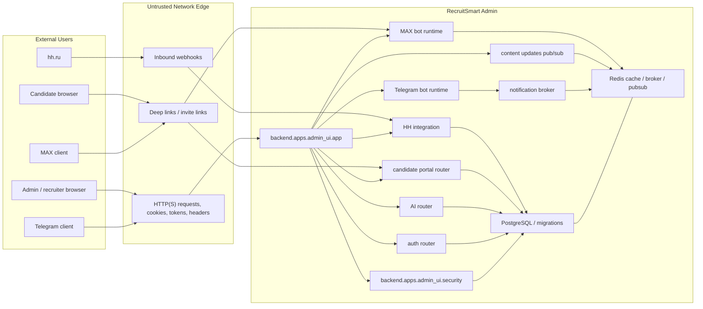

# Trust Boundaries

## Purpose
Зафиксировать доверенные границы RecruitSmart Admin: где находятся точки входа, какие каналы считаются недоверенными, какие данные проходят через границы доверия и какие проверки обязательны на каждом переходе.

## Owner
Security / Backend Platform

## Status
Canonical

## Last Reviewed
2026-03-25

## Source Paths
- `/Users/mikhail/Projects/recruitsmart_admin/backend/apps/admin_ui/app.py`
- `/Users/mikhail/Projects/recruitsmart_admin/backend/apps/admin_ui/security.py`
- `/Users/mikhail/Projects/recruitsmart_admin/backend/apps/admin_ui/routers/auth.py`
- `/Users/mikhail/Projects/recruitsmart_admin/backend/apps/admin_ui/routers/candidate_portal.py`
- `/Users/mikhail/Projects/recruitsmart_admin/backend/apps/admin_ui/routers/api_misc.py`
- `/Users/mikhail/Projects/recruitsmart_admin/backend/apps/admin_ui/routers/ai.py`
- `/Users/mikhail/Projects/recruitsmart_admin/backend/apps/admin_ui/routers/hh_integration.py`
- `/Users/mikhail/Projects/recruitsmart_admin/backend/apps/bot/broker.py`
- `/Users/mikhail/Projects/recruitsmart_admin/backend/apps/max_bot/app.py`
- `/Users/mikhail/Projects/recruitsmart_admin/backend/domain/candidates/portal_service.py`
- `/Users/mikhail/Projects/recruitsmart_admin/backend/domain/hh_integration/oauth.py`
- `/Users/mikhail/Projects/recruitsmart_admin/backend/core/content_updates.py`

## Related Diagrams
- `docs/security/trust-boundaries.md` Mermaid boundary map
- `docs/security/auth-and-token-model.md` sequence diagrams

## Change Policy
- Любое изменение доверенных границ требует обновления этого документа и связанного auth/token model.
- Новые исключения на локальную разработку должны быть ограничены `development`/`test` и не менять production-поведение.
- Каноническая документация описывает текущий код; если реализация меняется, документ обновляется в том же наборе изменений.

## Boundary Map

## Trust Boundary Summary

### 1. Browser boundary
- Все cookie, query params, form fields, headers и local/session storage считаются недоверенными до серверной валидации.
- Admin UI использует `SessionMiddleware` и CSRF middleware; state-changing запросы требуют CSRF, кроме публичного candidate portal path, где используются отдельные portal tokens.
- Bearer JWT и session cookie могут сосуществовать; сервер сам разрешает principal.

### 2. Candidate portal boundary
- Public portal API расположен на `/api/candidate/*`.
- Доступ разрешается только через signed portal token и/или валидную серверную сессию портала.
- При истечении cookie browser может восстановиться через `x-candidate-portal-token` из deep link или сохранённого session token.
- Header recovery доверяется только после проверки `candidate_id + journey_session_id + session_version`; stale version must fail closed с audit-событием `portal_session_rejected_version_mismatch`.
- Portal token нельзя считать аутентификацией admin/recruiter.

### 3. MAX boundary
- MAX deep link и mini-app link используют отдельные токены для связывания кандидата.
- Webhook события MAX обрабатываются отдельным runtime и должны быть идемпотентны.
- `max_bot` не должен доверять raw update payload без dedupe и platform-adapter проверки.
- Канонический linking path: recruiter-issued invite. Public MAX entry допускается только под feature flag и не должен silently становиться preferred channel.
- Один кандидат имеет только один active MAX invite. Superseded invite и invite conflict считаются отдельными observable состояниями, а не неявным retry path.

### 4. HH boundary
- HH OAuth state подписывается `session_secret`.
- Webhook endpoint для HH основан на секретном ключе в path; сам ключ является bearer-like секретом и не должен попадать в логи.
- OAuth callback проверяет соответствие principal, state и redirect target.

### 5. Internal service boundary
- Redis используется как best-effort transport/cache/broker layer, а не как источник истины.
- Notification broker и content update pub/sub должны деградировать без потери целостности данных.
- База данных остается source of truth для кандидатов, сессий, слотов, сообщений, интеграций и audit state.
- Telegram и MAX считаются разными failure domains. Degraded state хранится отдельно по каналу и должен быть видим через операторские surfaces и `/api/system/messenger-health`.

## Security Regression Areas

- `/auth/login`, `/auth/token`, `SESSION_KEY` payload, JWT issuance.
- Session cookie flags: `secure`, `same_site`, `HttpOnly` behavior via Starlette session middleware.
- `require_csrf_token()` и `/api/csrf`.
- Candidate portal token exchange, portal session renewal, and token headers.
- MAX invite/deeplink generation and callback handling.
- HH OAuth authorize/callback/state validation and HH webhook delivery path.
- AI endpoints that mutate state or persist outputs.
- Redis broker fallback paths and content update pub/sub.
- Secret logging and audit context propagation.

## Secret And Logging Rules

- Не логировать `SESSION_SECRET`, `BOT_TOKEN`, `BOT_CALLBACK_SECRET`, `hh_client_secret`, `max_bot_token`, portal tokens, invite tokens и webhook secrets.
- В логах допускаются только безопасные метаданные: principal type/id, request id, route, status, timing, environment, redacted host.
- Любые headers с токенами должны попадать в лог только после redaction.
- Error payloads наружу должны содержать только actionable message, без raw secrets и без внутренних stack traces.

## Control Matrix

| Boundary | Entry point | Trust check | Failure mode |
| --- | --- | --- | --- |
| Browser admin | `/auth/login`, `/auth/token`, SPA API | session/JWT + CSRF | 401 / 403 |
| Browser portal | `/api/candidate/session/exchange` | signed portal token + active journey + matching session version | 401 / 409 |
| MAX deep link | `/candidates/{id}/channels/max-link`, `startapp` | signed invite / mini-app token + conflict/idempotency checks | 400 / 409 / 503 |
| HH OAuth | `/api/integrations/hh/oauth/callback` | signed state + principal match | 400 / 403 / 502 |
| HH webhook | `/api/hh-integration/webhooks/{key}` | secret path key | 404 |
| Delivery channel health | `/api/system/messenger-health`, `/api/system/messenger-health/{channel}/recover` | persisted per-channel degraded state + explicit admin recovery | degraded / healthy |
| Redis broker | notification streams / pubsub | broker availability + dedupe | degraded / memory fallback |
