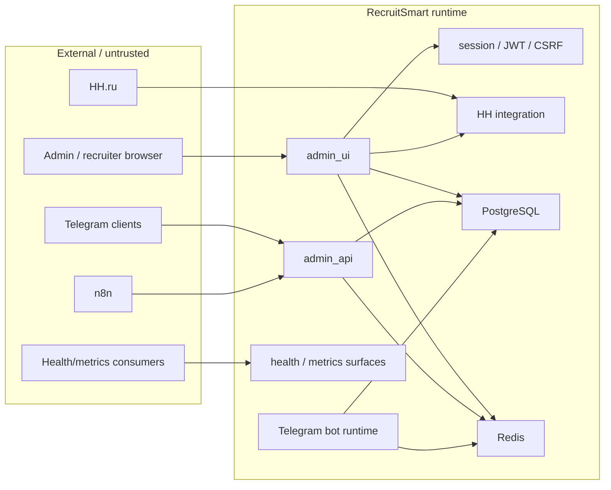

# Trust Boundaries

## Purpose
Зафиксировать текущие доверенные и недоверенные границы RecruitSmart runtime без исторических candidate-portal/MAX promises.

## Owner
Security / Backend Platform

## Status
Canonical

## Last Reviewed
2026-04-16

## Source Paths
- `backend/apps/admin_ui/app.py`
- `backend/apps/admin_ui/security.py`
- `backend/apps/admin_ui/routers/auth.py`
- `backend/apps/admin_ui/routers/system.py`
- `backend/apps/admin_ui/routers/hh_integration.py`
- `backend/apps/admin_api/main.py`
- `backend/apps/admin_api/hh_sync.py`
- `backend/apps/bot/app.py`
- `docs/architecture/supported_channels.md`

## Boundary Map

## Trust Boundary Summary

### 1. Browser admin boundary
- Все cookies, headers, query params, forms и SPA state считаются недоверенными до серверной проверки.
- Admin browser mutations требуют authenticated principal и CSRF.
- Destructive admin endpoints требуют дополнительный feature flag и typed confirmation.

### 2. Telegram boundary
- Telegram runtime и Mini App остаются supported channel boundary.
- Bot runtime, callback secret и recruiter webapp auth считаются отдельным trust boundary от browser session.
- Delivery/runtime problems должны быть observable через operator health surfaces, но не должны открывать внутренние детали анонимному клиенту.

### 3. HH / n8n boundary
- HH OAuth, HH webhook registration и n8n callback endpoints требуют explicit secret/state validation.
- Webhook/callback secrets являются bearer-like secret material и не должны попадать в логи.
- Callback replay и partial failures должны fail closed и оставаться audit-friendly.

### 4. Health / metrics boundary
- `/healthz`, `/ready`, `/health` могут быть публичными только потому, что не возвращают sensitive payload.
- `/health/bot` и `/health/notifications` являются operator-only diagnostic surface и требуют authenticated admin session.
- `/metrics` и `/metrics/notifications` не считаются public diagnostic surface: они должны быть защищены auth и/или deployment allowlist boundary.

### 5. Unsupported surfaces
- Legacy candidate portal implementation не является активной trust boundary в supported runtime: `/candidate*` закрыт, `/api/candidate/*` не advertised.
- Historical MAX runtime не является активной trust boundary в default runtime: standard compose/runtime не должен его запускать и не должен зависеть от него.

## Control Matrix

| Boundary | Entry point | Required trust check | Failure mode |
| --- | --- | --- | --- |
| Admin browser | `/auth/*`, admin UI `/api/*` | session or JWT + role + CSRF for mutations | `401` / `403` |
| Telegram Mini App | `/api/webapp/*`, `/api/webapp/recruiter/*` | Telegram/webapp auth contract | `401` / `403` |
| HH OAuth | `/api/integrations/hh/oauth/*` | signed state + principal match | `400` / `403` / `502` |
| n8n HH callbacks | `/api/hh-sync/*` | webhook secret header | `403` |
| Metrics | `/metrics`, `/metrics/notifications` | authenticated principal or allowlisted client | `403` / `404` |
| Unsupported portal surface | `/candidate*`, `/api/candidate/*` | fail closed, no runtime promise | `410` / absent from schema |

## Secret And Logging Rules
- Не логировать `SESSION_SECRET`, `BOT_TOKEN`, `BOT_CALLBACK_SECRET`, `HH_CLIENT_SECRET`, webhook secrets и auth headers.
- Destructive admin actions must write audit records with actor, IP, user agent and action metadata.
- Public probes must not expose stack traces, tokens, queue internals or raw exception payloads.
